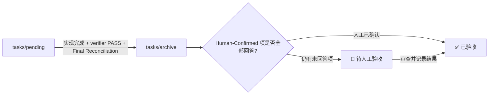

# PRD Skill：从需求判断到可验收交付

> 本文介绍仓库中的 PRD skill：它如何理解需求、分析代码库、形成实施方案、组织验证证据，并把执行完成与人工验收分开记录。规范的完整原文位于 [`skills/prd/SKILL.md`](https://github.com/ZataZhang/zata-codes-template/blob/main/skills/prd/SKILL.md)。

!!! abstract "一句话说明"
    这套 skill 不只是把需求填进 PRD 模板，而是先核对仓库事实和架构边界，再让人审阅需求解释与关键决定，最后交付一份可执行、可验证、证据可审查的计划。

## 这份 Skill 解决什么问题

规划阶段常见的交付偏差包括：还没看代码就开始设计、重复建设已有能力、把实现细节塞进人审文档、漏掉前端影响、只写“跑单测”却没有验证真实入口，以及把“测试通过”“代码归档”和“人确认接受”混成一个状态。

PRD skill 将这些问题放进一条完整链路中处理。它的输入是用户的功能、修复或重构意图，以及当前仓库；输出是保存在 `tasks/pending/` 下的一份技术 PRD。PRD 同时服务两类读者：人用它确认需求和需要自己判断的结果；执行者用它找到正确代码路径并完成实现与验证。

典型触发意图包括：

- “为这个需求写一份 PRD。”
- “规划这个功能怎么实现。”
- “把这个想法整理成可执行方案。”

规划阶段的产物是计划，不等于已经实现功能。进入 `tasks/pending/` 的 PRD 后，执行阶段再通过仓库的 `just` 工作流领取和实现。

## 设计原则

| 原则 | 在 PRD 中的体现 |
| --- | --- |
| 先看仓库，再写方案 | 查找现有入口、模块边界、扩展点、测试、文档和相关 PRD；仓库能回答的问题不再抛给用户。 |
| 优先最小完整改动 | 先比较沿用现有路径的方案；只有现有路径确实不够时，才增加抽象、服务、表、页面或依赖。默认交付目标状态，不把必要收尾推迟到模糊的“后续阶段”。 |
| 人审与执行分层 | Part A 用用户能理解的行为和决定描述需求；实现机制、文件、命令、风险登记和证据细节放进 Part B。 |
| 让需求可被纠正 | 先展示输入和可观察结果，让用户能指出具体哪一行理解错了，而不是只确认一段抽象摘要。 |
| 前端是完整交付面 | 查明项目真实拥有的前端应用；任何用户可见改动都规划页面、组件、状态、API 接线和验证入口。后端专属任务也要说明为什么没有前端影响。 |
| 验证强度随风险变化 | 低风险改动只要求能区分自身失败的断言；持久化、兼容性、安全等高风险改动需要跨真实边界并证明最终状态的证据链。 |
| 外部研究按需进行 | 只有决定依赖会变化的外部事实时才联网研究；优先官方或一手资料，并标清来源事实与推断。 |

## 工作流总览


流程分成规划与执行两段。规划时先给人一次集中审阅机会；方案确认后，执行者在证据约束下自主完成工作，不在实现过程中不断打断用户。交付末尾再集中呈递风险排序的结果和需要人工回答的事项。

### 规划阶段

| 阶段 | Skill 要完成的事 | 主要输出 |
| --- | --- | --- |
| 0. 把请求写成可实施主张 | 说明谁在什么条件下需要什么行为，系统应出现什么可观察变化；尽可能找到仓库内的具体现状证据。 | `Interpretation`，含行为样例、默默采用的解释和明确不做的范围。 |
| 1. 仓库与架构分析 | 检查技术栈、模块依赖、数据所有权、可复用路径、测试与文档，并搜索待执行和已归档 PRD。 | 现有路径、复用候选、架构约束、PRD 关系和冗余风险。 |
| 1.5. 前端影响判断 | 从仓库实际目录、配置和 package 脚本发现前端，不凭经验猜测框架或入口。 | Full-stack、Frontend-only 或 Backend-only 归类，以及受影响 app、页面和验证命令。 |
| 2. 只澄清代码无法回答的问题 | 只询问会改变范围、行为、信任边界、上线或架构的关键歧义；给出推荐答案和理由。 | 少量需要用户确认的明确决定；无需确认时直接继续。 |
| 2.5–3.4. 挑战与收敛方案 | 反向检查所有权、用户心智、相邻需求和变化压力；与最接近的重型方案比较；判断独立工作是否应拆分。 | 一个优先方案；只保留会实质影响范围、风险或架构的替代项。 |
| 3.5–3.6. 锁定验证与人审项 | 定义最高可行保真度的真实入口、验收 oracle、风险等级和对应审阅人。 | Realistic Validation Plan、Human Review Map 和内部风险登记。 |
| 4–5.5. 外部事实、原型与执行韧性 | 必要时研究外部事实；规划流程图、影响树、原型和数据库图；使用语义锚点而非脆弱行号。 | Part B 所需图示、原型依据、引用来源和可执行的搜索/命令。 |
| 6–7. 生成与合规检查 | 按命名约定保存 PRD，检查必需章节、验收 oracle 和执行计划是否完整。 | `tasks/pending/<优先级>-<类型>-<日期>-<slug>.md`。 |

### Interpretation Echo：先让人能纠正理解

PRD 的第一项人工审阅不是泛泛地问“这个需求理解得对吗”，而是展示足够具体的行为，让人能指出哪一条不对。通常包括：

1. **3–7 行行为样例**：用用户熟悉的输入或操作，对应准确的预期结果；覆盖边界情况和失败情况。
2. **默默采用的决定**：列出 Agent 根据仓库现状自行选定的解释，每项明确写出选择结果。
3. **理解为不做的内容**：列出读者可能以为包含、但此次明确不交付的合理事项。

这些样例会成为后续验收 oracle 的行为基准。这样可以在实现之前发现“需求解释和实现都很自洽，但两者一起做错了”的问题。

## PRD 的阅读结构

每份 PRD 先呈现三个摘要块，再分成人审层和执行层。摘要块是后文的投影，不能另行定义行为：

| 开篇内容 | 用途 | 权威来源 |
| --- | --- | --- |
| Delivery Gate Banner | 一眼说明是否受上游任务阻塞，以及顺序为什么重要。 | Section 8 `Delivery Dependencies` |
| Acceptance Status Banner | 标记尚未开工、等待人工验收或已经验收。 | Section 9 `Acceptance Checklist` |
| Feature Overview | 用简短条目概括将交付的行为。 | Section 10 `Functional Requirements` |

### Part A · Review Layer（人审层）

Part A 让人可以理解和接受需求，无需先阅读文件路径、命令和实现机制。

| 章节 | 解决的问题 |
| --- | --- |
| 1. Introduction & Goals | 当前问题是什么？需求是如何解释的？用户得到什么？成功如何判断？ |
| 2. Human Review Map | 哪些具体决定需要人确认？建议是什么，风险是什么，最终要看到什么结果？ |
| 3. Usage And Impact After Implementation | 各类用户、调用方、管理员或操作人员会经历什么变化？ |
| 4. Requirement Shape | 谁是参与者、什么事件触发、预期行为和范围边界是什么？ |

Human Review Map 不是风险分类清单。它只呈现真正需要人作出的具体决定；普通实现工作归入“执行者 + 自动门禁”。若没有人工决定，也必须清楚说明这一点。

### Part B · Build Layer（执行层）

Part B 面向执行者，给出足够具体又能适应正常代码漂移的施工依据。

| 章节 | 主要内容 |
| --- | --- |
| 5. Repository Context And Architecture Fit | 现有模块、依赖边界、前端影响、相关 PRD 和运行约束。 |
| 6. Recommendation | 推荐方案、与架构匹配的理由、拒绝重复抽象的原因，以及有实质意义时的替代方案。 |
| 7. Implementation Guide | 核心数据/控制流、Change Impact Tree、风险登记、Mermaid 图、验证计划和原型/数据库图（按需）。 |
| 8. Delivery Dependencies | 唯一的任务依赖和执行顺序来源；顶部的 Delivery Gate 只做镜像。 |
| 9. Acceptance Checklist | 单一交付清单：人可见呈递区和按风险排序的机器证据包。 |
| 10. Functional Requirements | 使用连续 `FR-1`、`FR-2` 等编号定义可观察要求。 |
| 11. Non-Goals | 明确不在本次交付范围内的事项。 |
| 12. Risks And Follow-Ups | 仅记录不可避免的迁移/发布风险及明确接受的非阻塞后续项。 |
| 13. Decision Log | 留存重要取舍，记录选择、具体拒绝的替代方案和理由。 |

Section 9 是单一完成门。清单条目应能被仓库证据证明，不能只有“已完成”这样的结论。人能判断的产品结果与纯机器结论分开呈递。

## 风险地图：把注意力放在后果上

每个重要变更点都按可逆性、影响范围、安全/金钱边界、正确性后果等维度分类。采用触及的最高等级，不把高风险和低风险平均掉；实现复杂度本身不自动等于高风险。

| 等级 | 含义 | 常见后果 | 默认处理 |
| --- | --- | --- | --- |
| `R0 · Trivial` | 纯机械或展示性改动，没有行为契约变化。 | 局部、立刻可见、容易回退。 | 执行者 + 针对性自动检查。 |
| `R1 · Contained` | 行为限于一个组件或适配器，且可可靠回退。 | 影响一个局部流程，恢复常规。 | 执行者 + 能区分本次失败的测试。 |
| `R2 · Material` | 跨组件、兼容性、持久状态或运行行为发生变化。 | 多流程受影响，定位或恢复成本较高。 | 有产品取舍时请人确认；否则使用强 oracle。 |
| `R3 · Critical` | 安全、资金、不可逆数据、外部破坏性契约或关键并发正确性。 | 越权、资金损失、不可恢复数据损坏或广泛中断。 | 人工确认 + 可执行负控。 |

核心业务规则、数据库结构/迁移、安全与身份边界、破坏性外部契约属于固定的人审区域。资金、不可逆数据动作、并发/事务/幂等等跨层事项也会提升人工关注。人工确认项必须精简：不是代码落在哪一层就自动要求人工逐条审批。

## Realistic Validation Plan：证明真实交付路径

PRD 必须回答的不只是“有哪些测试”，还包括“这些证据能否证明最终交付行为确实正确”。当需求改变 API、CLI、页面、任务、文件输出、外部集成、启动或迁移行为时，验证计划至少有一项经过真实项目入口；纯内部重构且没有可执行表面时，才可以记录例外。

验证保真度通常按以下顺序提升：

1. **Unit**：纯逻辑、边界值和错误分支。
2. **Integration**：模块组合、存储适配、配置解析和跨层契约。
3. **Real entry**：通过真实 HTTP API、CLI、应用启动、worker、迁移或 composition root。
4. **User flow**：通过 Playwright 等方式，从生产页面入口走完整用户流程。
5. **Sandbox / live**：仅当本地证据无法证明外部系统行为时采用；凭据与真实服务验证显式 opt-in。

验证的关键是让 oracle 能分辨本次错误，并且不绕开生产路径。对高风险 `R2/R3` 行为，PRD 需要追踪关键值从何而来、必须经过哪些运行边界、哪些旁路不允许、如何从全新消费者确认最终状态，以及证据对应的最终代码树。举例说，UI 生成一个可复制链接时，应从真实 UI 读取它，再用该值走规范路由，最后从新会话中确认结果，而不是在测试中重造一个“等价”链接。

| 风险 | Oracle 和证据深度 |
| --- | --- |
| `R0/R1` | 一条能在行为错误时失败的断言通常足够；不为局部改动构造昂贵的来源证明链。 |
| `R2/R3` | 明确来源、真实边界、禁止旁路、全新状态探针、最终实现树身份；需要时加入负控。 |

**负控必须来自真实路径。** 不得为了让测试变红而往生产代码加入故障注入开关、test-only 配置、计数器或观察钩子。找不到合法的负控路径时，记录原因，而不是污染生产接口。

每条 oracle 还要注明审阅受众：

- **`reviewer: human`**：结果是人能感知的页面、交互或产物；提供可直接打开的截图、录屏、URL 或文件，并说明人需要检查什么。
- **`reviewer: verifier`**：构建、退出码、静态检查等不需要人肉观察的结论；由执行者和独立 verifier 审查，失败时再升级给人。

前端视觉证据要标注它实际达到的验证级别：组件预览、生产组合、真实用户流程或 live integration。用户可见改动进入 PR 时，需要把目标原型和真实入口截图并排展示，匹配关键状态与视口；原型表示设计意图，不能冒充生产行为验证。

### 证据目录与独立审查

常规 PRD 的证据目录是 `tasks/evidence/<prd-stem>/`。其中三份 Markdown 报告随 PRD 提交：

```text
<prd-stem>.verification-plan.md
<prd-stem>.evidence-report.md
<prd-stem>.verifier-report.md
```

原始截图、录屏、日志和输出不直接进入代码 diff；需要 PR 呈递时，通过仓库批准的证据发布渠道展示。证据报告先提供人审导航，再给出与 oracle 对应的结果。独立 verifier 的发现分为 `BLOCKER`、`NON-BLOCKING` 和 `SECURITY`：只有会改变通过/失败结论的 `BLOCKER` 触发复审；常规 verifier 最多两轮，仍有 blocker 时交人裁决，不再无限重试。评审设施故障属于 `REVIEW_INCIDENT / INCONCLUSIVE`，不能伪装成产品通过或产品失败。

## 归档与人工验收是两条状态轴

这是 PRD skill 最重要的交付语义之一：**归档表示执行侧工作完成；验收横幅表示人是否确认了产品结果。** 两者有关联，但不是同一个状态。



归档前须同时满足：

- `Human-Confirmed` 以外的验收清单项全部完成（`[x]` 或合法的 runner-owned `[~]`）；
- 独立 verifier 给出 `PASS`；
- Final Reconciliation 已对照最终实现和新鲜证据完成；
- Acceptance Status Banner 与人工清单状态一致。

人工专属的 `Human-Confirmed` 项不阻塞归档。未回答时保持 `🧍 待人工验收`；回答完毕后才改为 `✅ 已验收`，并追加验收记录。归档不是“免验收”，而是把执行交付和人工产品判断分别记录。

如果通过 PR 交付，只有 PR 明确声明“合并即接受”、关联唯一 PRD、发布证据、required checks 通过，并证明最终合并树与 verifier 检查的树等价时，合并才可以作为人工验收事件。仅仅打开、批准或合并一个缺少这些条件的 PR，不会自动勾选人工验收。若人发现实际实现没有满足 PRD 自己的范围或 oracle，应重开 PRD；如果只是需求变了，则保留交付记录并新建关联 PRD。

## Skill 文件地图

| 文件 | 作用 |
| --- | --- |
| [`skills/prd/SKILL.md`](https://github.com/ZataZhang/zata-codes-template/blob/main/skills/prd/SKILL.md) | 触发条件、核心原则、规划阶段、PRD 必需结构和 Machine Contract v5。 |
| [`references/prd-content-rules.md`](https://github.com/ZataZhang/zata-codes-template/blob/main/skills/prd/references/prd-content-rules.md) | Change Impact Tree、Mermaid 图、验证计划、用户影响、验收清单和最终叙述对账的细节。 |
| [`references/validation-evidence-integrity.md`](https://github.com/ZataZhang/zata-codes-template/blob/main/skills/prd/references/validation-evidence-integrity.md) | 高风险验证链、证据新鲜度、verifier finding 分级和重开规则。 |
| [`references/pr-evidence-and-merge-acceptance.md`](https://github.com/ZataZhang/zata-codes-template/blob/main/skills/prd/references/pr-evidence-and-merge-acceptance.md) | PR 原生人审材料、证据发布、前后端配对呈递和合并后验收记录。 |
| [`references/rv-harness-cookbook.md`](https://github.com/ZataZhang/zata-codes-template/blob/main/skills/prd/references/rv-harness-cookbook.md) | 需要隔离真实入口的 RV harness 组织方式。 |
| `templates/prd-visual-template.md` | 新 PRD 的结构模板。 |
| `templates/human-review-checklist.html` | 面向人的验收审查清单模板。 |
| `scripts/check_prd_acceptance_checklist.py` | 检查 PRD 章节、验收清单和归档就绪状态。 |

`Machine Contract (v5)` 是执行器和检查工具依赖的稳定格式；改动该区域时必须提升版本。Skill 的其他流程说明可以演进，但文档不能与真实机器契约冲突。

## 如何使用

需要规划功能或形成实施方案时，说明需求并触发 `prd` skill。Skill 会先读仓库，而不是要求用户重复提供仓库里已经存在的信息；只有代码和现有文档回答不了、且会实质改变决策的问题才会集中澄清。

新 PRD 通常写入 `tasks/pending/`。开始执行前，先运行 `just prd start <prd-file>` 领取执行锁；已领取并确认 PRD 范围后，再用 `just ai implement <prd-file>` 完成实施、验证和证据流程。完整命令语义见[工具链规范](../ai-standards/tooling.md)，测试保真度与证据要求见[测试规范](../ai-standards/testing.md)。

## 阅读顺序建议

如果你只想快速理解这套设计，先看本文的工作流、两层 PRD 结构和“归档与人工验收”三节。要撰写或执行真实 PRD，再以 [`skills/prd/SKILL.md`](https://github.com/ZataZhang/zata-codes-template/blob/main/skills/prd/SKILL.md) 为准，并按任务读取对应 reference；本文用于讲解，不替代 skill 的权威条款。
