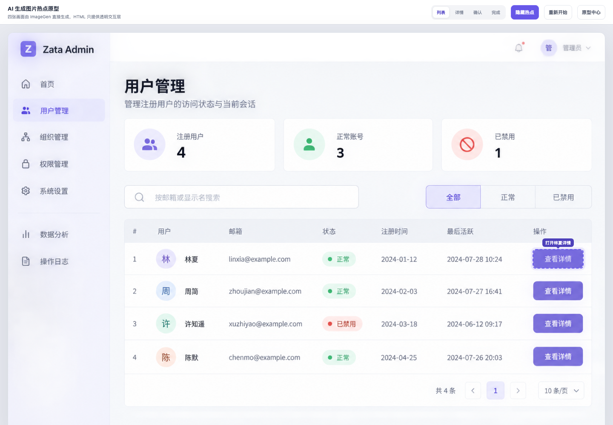

# AI 生成图片热点原型

[打开 AI 生成图片热点原型](admin-users-ai-image-hotspot.html)



这个案例的四张界面均由 ImageGen 直接生成或基于上一张生成图编辑得到，没有使用浏览器截图作为原型画面。HTML 只负责热点、状态条和图片切换。

```text
AI 列表图
→ AI 详情抽屉图
→ AI 确认弹窗图
→ AI 操作成功图
```

每张图片旁边都有同名 `.prompt.md`，记录完整提示词、参考图、保持不变区域和本次状态变化，可以继续使用原图与提示词进行编辑。

## 图片与提示词

- [`ai-users-list.png`](assets/ai-users-list.png) / [`ai-users-list.prompt.md`](assets/ai-users-list.prompt.md)
- [`ai-users-detail.png`](assets/ai-users-detail.png) / [`ai-users-detail.prompt.md`](assets/ai-users-detail.prompt.md)
- [`ai-users-confirm.png`](assets/ai-users-confirm.png) / [`ai-users-confirm.prompt.md`](assets/ai-users-confirm.prompt.md)
- [`ai-users-success.png`](assets/ai-users-success.png) / [`ai-users-success.prompt.md`](assets/ai-users-success.prompt.md)

这是 **AI-generated image-state interactive prototype / component preview**，不连接真实 API。
