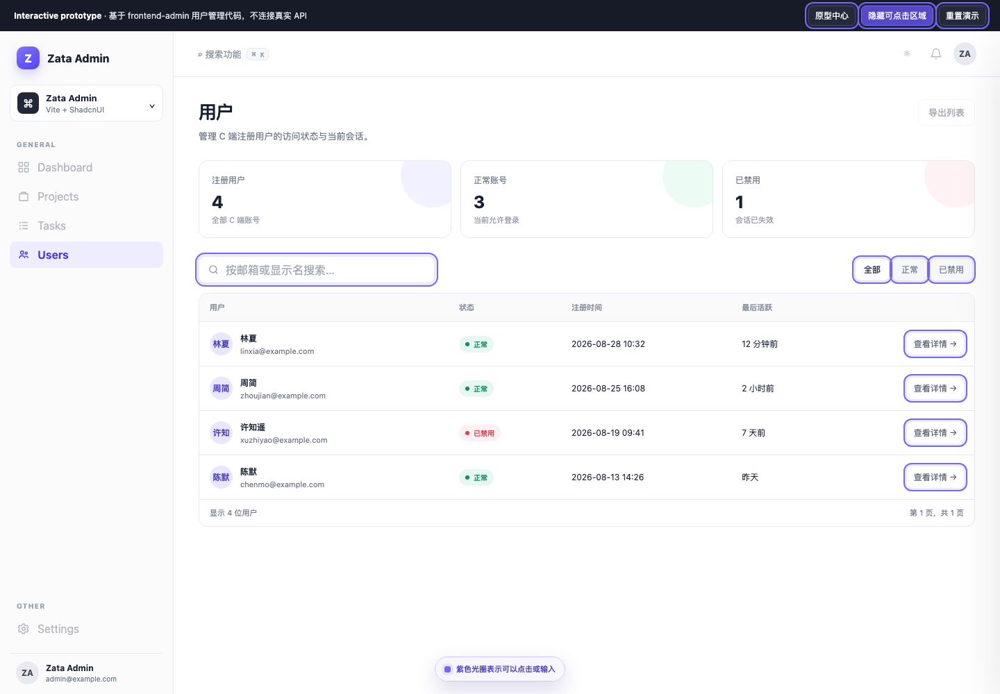
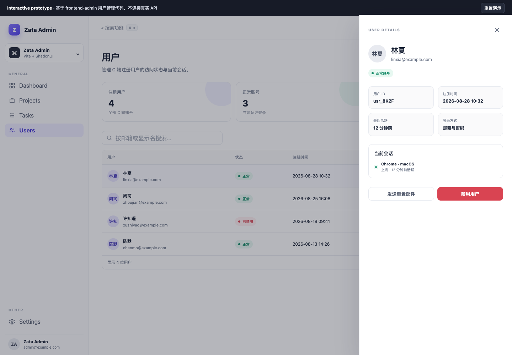

# 后台用户管理交互原型

[打开交互原型](admin-users-interactive.html)

## 最终画面





## 设计依据

原型来自现有后台用户管理功能：

- 页面：`frontend-admin/src/features/users/index.tsx`
- API：`frontend-admin/src/api/users.ts`
- 导航：`frontend-admin/src/components/layout/data/sidebar-data.ts`
- 主题变量：`frontend-admin/src/styles/theme.css`

保留了现有的搜索、正常/已禁用状态和启用/禁用确认流程；统计摘要、状态筛选和用户详情抽屉用于探索更完整的管理体验。

## 可交互状态

```text
用户列表
→ 搜索或状态筛选
→ 打开用户详情
→ 启用/禁用确认
→ 处理中
→ 状态更新与 Toast 反馈
```

可以点击“重置演示”恢复初始状态。抽屉和确认框支持点击遮罩或按 `Escape` 关闭。

页面顶部的“显示/隐藏可点击区域”用于切换交互提示。紫色光圈标识当前可以点击或输入的元素；未实现的控件保持禁用状态，不提供虚假的点击反馈。

## 原型边界

这是 **interactive prototype / component preview**。用户数据和请求延迟由页面内 JavaScript 模拟，没有连接真实 API，也不构成功能验收或 E2E 证据。
