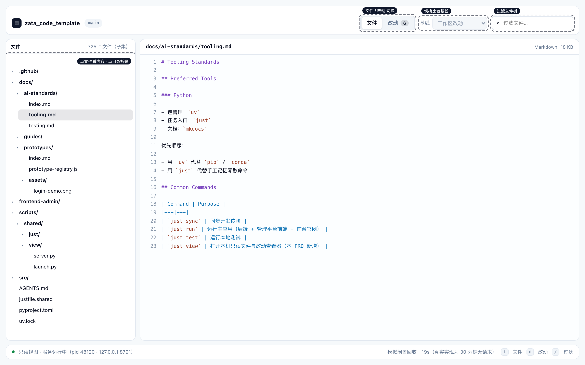
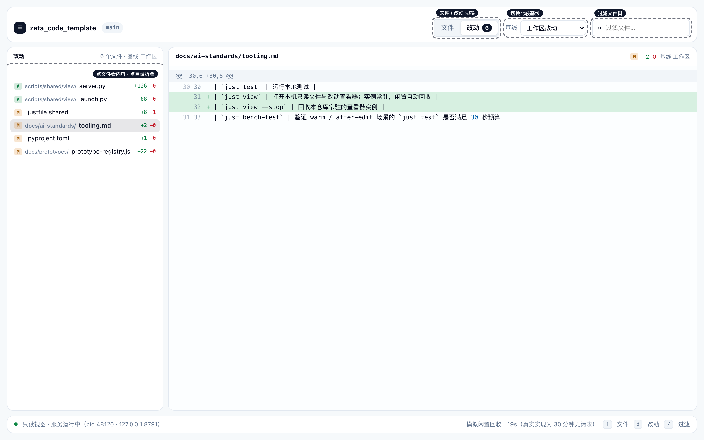
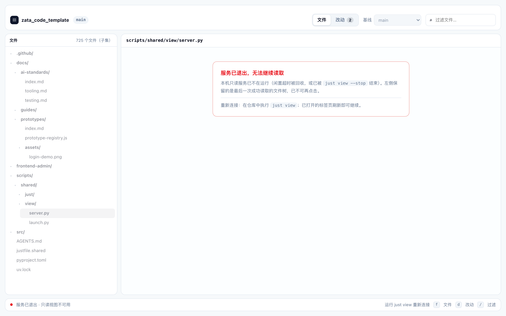

# 只读文件与改动查看器交互原型

[打开交互原型](file-viewer-interactive.html)

## 最终画面







## 设计依据

本查看器是一条新的本机工具命令，仓库里没有对应的产品页面，因此原型的设计依据分两部分：

**设计令牌与评审工具层（取自真实代码）**

- 设计令牌：`frontend-admin/src/styles/theme.css` 的 `:root`（oklch 令牌与 `--radius`）
- 评审工具层：`docs/prototypes/shared.css` 与 `docs/prototypes/login-demo.html` 的 prototype chrome 约定（底部毛玻璃 Dock、可点击区域开关、重置）

**数据与结构（取自真实仓库与需求）**

- 文件路径与目录结构：本仓库真实路径
- 文件内容：`docs/ai-standards/tooling.md`、`AGENTS.md`、`frontend-admin/src/styles/theme.css`、`justfile.shared` 为真实文件片段
- 「文件过大」示例：`uv.lock`（287 KB / 1798 行，超过 256 KiB 渲染上限）
- 「二进制文件」示例：`docs/prototypes/assets/login-demo.png`（42 KB）
- 仓库规模：725 个受版本控制文件
- 命令面与状态模型：`tasks/pending/P2-FEAT-20260921-111233-local-file-diff-viewer.md` 的 §6 / §7.1 / §7.7

## 可交互状态

```text
文件视图（默认，选中 docs/ai-standards/tooling.md）
→ 点左树文件 → 右侧切换为该文件内容（行号 + 语法高亮）
→ 点目录 → 折叠 / 展开
→ 顶部切到「改动」→ 左树只列改动文件（含 A/M 徽标与 +N -M）
→ 选中改动文件 → 右侧显示逐行 diff
→ 切换基线 main → 改动文件从 6 个减到 2 个
→ 切换基线 v1.2.0 → 空态「该基线与当前分支没有差异」
→ 过滤框输入 view → 文件树按路径过滤，命中路径的祖先目录自动展开
→ 点 uv.lock → 文件过大提示（不渲染正文）
→ 点 login-demo.png → 二进制文件提示
→ 闲置 20 秒（状态条有倒计时）→ 服务退出态 + 左侧置灰不可点
```

键盘：`f` 切文件视图、`d` 切改动视图、`/` 聚焦过滤框、`Escape` 关闭说明浮层。
Dock 的「重置」恢复初始状态并重启倒计时；「显示/隐藏可点击区域」切换交互提示。

**为什么空闲只等 20 秒**：真实实现的空闲口径是「30 分钟无任何请求即回收服务」，等待太久无法在评审里演示，
因此原型把它压缩成 20 秒并在状态条标注真实值。这个状态也可以从「说明」浮层里的按钮立即触发。

## 原型边界

这是 **interactive prototype / component preview**。文件树、文件内容与 diff 全部是页面内的本地 fixture，
**没有连接任何真实只读接口**，不构成功能验收或 E2E 证据。

未覆盖、需要由实现与验收覆盖的部分：

- 真实的 `git` 执行、文件读取、语法高亮渲染与路径越界防护
- 常驻实例的登记文件读写、陈旧实例识别、进程存活与端口探测
- 复用命中与冷启动两条路径的真实耗时（原型状态条上的 pid 与端口是示意值）
- 真实浏览器冷启动耗时（实测 1.5–3s，PRD 明确不计入性能承诺）
- 700+ 文件规模下的真实文件树性能与懒加载策略

## 来源与旁车

- 截图旁车（浏览器截图，非 AI 生成）：`assets/file-viewer-interactive.source.md`
- 对应 PRD：`tasks/pending/P2-FEAT-20260921-111233-local-file-diff-viewer.md`
- Hub 入口：[可点击原型中心](prototype-hub.html)
