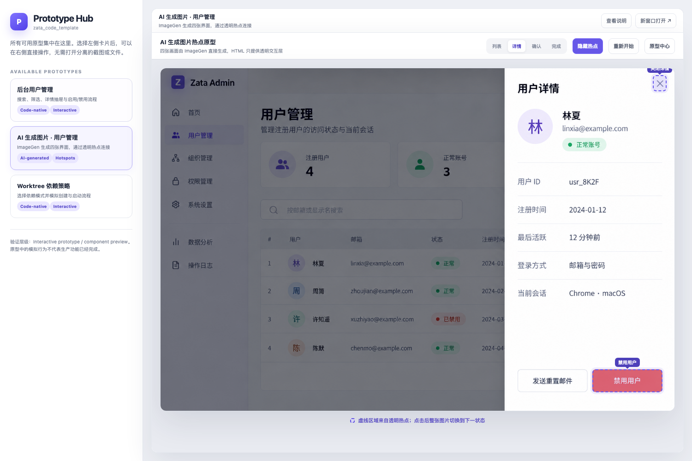

# 原型演示

本目录用于承载 PRD 关联的可交互原型页面，目标是让评审和开发在文档站点内直接操作关键流程。

## 使用方式

1. 在对应 PRD 的 `Implementation Guide` 中写明原型文件路径。
2. 原型页面放在 `docs/prototypes/`，静态资源放在 `docs/prototypes/assets/`。
3. 原型页面应提供最小交互（例如 Start / Next / Reset）和可见状态变化。
4. 资源命名使用通用约定，优先引用 `assets/prototype.css` 与 `assets/prototype.js`。

## 示例入口

- [可点击原型中心](prototype-hub.html)
- [后台用户管理交互原型](admin-users-interactive.md)
- [AI 生成图片热点原型](admin-users-ai-image-hotspot.md)
- [PRD Demo 可交互原型](prd-demo.html)
- [登录页交互原型](login-demo.md)
- [只读文件与改动查看器交互原型](file-viewer-interactive.md)
- [Assets 命名规范](assets/README.md)

## 设计约束

- 仅用于需求评审与流程演示，不替代正式前端实现。
- 保持移动端可操作，避免仅桌面可用。
- 页面内应提供回链到 PRD 或规范文档的入口。
