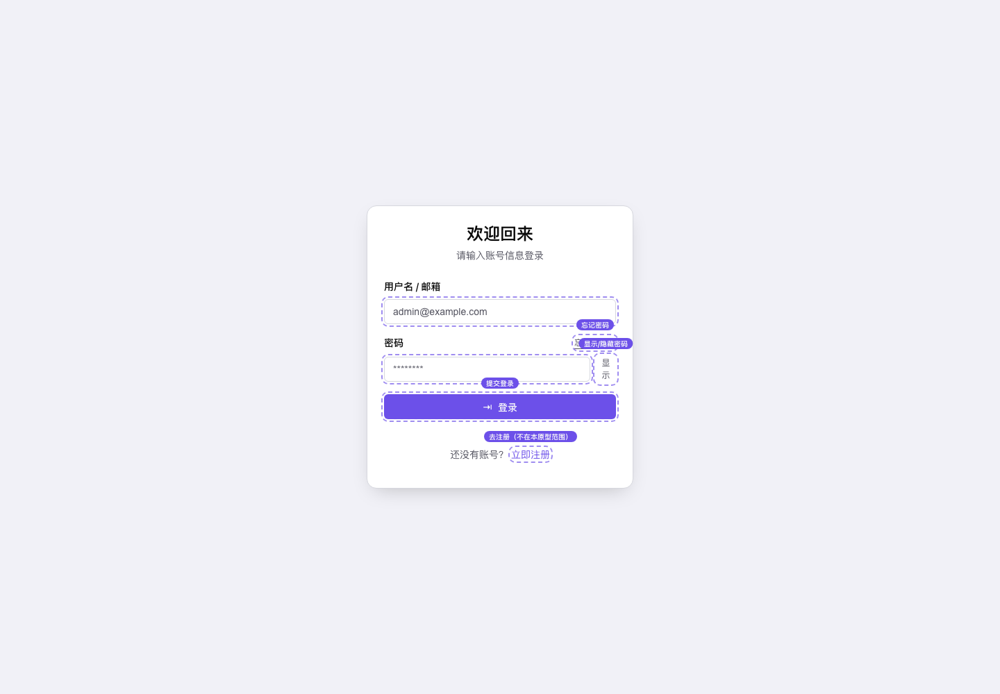

# 登录页交互原型

[打开交互原型](login-demo.html)

## 最终画面



## 设计依据

原型来自现有用户侧登录页：

- 页面：`frontend-public/app/(auth)/login/page.tsx`
- 表单：`frontend-public/app/(auth)/login/login-form.tsx`
- 外层布局：`frontend-public/app/(auth)/layout.tsx`
- 设计令牌：`frontend-public/app/globals.css` 的 `:root`
- 文案：`frontend-public/messages/zh.json` 的 `auth` / `errors` / `toast` 命名空间

保留了现有的标题副标题、`用户名 / 邮箱` 与 `密码` 字段、`忘记密码？`、「还没有账号？→ 立即注册」，
以及必填校验消息（`请输入用户名或邮箱` / `请输入密码`）、提交中禁用与成功/失败 Toast 反馈。

## 可交互状态

```text
登录页（默认）
→ 留空点「登录」→ 两个字段分别报必填错误
→ 填写后提交 → loading（按钮转圈并禁用输入）
→ 成功（密码填非 wrong，提示「登录成功」）
→ 失败（密码填 wrong，提示「登录失败」并给出 401 内联错误）
```

另外可切换密码明文/掩码；「忘记密码？」与「立即注册」为范围外提示，不做真实跳转。
可以点击 Dock 的「重置」恢复初始状态。

Dock 的「显示/隐藏可点击区域」用于切换交互提示；未实现的控件保持静态，不提供虚假的点击反馈。

## 原型边界

这是 **interactive prototype / component preview**。请求延迟与登录结果由页面内 JavaScript 模拟，
没有连接真实 API，也不构成功能验收或 E2E 证据。

未覆盖：真实鉴权、`redirect` 查询参数落地、注册页与找回密码页、限流（429）与网络失败等平台级错误、多语言切换。

## 来源与旁车

- 预览图旁车（浏览器截图，非 AI 生成）：`assets/login-demo.source.md`
- Hub 入口：[可点击原型中心](prototype-hub.html)
