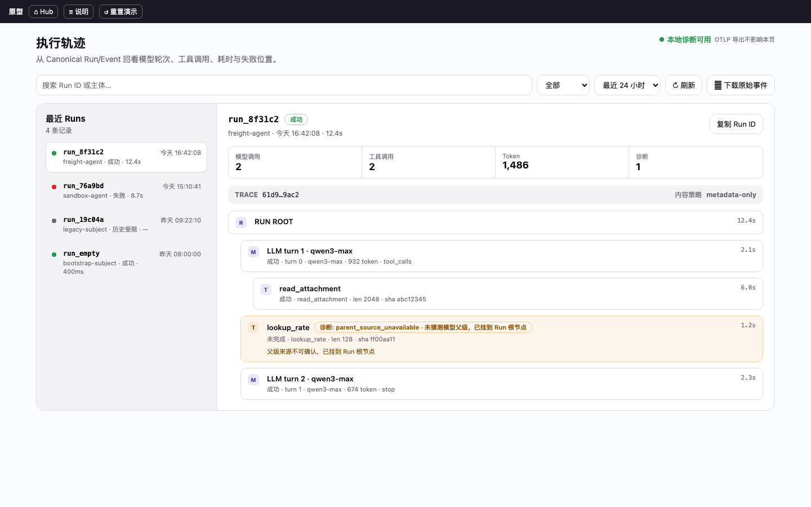

# Run 执行轨迹交互原型

[打开交互原型](run-tracing.html)

## 最终画面



## 设计依据

原型来自本模板已实现的 Admin 执行轨迹页：

- 页面：`frontend-admin/src/features/run-tracing/index.tsx`
- 节点树：`frontend-admin/src/features/run-tracing/trace-tree.tsx`
- 文案：`frontend-admin/src/locales/zh.json` 的 `runTracing` 命名空间
- 接口契约：`GET /admin/run-traces`、`GET /admin/run-traces/{run_id}`、`.../export`
- 设计令牌：`frontend-admin/src/styles/index.css`

保留了列表 / 详情两栏布局、筛选与刷新、Run 摘要四宫格、`TRACE` 上下文条、`metadata-only`
内容策略，以及以唯一 `RUN ROOT` 为根的模型 / 工具节点树。

## 可交互状态

```text
执行轨迹页（默认：run_8f31c2，成功，2 模型 + 2 工具 + 1 个父级 fallback）
→ 点击左侧任一 Run → 右侧详情切换
→ 搜索框过滤 Run 列表（输入即筛，无命中时显示空态）
→ 状态筛选「成功 / 失败 / 运行中 / 历史受限」
→ run_76a9bd → 失败节点（provider_timeout 错误码与红色样式）
→ run_19c04a → 历史受限（limited visibility，不伪造根节点）
→ run_empty  → 空轨迹（仅 RUN ROOT，提示「没有模型或工具步骤」）
→ 未终结 Run 的「下载原始事件」保持禁用；终态可点，仅弹出原型提示
→ 「复制 Run ID」弹出原型提示；「重置演示」恢复初始状态
```

## 原型边界

这是 **interactive prototype / component preview**。数据为页面内 JavaScript fixture，
未连接任何生产 API，也不构成功能验收或 E2E 证据。

未覆盖：真实鉴权与 401、分页翻页、时间范围真实过滤、OTLP 导出、i18n 实时切换、
网络错误与加载骨架的真实时序。

## 来源与旁车

- 预览图旁车（浏览器截图，非 AI 生成）：`assets/run-tracing.source.md`
- Hub 入口：[可点击原型中心](prototype-hub.html)
