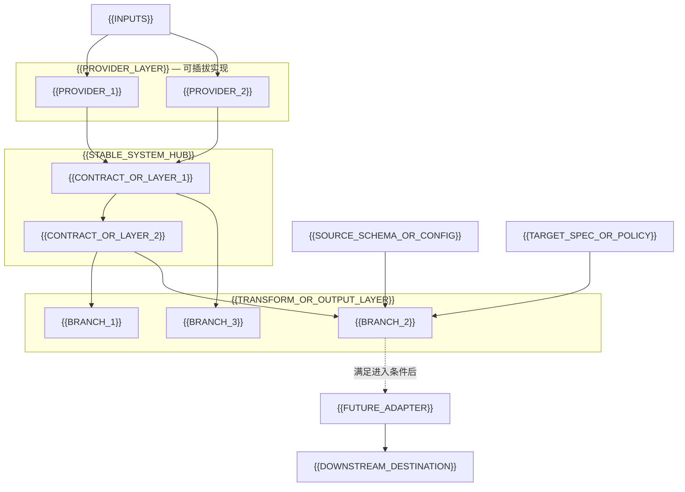
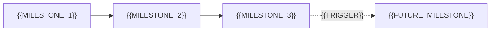

# {{PROJECT_NAME}} Roadmap

> **项目定位**：{{CURRENT_PRODUCT_SCOPE}}；长期演进为 {{NORTH_STAR}}。
>
> **最后更新**：{{YYYY-MM-DD}}

## 目标架构

{{EXPLAIN_THE_MOST_IMPORTANT_BOUNDARY_IN_ONE_PARAGRAPH}}

### 不变的架构决策

1. **{{DECISION_1}}**：{{RATIONALE_1}}。
2. **{{DECISION_2}}**：{{RATIONALE_2}}。
3. **{{DECISION_3}}**：{{RATIONALE_3}}。

---

## 文档职责与状态约定

本页回答：**为什么做、先做什么、怎样算完成**。详细契约和任务状态由以下权威来源维护：

- 架构：`{{ARCHITECTURE_DOC_PATH}}`
- 当前任务：`{{ACTIVE_TASK_SOURCE}}`
- 完成证据：`{{ARCHIVE_OR_EVIDENCE_SOURCE}}`

| 状态 | 含义 |
|------|------|
| ✅ 已完成 | 有验收证据并已归档 |
| 🚧 当前 | 当前交付主线 |
| 🧭 下一步 | 当前主线完成后进入交付 |
| 💡 候选 | 尚未承诺资源或时间 |
| ⏸ 暂不做 | 满足触发条件后再立项 |

---

## 当前执行摘要

| 时间视野 | 重点 | 预期结果 |
|----------|------|----------|
| **Now** | {{NOW_FOCUS}} | {{NOW_OUTCOME}} |
| **Next** | {{NEXT_FOCUS}} | {{NEXT_OUTCOME}} |
| **Later** | {{LATER_FOCUS}} | {{LATER_OUTCOME}} |
| **Not now** | {{NOT_NOW_SCOPE}} | {{WHY_NOT_NOW}} |

## 当前关键路径

---

## 交付里程碑

### M1：{{MILESTONE_NAME}} 🚧 当前

**结果**：{{USER_OR_SYSTEM_OUTCOME}}

**完成标准**：

- {{REAL_ENTRY_EVIDENCE}}
- {{QUALITY_OR_RELIABILITY_EVIDENCE}}
- {{NEGATIVE_OR_FAILURE_EVIDENCE}}

**依赖/进入条件**：{{DEPENDENCIES}}

**执行入口**：

- [`{{TASK_NAME}}`]({{TASK_PATH}})

### M2：{{MILESTONE_NAME}} 🧭 下一步

**结果**：{{USER_OR_SYSTEM_OUTCOME}}

**完成标准**：

- {{EXIT_CRITERION_1}}
- {{EXIT_CRITERION_2}}

**依赖/进入条件**：{{DEPENDENCIES}}

---

## 路线图指标

| 维度 | 核心指标 | 基线/目标来源 |
|------|----------|---------------|
| 质量 | {{QUALITY_METRICS}} | {{SOURCE}} |
| 人工成本 | {{HUMAN_EFFORT_METRICS}} | {{SOURCE}} |
| 稳定性 | {{RELIABILITY_METRICS}} | {{SOURCE}} |
| 性能与成本 | {{PERFORMANCE_COST_METRICS}} | {{SOURCE}} |

---

## 风险与技术债务

| 项目 | 优先级 | 影响 | 退出标准 |
|------|--------|------|----------|
| {{RISK_OR_DEBT}} | {{PRIORITY}} | {{IMPACT}} | {{EXIT_CRITERIA}} |

---

## 已完成的基础能力

- **{{CAPABILITY_GROUP}}**：{{COMPACT_SUMMARY}}；

历史完成项不持续堆叠在本页；仅保留对后续决策仍有影响的能力摘要。
