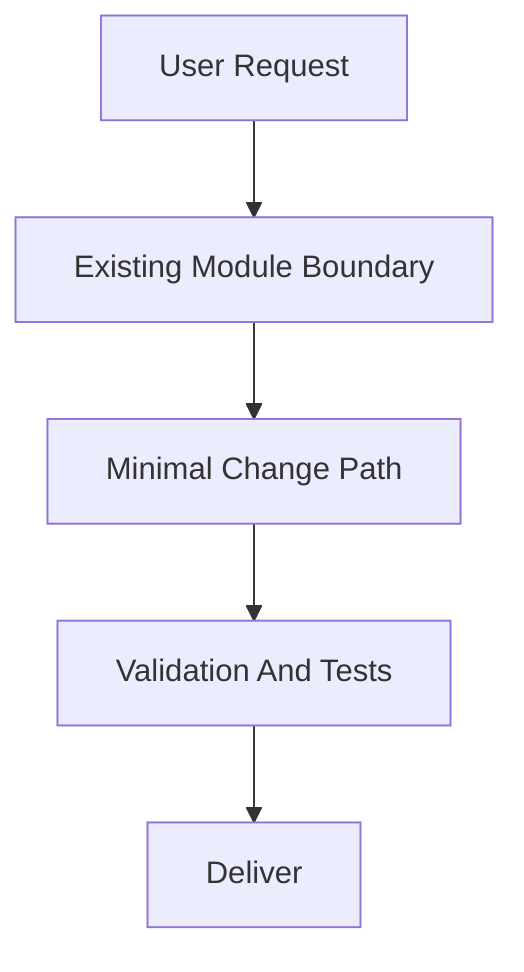
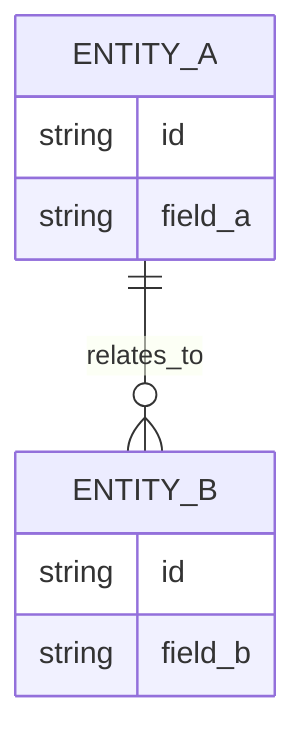

# PRD: [Feature Name]

> ✅ **交付前置**：无，可立即开工。（有依赖时改用 ⛔ 并指明上游 PRD 与顺序原因）
> 结构化声明见 §8 Delivery Dependencies，**那里是唯一事实源**。

> ⬜ **验收状态**：未开工。（实现与自动验证完成、仅剩 Human-Confirmed 项时改为 🧍 待人工验收；§9 全部勾选后改为 ✅ 可归档）
> 本行是 §9 Acceptance Checklist 的投影，**那里是唯一事实源**。

> 本 PRD 分两个 altitude，分别服务不同读者，自上而下阅读：
>
> - **Part A · 人审层 (Review Layer)** — 需求方 / 验收人读这部分，决定"该不该做、做得对不对"，并通过风险地图知道**哪些地方必须亲自确认**。Part A 不出现实现机制、文件路径、命令。
> - **Part B · 执行器层 (Build Layer)** — 实现者（人或 Agent）读这部分动手。人只在 Part A 风险地图**点名处**下钻审查，其余默认交执行器 + 自动门禁（hook / 测试 / 架构检查）。

---

# Part A · 人审层 (Review Layer)

## 1. Introduction & Goals

### Problem Statement

[用大白话说明现在发生了什么、谁受到影响、造成什么实际问题。尽量包含至少一个从仓库确认的现状事实，例如重复调用、旧依赖、实际错误或扩展阻塞；不要只写“边界不清晰”。只讲问题，不讲方案、文件或命令。]

### Interpretation (解读回显)

这是你**前置批准**的对象，也是唯一能拦住"解读错了"的关卡——oracle 和实现都是同一份解读的产物，解读错了它们会互相印证，下游检查全绿在错的行为上。散文没法逐条否证，所以先给可以逐格改的具体样例。

| 验证方式 | 输入 / 操作 | 期望观察到的结果 |
|---|---|---|
| 👀 人审 + 自动验证 | [需要人查看的用户可感知行为] | [具体、可观测的结果] |
| 🤖 自动验证 | [第二个正常场景] | [期望结果] |
| 🤖 自动验证 | [一个边界场景] | [期望结果] |
| 🤖 自动验证 | [一个失败场景] | [期望的失败表现，不是"报错"] |

`👀 人审 + 自动验证` 表示自动断言之外还需人检查呈递的用户可感知结果；对应 §7.6 `reviewer: human`，必须填写 `presentation`。`🤖 自动验证` 表示自动 oracle 和 verifier 证据审查足够；对应 `reviewer: verifier`，不产生产品人审勾选。这个标记是审阅元数据，不属于行为 oracle；各行的“输入 / 操作”和“期望观察到的结果”须与 §7.6 中对应 oracle 的行为和预期逐项一致，命令、`rv-id` 和证据链放在 Part B。

表中只放当前仍成立的行为。行为被后续决策取代时，从样例表删除旧行，并在适当的变更记录中保留必要历史；不要把划线、打叉或标成“已取代”的过期决策继续留作当前验收 oracle。

**我默默定了这些**（没问你、我自己定的歧义点）

- [歧义点 → 我选的答案]
- [歧义点 → 我选的答案]

**我理解为不做**（你可能想要、但我读成不在范围内的）

- [可能被期待但排除的能力]
- [可能被期待但排除的能力]

[最后写可否证的散文解读："读成 X，不是 Y"。说明目标行为、会改变方案含义的关键边界和明确不做什么。保留强制路径、正式模式、禁止旧路径、失败语义和兼容承诺；把必要术语写成"大白话（内部名称）"。不放文件路径、类名和命令。]

### What The User Gets

[白话描述交付后使用者（终端用户 / 调用方 / 运维）拿到什么能力、什么行为变化。站在使用者视角，禁止出现实现机制、模块路径、命令。机制写在 Part B 第 6 节。]

### Measurable Objectives

- [可明确判定通过或失败的行为结果]
- [必须保持不变的兼容结果]
- [禁止路径或失败语义的可验证结果]

[不要写“更清晰”“更易维护”“能被描述为”等无法直接验收的目标。]

---

## 2. Human Review Map (介入与风险地图)

这一节只列需要人判断的决策。文件移动、代码检查、构建和回归测试由执行器完成，不要求 reviewer 逐项阅读实现细节。

### 决策一：[用业务语言描述需要确认的决定]

[用一到两段自然语言说明建议、为什么重要以及主要风险。保留会限制实现的强制路径、正式模式、禁止行为、失败语义、数据完整性和兼容范围；不要因为改成大白话而删除它们，也不要机械拆成“建议 / 原因 / 风险 / 如何证明”多个小节。]

**请确认：** [写成 reviewer 可以直接回答的问题。]

**验收：** [用一句白话说明通过什么真实使用路径、看到什么结果，能证明该决定实现正确。命令和 rv-id 留在 Part B。]

### 决策二：[仅在确有第二个需要人工确认的决定时保留]

[同上。没有第二项就删除本段，不要为了模板凑数。]

**请确认：** [明确问题。]

**验收：** [可观察的通过标准。]

### 自动门禁，不需要逐项人工审阅

- [普通实现工作及能判别其失败的自动门禁，用业务结果概括，不写命令或 rv-id。]

### 本次明确不涉及

[用一句话说明数据库、鉴权、计费、破坏性操作、并发等真正不在范围内的高风险事项。若 schema 有变化，则改为在对应决策下展示 ER 图。]

---

## 3. Usage And Impact After Implementation

写 PRD 时即填写，描述实现后的**目标态使用脚本**（消费者视角），作为构建目标和回头验证的依据；不是事后日志。先识别所有经过本次修改流程的角色，即使入口和操作不变，也要明确说明“不变”。删除某类角色前，确认其真实入口不经过本次修改流程。完整命令和验证脚本留在 Part B。

### [直接使用者的真实角色名称]

[从哪里进入、做什么、看到什么；哪些变化、哪些保持不变。]

### [管理 / 审核角色，存在时保留]

[管理或审核什么、从哪里查看、结果如何变化或保持不变。]

### [运行 / 接入 / 开发角色，存在时保留]

[如何运行、排障或扩展，应使用什么公开边界。]

### Impact On Existing Behavior
- [What stays unchanged for existing users/data/config]
- [Any new optional config/env and its default-off behavior; existing paths must keep working]

If the change is purely internal:
- `No user-facing usage change; internal-only change.`

---

## 4. Requirement Shape

- Actor: [必须覆盖 Section 3 中的实际角色，不得遗漏直接使用者]
- Trigger: [何时触发]
- Expected behavior: [系统应做什么]
- Scope boundary: [本 PRD 不覆盖什么]

---

# Part B · 执行器层 (Build Layer)

> 以下供实现者（人或 Agent）使用。人只在 Part A 风险地图点名处下钻审查；其余默认交执行器 + 自动门禁。

## 5. Repository Context And Architecture Fit

- Existing path: [Closest current module or code path]
- Reuse candidates: [Files/modules to extend directly]
- Architecture pattern to preserve: [Relevant boundary or dependency direction]
- Frontend impact: [which frontend app(s) the repo ships and which change + closest routes/components, or "No frontend impact" with reason]
- Existing PRD relationship: [Result of checking tasks/pending/ first and relevant tasks/archive/ second: duplicate / depends on / blocks / independent / none found]
- Redundancy risks: [Likely duplication or parallel abstraction risks]

---

## 6. Recommendation

### Recommended Approach
- Approach: [Extend the best existing path or justify the smallest necessary new piece]
- Why this is the best fit: [Why this best fits the current architecture]
- Rejected redundancy: [What extra layer, module, or dependency was intentionally avoided]

### Proposed Solution Summary (实现机制)

[实现方向，给实现者看：核心机制 / 架构路径、谁提供必要的声明·配置·输入（系统是推断还是只消费显式数据）、插入到哪个现有入口 / 模块边界 / API / 工作流 / UI、主要 state·output·用户可见行为变化、刻意避免的复杂度（如新存储、并行抽象、改动的状态机）。]

### Alternatives Considered (Only When Useful)
- Alternative: [Meaningful non-trivial alternative]
- Why not chosen: [Why it adds unnecessary risk, scope, or complexity]

---

## 7. Implementation Guide

This section is a living implementation guide based on current repository analysis. If implementation discovers additional affected files, hidden dependencies, edge cases, or a better path, update this PRD before proceeding.

### 7.1 Core Logic
- [How data and control move through the existing system]

### 7.2 Change Impact Tree

```text
.
├── [Backend Layer]
│   └── [path/to/file]
│       [新增] / [修改] / [删除]
│       【总结】[One-sentence summary of the file-level change]
│
│       ├── [Concrete logical change 1; use symbol/config/route anchors, not line numbers]
│       ├── [Concrete logical change 2; include rg anchor when useful]
│       └── [Concrete logical change 3]
│
└── Frontend ([repo's frontend app])   # 用户可见改动时必填；纯后端任务写 "No frontend impact"
    └── [frontend-app]/[path/to/component-or-route]
        [新增] / [修改] / [删除]
        【总结】[组件/路由/状态/API 客户端调用的一句话总结]

        ├── [组件或页面改动]
        ├── [调用后端 API 的客户端代码与类型同步]
        └── [状态或交互改动]
```

### 7.3 Executor Drift Guard

The file list above is the expected implementation surface from current repository analysis. During implementation, treat it as a starting point and use these repository searches to catch hidden references or drift before marking the PRD complete.

| Check | Command | Expected Result | If It Fails, Inspect First |
|---|---|---|---|
| [Legacy reference search] | `rg -n "[legacy-symbol-or-path]" [scope]` | [No obsolete references remain / only approved references remain] | [Config keys, build context, working directory, route, import, or docs area] |
| [Target reference search] | `rg -n "[new-symbol-or-path]" [scope]` | [Expected target references exist in the owning files] | [Composition root, entry command, generated config, or docs index] |
| [Hidden entry point search] | `rg -n "[command|env|artifact|route-pattern]" [scope]` | [No unreviewed entry points bypass the new target state] | [CI, scripts, Docker, deployment, README, IDE config] |

### 7.4 Flow Or Architecture Diagram



### 7.5 ER Diagram (Only When Data Model Changes)

> 与 Part A 第 2 节"数据库结构评审"联动：本图是人审依据，schema 变化时必出。



If not required:
- `No data model changes in this PRD.`

### 7.6 Realistic Validation Plan (Oracle 块)

机读 + 执行追踪的**单一 oracle 源**：§9 证据包和任何确定性抽取器都引用 / 解析这里的 `id`。不要把命令、边界字段或 `rv-id` 复制到 Part A；Part A 每个人审决策至少在这里对应一条 oracle。

证据深度按 `tier` 走：`R0`/`R1` 只写"总是必填"那几项，`R2` 加证据链，`R3`/人审项再加负控。不写 `tier` 视为 `R3`，背全套。一份 PRD 超过 3 条 `R2`/`R3` 是范围信号，先回去看 §3.4 拆分。

```yaml
- id: rv-1
  # --- 总是必填 ---
  behavior: 这条证明的用户可见行为(白话)
  real_entry: "用户真正会敲的命令 / URL / 入口"      # 真实入口,不是单测/helper
  expected: "看到什么算它真的成立(可观测)"
  mock_boundary: "什么可 mock、什么必须真"           # under-test 的那层不准 mock
  tier: R0|R1|R2|R3                                  # 取自 §7.3 风险分级登记
  test_layer: unit|integration|e2e|smoke|sandbox|manual
  required_for_acceptance: true
  # --- 仅 R2 / R3 必填 ---
  critical_value_source: "URL/token/ID/命令/载荷必须从哪个真实 UI/响应/剪贴板取得"
  must_cross: "必须依次穿过的真实边界: UI -> proxy -> canonical API -> commit -> fresh read"
  forbidden_bypasses: "禁止 helper/重构值/直调 service/fake adapter/legacy 或兼容路由"
  fresh_state_probe: "动作完成后由新 browser/request/process/DB session 独立观察什么"
  final_tree_evidence: "证据如何绑定最终相关代码树，以及哪些改动后必须重跑"
  # --- 仅 R3 / 人审项必填 ---
  negative_control: "什么命令 / 种个 bug 能让它变红"  # 判别力:证明这测试会失败
  expected_fail: "红的时候长什么样"
```

Failure triage:
- `real_entry` 跑挂,先查 `[第一处 config / 路径 / 边界]`,别急着改实现策略。
- 生产 / 供应商 / 需凭据的项标 `opt-in / post-merge`;无凭据时必须有仍可跑的 fallback。
- UI 产生的关键值必须从 UI 原样提取再消费；写操作必须跨 commit 后由 fresh state 独立读取；已归档 PASS 若被真实运行反驳，立即失效并重新验收。
- **禁止为了让 oracle 能变红去改生产代码**（故障注入开关、失败模式、test-only 配置项、计数器、观测钩子）。合法来源依次是：实现前先跑红的那次运行、测试边界打桩、`tests/` 下的 fake/子类。都不行就写 `negative_control: not feasible — <原因>` 并省略 `expected_fail`。

无可执行行为时,本块写：
- `No executable behavior changes; realistic validation is limited to documentation/build checks.`

### 7.7 Low-Fidelity Prototype (Only When Required)

```text
+--------------------------------------------------+
| [Main Screen/Module Name]                        |
+--------------------------------------------------+
| [Section A]                                      |
| [Section B]                                      |
| [Section C]                                      |
+--------------------------------------------------+
```

If not required:
- `No low-fidelity prototype required for this PRD.`

### 7.8 Interactive Prototype Change Log (Only When Files Actually Changed)

| File Path | Change Type | Before | After | Why |
|---|---|---|---|---|
| `docs/prototypes/[feature]-demo.html` | Modify/Add | [Old behavior] | [New behavior] | [Reason] |

If no prototype changes:
- `No interactive prototype file changes in this PRD.`

### 7.9 External Validation (Only When Web Research Was Used)

| Topic | Source | Checked On | Relevant Finding | Impact On Recommendation |
|---|---|---|---|---|
| [Vendor/API/standard] | [URL or doc title] | [YYYY-MM-DD] | [Fact] | [Constraint or risk] |

If no external validation was needed:
- `No external validation required; repository evidence was sufficient.`

---

## 8. Delivery Dependencies

工具中立的排期元数据，不是工具专属队列语法。无依赖时显式写 `none`。

- Group: [logical-delivery-group-or-none]
- Depends on tasks/issues:
  - none
- Gate type: none
- Notes: [Use tool-neutral dependency names. Do not put tool-specific hidden markers here.]

---

## 9. Acceptance Checklist

本节分两层读者：**9.1 是给人看的**——验收时只看这一层，目标是几分钟内看完；**9.2 起是给 verifier 和未来回溯用的机器证据**，默认不用打开，出问题再下钻。每项必须带证据（命令输出 / 观察 / 工件引用），不是裸勾。Use task-relevant groups; validate the final target state, not only an interim first phase.

### 9.1 人读呈递区（Human Review Surface）

规则：

- 交付时本表必须填上**实际呈递物路径**；agent 的完成回复必须原样带上本表内容（截图路径 + 自验方式），不允许只甩一句"证据在 tasks/evidence/ 里"。
- **呈递物要可直接打开，不能只给一个文件名**：本地产物给绝对路径 + 一行可执行命令（macOS `open "<绝对路径>"`）；页面、PR、CI 等给可点 URL。
- **视觉产物必须附真实渲染图**：表格、报告、页面这类人审件由**真实文件/真实页面**渲染成图片（不能用重建的复刻图冒充）。
- **图必须就地嵌，`open` 命令不能替代嵌图**：在本 PRD 与证据报告里用 `` 嵌入，例如 ``——报告与图片同目录，本地 Markdown 预览直接渲染。图片被 `.gitignore` 排除、在 GitHub 上是坏图，这正是那句「本地图片，GitHub 上不显示」要解释的事，也是 `open "<绝对路径>"` 兜底的原因。每张图三件套齐发、顺序固定：**嵌图 → 本地标注 → open 命令**；只发后两件不算呈递——让人先粘一条命令才能看见截图，等于什么也没给他看。录屏无法内联渲染，免嵌图，只给 open 命令。
- **"想自己复核？"要精确到看哪里、期望看到什么**（某张表的某列、某页的某个字段、旧值→新值），不要写"打开看看"。
- 截图落在 `tasks/evidence/<prd-slug>/`，并标注验证层级（real user flow / component preview）；涉及 Dialog、Portal、父级布局或用户流程时保留生产边界。
- 证据报告 `<prd-slug>.evidence-report.md` 的**首节必须是同一份「人审导航」**（同样的就地嵌图、打开命令、逐项期望值，另加 PR/CI 链接与"执行者已替你核对过什么"）——人只看这一节就知道要不要点开、点开看哪。
- "想自己复核？"列是可选项：呈递物可信就不用做；不信就花十几秒自己点。

| # | 你要看什么（对应 oracle） | 呈递物（交付时填实际路径） | 想自己复核？ |
|---|---|---|---|
| 1 | [reviewer: human oracle 的白话结果] | [截图 / 录屏 / URL / 产物文件路径] | [一条十几秒可完成的自助复核动作] |

**以下项不需要你看**（`reviewer: verifier`，agent 自验 + verifier 复核，挂了会自己红）：[列出 verifier-only 的 oracle / 门禁组]。它们的证据在 §9.2。

### 9.2 Acceptance Evidence Package（机器证据 · verifier 入口，人默认跳过）

1. **人审项的 oracle 跑绿证据**（对应 §9.1 各行，呈递物之外另附命令证据）：[oracle → 通过证据]
2. **verifier-only 项结果**：[reviewer: verifier 的 oracle 输出]
3. **风险地图对账 Predicted → Reconciled**：[实现中有无未预测到的高风险面被触发，如何处理]
4. **对抗自检**：[对自动门禁、明确非范围和关键断言的反方检查结论]
5. **对锁定契约的 diff**：[高风险改动 vs 前置约定的 API 契约 / schema / 行为]
6. **低风险门禁结果（折叠）**：[通用 build / lint / 架构 / 类型检查]

### Human-Confirmed (来自 Part A 风险地图)

> Part A 第 2 节每个"必须人工确认"的决策点，这里都有对应的确认项；oracle 跑绿是机器层前提，**不是**人工勾选对象。

- [ ] [Part A 中需要人确认的业务规则、schema、安全或对外契约决策已逐条确认]
- [ ] §9.1 呈递区各项已亲眼看过（截图 / 自验，二选一或都做）

### Architecture Acceptance

- [ ] [Concrete boundary, directory, ownership, or entry-point outcome]
- [ ] [Concrete layering or composition-root outcome]

### Dependency Acceptance

- [ ] [Concrete import, port, adapter, or dependency-direction constraint]
- [ ] [Concrete contract-compatibility or forbidden-dependency constraint]

### Behavior Acceptance

- [ ] [Concrete API, workflow, runtime, or business behavior outcome]
- [ ] [Concrete compatibility or invariance that must remain true]

### Frontend Acceptance (When A Frontend App Changes)

- [ ] `[frontend-app]/[component or route]` renders/behaves as specified
- [ ] Frontend calls the new/changed backend endpoint with the correct contract and synced types
- [ ] If no frontend changes: `No frontend impact` recorded with a reason

### Documentation Acceptance

- [ ] [Concrete doc page or reference updated to match the target design]
- [ ] [PRD and repository docs stay aligned with the final architecture direction]

### Validation Acceptance

- [ ] `[validation command]` passes
- [ ] `[real entry command]` exercises the changed behavior through `[API/CLI/UI/job/startup/migration]` without bypassing `[critical boundary]`
- [ ] Evidence uses the exact `[UI/response/clipboard]` value, crosses `[named boundaries]`, rejects `[forbidden bypasses]`, and proves the postcondition from `[fresh browser/request/process/DB session]`
- [ ] Evidence artifacts identify the final relevant code tree and were recollected after the last change affecting the oracle chain
- [ ] For user-visible changes: the repo's e2e/UI test command or a manual app run confirms the flow end-to-end
- [ ] `[rg search command]` confirms no legacy entry point, duplicate path, or compatibility shim remains
- [ ] `[rg search command]` confirms expected target references exist in the owning files

### Delivery Readiness

- [ ] Recommended approach fully implemented; no unapproved parallel abstraction introduced
- [ ] No open regression or rollout blocker remains
- [ ] §9.1 呈递区的呈递物路径已全部回填，且完成回复已原样带上呈递表内容（只给 evidence 目录链接不算交付）
- [ ] 每个呈递物都带**可直接执行的打开方式**（绝对路径 + `open` 命令或可点 URL）与**逐项期望值**
- [ ] 每张证据静态图都在 PRD 与证据报告里用 `` **就地嵌入**（只给 `open` 命令不算），并在嵌图旁标注「本地图片，GitHub 上不显示」
- [ ] 证据报告首节是同一份「人审导航」，含就地嵌图、打开命令、逐项期望值、PR/CI 链接与"已替你核对过什么"

---

## 10. Functional Requirements

- FR-1: [Requirement statement]
- FR-2: [Requirement statement]
- FR-3: [Requirement statement]

---

## 11. Non-Goals

- [Out-of-scope item 1]
- [Out-of-scope item 2]

---

## 12. Risks And Follow-Ups

- [Unavoidable risk or explicitly approved non-blocking follow-up]

---

## 13. Decision Log

每条记录对应本 PRD 中做出的一个关键决策，归档后作为永久参考。

| # | 决策问题 | 选择 | 放弃的方案 | 理由 |
|---|---|---|---|---|
| D-01 | [决策问题，如"架构模式选择"] | [最终选择] | [放弃的方案] | [一句话说明为什么] |

### Final Reconciliation (Archive Only)

- Interpretation: [confirmed / corrected — summary]
- Public behavior and contracts: [confirmed / corrected — summary]
- Related PRD status: [confirmed / corrected — summary]
- Requirements and risks: [confirmed / corrected — summary]
- Reconciled differences:
  - [none，或列出已经反向修正到正文的差异]
