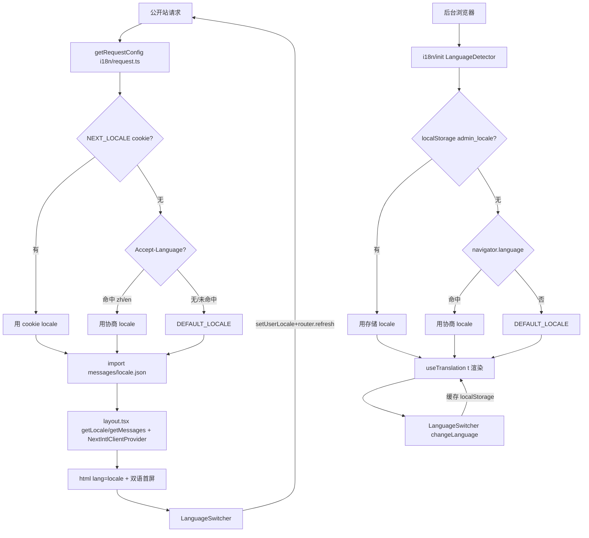

# PRD: 前端界面中英文 i18n 双语能力

> ✅ **交付前置**：无，可立即开工。
> 结构化声明见 §8 Delivery Dependencies，**那里是唯一事实源**。

> ✅ **验收状态**：已完成（rv-1~rv-8 全部跑绿；§9 Human-Confirmed 四项含 D1=en、D2 交付范围、D3 key 命名、§9.1 呈递区第 1~6 行均已由验收人确认）。证据见 §9.2 与 `tasks/evidence/P2-FEAT-20260707-150000-frontend-i18n-bilingual/`。
> 本行是 §9 Acceptance Checklist 的投影，**那里是唯一事实源**。

> 本 PRD 分两个 altitude，分别服务不同读者，自上而下阅读：
>
> - **Part A · 人审层 (Review Layer)** — 需求方 / 验收人读这部分，决定"该不该做、做得对不对"，并通过风险地图知道**哪些地方必须亲自确认**。Part A 不出现实现机制、文件路径、命令。
> - **Part B · 执行器层 (Build Layer)** — 实现者（人或 Agent）读这部分动手。人只在 Part A 风险地图**点名处**下钻审查，其余默认交执行器 + 自动门禁（hook / 测试 / 架构检查）。

## Feature Overview (功能一览)

> 本块是 §10 Functional Requirements 的白话投影，**那里是唯一事实源**；行为验收以 §1 行为样例表为准。

- **公开站自动说对语言**（FR-1）：首次访问按浏览器语言偏好出中/英文，服务端直出对应语言的首屏与 `<html lang>`。
- **后台同样双语**（FR-2）：管理界面按上次选择或浏览器语言呈现中/英文。
- **一键切换、换完记住**（FR-3）：两端导航区有语言切换器，点击整页立即换语言，刷新后保持。
- **核心页面无漏翻**（FR-4）：根布局 metadata、导航、登录注册、仪表盘、设置页全部走文案 key，无硬编码文案。
- **文案文件防缺漏**（FR-5）：`en`/`zh` 两份文案 key 一一对应，脚本校验接入 CI，缺 key 直接拦红。
- **未迁移页面不受伤**（FR-6）：其余业务页面保留现有中文，接入 i18n 后照常渲染不报错。
- **维护方式成文**（FR-7）：新增 i18n 指南页，记录两端架构、cookie/localStorage 约定与新增文案规范。
- 范围边界（§11）：不做后端报错翻译、URL 语言前缀、RTL、机翻文案、文档站多语言、全量页面一次性迁移。

---

# Part A · 人审层 (Review Layer)

## 1. Introduction & Goals

### Problem Statement

当前仓库的两个前端应用（面向终端用户的公开站、面向管理员的后台）所有界面文案都是硬编码中文：标题、导航、按钮、表单标签、错误提示、空状态说明都写死在组件里，`<html lang>` 也固定为 `zh-CN`。没有任何语言切换入口、没有任何文案抽取、没有 locale 协商。对于英文用户（海外协作者、英文环境客户、国际化场景）来说，界面完全不可用；对于维护者来说，每改一处文案都要在组件里穿行，无法统一审校。参考仓库 `freshai` 已经建立了完整的前端 i18n 体系（公开站基于 `next-intl` 的服务端 cookie 模式、后台基于 `react-i18next` 的客户端模式，含 `en`/`zh` 双语文案、语言切换器、`Accept-Language` 协商），本仓库作为同源模板，目前完全缺失这一层能力。

### Interpretation (解读回显)

本次需求被理解为：**参考 `freshai` 的前端 i18n 体系，为本仓库的两个前端应用建立中英文双语能力**。

**行为样例**（这些行会被逐字抄进 §7 Realistic Validation Plan 的验收 oracle——改其中一格，就是在改验收标准）：

| 输入 / 操作 | 期望观察到的结果 |
|---|---|
| 浏览器语言为英文的访客首次打开公开站 | 首屏直接是英文，页面源码 `<html lang="en">` |
| 点语言切换器选"中文" | 整页文案立刻变中文，不需要手动刷新 |
| 切换语言后按 F5 刷新、或关掉浏览器明天再来 | 界面仍是上次选的语言 |
| 浏览器语言是法语（不支持的语言） | 回退到默认 locale，不报错、不出现空白文案 |
| 某个文案 key 只在 `en.json` 加了、忘了加进 `zh.json` | 校验脚本报错并指出缺哪个 key，CI 拦红 |
| 打开还没迁移的业务页面（如 Agent 列表） | 照常显示原有中文，页面不报错 |

**我默默定了这些**：

- 两个前端用各自框架的最佳拍档，不统一成同一个库：公开站 `next-intl`（服务端 cookie 模式）、后台 `react-i18next`（客户端 localStorage 模式）——与 `freshai` 对齐。
- locale 集合只有 `en` + `zh`，不做 URL 前缀路由（`/en/...`），语言选择走 cookie / localStorage。
- 交付分阶段：本次只做基础设施 + 核心页面（根布局、导航、登录注册、仪表盘、设置），其余业务页面列后续清单，不阻塞本次验收。
- 未迁移页面保留现有中文硬编码，不强制一并改造。

**我理解为不做**：

- 后端 API 错误消息的 i18n（界面文案之外的报错文本本次不动）。
- URL 路由前缀式 i18n、RTL 布局、自动机器翻译。
- 文档站点（mkdocs）的多语言。

**前置批准对象**（第一次人类触点）：批准本条 = 同意按这个解读自动实现。三个关键确认点：① 默认 locale 是 `en` 还是 `zh`（建议 `en`，与 `freshai` 一致）；② 交付范围是"基础设施+核心页面"还是"全量一次性迁移"（建议前者）；③ 后端 API 错误消息是否也要 i18n（建议不做）。

### What The User Gets

- 任意访客首次打开公开站时，系统根据浏览器语言偏好（`Accept-Language`）自动选择中/英文；之前手动选过语言的访客，自动恢复其选择。
- 页面右上角（或导航区）出现语言切换器，可在中文与英文之间一键切换；切换后整页立刻呈现新语言，选择被记住。
- 后台管理界面同样提供语言切换器，切换后所有界面文案随之改变，选择被记住。
- 登录注册、导航菜单、仪表盘、设置页等核心路径的文案完全双语化；其余业务页面在后续迁移清单中按同一模式逐步双语化，未迁移前保留现有中文（不会因为基础设施接入而坏掉）。
- 维护者获得结构化的文案文件（按命名空间组织，如 `common`/`nav`/`auth`/`dashboard`），新增文案时在文件里加 key，不再往组件里塞硬编码字符串。
- 不切换语言、不使用切换器的既有访问者，界面体验与现状一致（首语言由默认 locale 决定）。

### Measurable Objectives

- 公开站与后台各自具备可工作的语言切换器；切换后界面文案立即变化，且刷新/重开页面后选择被保留。
- 公开站服务端渲染的 HTML 的 `<html lang>` 与页面可见文案随协商 locale 变化（不是固定 `zh-CN`）。
- 核心页面（根布局 metadata、导航、登录、注册、仪表盘、设置）的所有可见文案均通过 i18n key 读取，不存在硬编码中/英文字符串。
- 新增 `en.json` 与 `zh.json` 两份文案文件，key 一一对应、无缺 key（用脚本/CI 校验）。
- 既有未迁移的业务页面在 i18n 基础设施接入后仍正常渲染（保留中文、不报错）。

---

## 2. Human Review Map (介入与风险地图)

本节只列**需要你本人决定或亲眼看**的事；其余全部交执行器 + 自动门禁，挂了会自己红。

### 决策 D1：默认语言是英文还是中文（前置确认）

首次访问、且浏览器语言无法判断时，界面用哪种语言。建议默认 `en`（与 `freshai` 一致、符合国际化产品惯例）；如果你的主要用户是中文环境，选 `zh` 也完全合理，改动成本相同。

**请确认：** 默认 locale 用 `en` 还是 `zh`？

**验收：** 用一个不带任何语言偏好的请求打开公开站，首屏语言就是你选的那个（截图证据，见 §9.1 第 1 行）。

### 决策 D2：本次做到哪（前置确认）

建议本次只交付"基础设施 + 核心页面（导航/登录注册/仪表盘/设置）"，其余业务页面列后续清单按同一模式跟进。一次性全量迁移会把验收拖进几百条文案的泥沼，且核心模式没定下来前迁移越多返工越多。

**请确认：** 同意分阶段，还是要求本次全量迁移？

**验收：** §9.1 呈递区只出现核心页面的双语截图；未迁移页面出现在"不回归"证据里（保留中文、正常渲染）。

### 决策 D3：文案 key 的命名规范（验收时扫一眼即可）

建议按功能模块分命名空间（`common`/`nav`/`auth`/`dashboard`/`settings`/`errors`），key 用语义化 camelCase（如 `nav.dashboard`、`auth.loginTitle`）。这影响后续所有页面迁移的一致性，但不需要前置讨论——交付时文案文件本身就是产物，验收时打开扫一眼，不顺眼当场改。

**验收：** §9.1 第 6 行直接呈递 `messages/zh.json` 文件本体。

### 自动门禁，不需要逐项人工审阅

以下改动点全部交执行器 + 自动门禁（不触碰后端 core / 数据库 schema / 鉴权 / 对外 API 契约，无资金、不可逆、并发风险）：next-intl 与 react-i18next 的接入、核心页面文案迁移、缺 key 校验脚本、未迁移页面回归。最坏情形是某处文案漏翻、界面显示 key 字符串——可被肉眼和缺 key 脚本双重捕获，不损坏数据。

**本次明确不涉及**：数据库结构变化（无）、后端 API 变化（无）、URL 路由前缀（不做）、RTL（不做）。

---

## 3. Usage And Impact After Implementation

### 终端用户 / End User
- 打开公开站任意页面，界面语言由浏览器偏好或上次手动选择决定；通过导航区的语言切换器在中/英文间切换，选择被记住。
- 核心路径（首页/市场/功能介绍/登录/注册/仪表盘/设置）全部双语化；其余业务页面在后续迁移清单中逐步双语化，未迁移者仍可正常使用（中文）。

### 管理员 / Admin
- 后台界面右上角（或导航区）提供语言切换器，切换后导航、表单、按钮、设置页等核心文案随之改变；选择持久化在 localStorage。

### 开发者 / Developer
- 公开站用 `next-intl`：组件内 `useTranslations("namespace")`、服务端 `getTranslations`/`getLocale`/`getMessages`；文案在 `messages/{en,zh}.json`。
- 后台用 `react-i18next`：组件内 `useTranslation()`；文案在 `src/locales/{en,zh}.json`。
- 新增页面/组件时，文案一律走 i18n key；命名空间按功能模块组织（`common`/`nav`/`auth`/`dashboard`/...）。

### Impact On Existing Behavior
- 既有未迁移的业务页面在 i18n 接入后仍正常渲染（保留原中文硬编码，不报错）。
- 公开站 `<html lang>` 从固定 `zh-CN` 变为动态 locale；既有 SEO 元数据从硬编码中文变为 i18n key 驱动（默认 locale 下与现状文案一致）。
- 不新增任何后端依赖、不改变后端 API、不改变数据库。

---

## 4. Requirement Shape

- Actor: 任意访客（公开站）/ 已登录管理员（后台）。
- Trigger: 首次访问（自动协商 locale）或主动操作语言切换器。
- Expected behavior: 界面呈现协商/选定的语言；切换器可改变语言且持久化；服务端渲染与客户端渲染一致；核心页面文案完全双语化。
- Scope boundary: 不做后端 API 错误消息 i18n、不做 URL 路由前缀式 i18n、不做 RTL、不做自动翻译文案、不做文档站多语言、不做全量页面一次性迁移（除核心页面外其余为后续清单）。

---

# Part B · 执行器层 (Build Layer)

> 以下供实现者（人或 Agent）使用。人只在 Part A 风险地图点名处下钻审查；其余默认交执行器 + 自动门禁。

## 5. Repository Context And Architecture Fit

- Existing path:
  - 公开站根布局 `frontend-public/app/layout.tsx`（当前硬编码 `lang="zh-CN"` + 中文 metadata）
  - 后台入口 `frontend-admin/src/main.tsx`（当前无 i18n 初始化）
- Reuse candidates:
  - `frontend-public/app/(app)/layout.tsx`、`frontend-public/app/(marketing)/page.tsx` 等核心页面（迁移文案到 key）
  - `frontend-public/components/ui/*`（shadcn 组件，切换器复用 DropdownMenu/Button）
  - `frontend-admin/src/components/ui/*`、`frontend-admin/src/routes/__root.tsx`（后台切换器挂载点）
- Architecture pattern to preserve: 两前端各自独立的构建/依赖；i18n 作为横切层接入，不引入跨前端耦合。公开站保持 Next.js App Router 的 RSC + client 边界；后台保持 Vite + TanStack Router。
- Frontend impact: 本 PRD **全部是前端改动**。公开站（`frontend-public/`）与后台（`frontend-admin/`）均受影响。
- Existing PRD relationship: 检查 `tasks/pending/` 与 `tasks/archive/` 后，无 i18n/前端国际化相关 PRD，`independent`。
- Redundancy risks:
  - 不要在公开站引入 `react-i18next`（与 Next.js SSR 契合差），也不要在后台引入 `next-intl`（后台不是 Next.js）。两前端用不同库是有意为之，与 `freshai` 对齐。
  - 不要自建文案抽取脚本框架；优先用 i18n 库自带能力 + 一个简单的缺 key 校验脚本。
  - 不要引入 URL 路由前缀式 i18n（`/en` `/zh`），那会牵动全部路由与链接、超出本 PRD 范围。

## 6. Recommendation

### Recommended Approach
- Approach: 对齐 `freshai` 的双前端异构 i18n 体系——公开站 `next-intl`（SSR cookie 模式）、后台 `react-i18next`（客户端 localStorage 模式）；分阶段交付，先基础设施+核心页面，其余页面列后续清单。
- Why this is the best fit: 与同源 `freshai` 实现形态一致，便于对照维护；各前端用其框架最佳拍档（Next.js 配 next-intl、Vite 配 react-i18next），避免 SSR/CSR 错配；分阶段让基础设施可独立验收，不被海量文案迁移拖死。
- Rejected redundancy: 不自建 i18n 框架、不统一两前端到同一库（会牺牲 SSR 能力或引入冗余适配）、不做 URL 前缀路由（超范围）。

### Proposed Solution Summary (实现机制)

**公开站 `frontend-public`（next-intl，SSR cookie 模式）**：
- 新增依赖 `next-intl`；`next.config.ts` 用 `createNextIntlPlugin("./i18n/request.ts")` 包裹。
- 新增 `i18n/` 目录：`constants.ts`（`LOCALE_COOKIE="NEXT_LOCALE"`、`SUPPORTED_LOCALES=["en","zh"]`、`DEFAULT_LOCALE`、`isSupportedLocale`、`SupportedLocale` 类型）、`request.ts`（`getRequestConfig`，优先级 cookie > Accept-Language > 默认）、`negotiate.ts`（`negotiateAcceptLanguage`，zh-*→zh、en-*→en）、`locale.ts`（server action `setUserLocale` 写 cookie）。
- 新增 `messages/en.json` + `messages/zh.json`，命名空间组织（`html`/`common`/`nav`/`auth`/`dashboard`/`settings`/`errors` 等）。
- 改造 `app/layout.tsx`：`generateMetadata` 用 `getTranslations("html")`；`getLocale`+`getMessages`+`NextIntlClientProvider` 包裹；`<html lang={locale}>`。
- 新增 `components/language-switcher.tsx`：`useLocale`+`useTranslations("common")`+`setUserLocale`+`router.refresh()`，复用 shadcn DropdownMenu。
- 核心页面（layout/(marketing)/(auth)/dashboard/settings）把硬编码文案替换为 `useTranslations`/`getTranslations` 调用。
- 在导航区（`app/(app)/layout.tsx` 与 marketing 布局）挂载语言切换器。

**后台 `frontend-admin`（react-i18next，客户端 localStorage 模式）**：
- 新增依赖 `i18next`、`react-i18next`、`i18next-browser-languagedetector`。
- 新增 `src/i18n/init.ts`：i18next 初始化，detection order `['localStorage','navigator']`、`fallbackLng` 默认 locale、`supportedLngs` 限定 en/zh；导出 `SUPPORTED_LOCALES`/`DEFAULT_LOCALE`/`LOCALE_STORAGE_KEY` 常量。
- 新增 `src/locales/en.json` + `src/locales/zh.json`，命名空间组织（`common`/`nav`/`auth`/`sidebar`/`settings`/`errors` 等）。
- `src/main.tsx` 在组件前 `import './i18n/init'`。
- 新增 `src/components/language-switcher.tsx`：`useTranslation`+`i18n.changeLanguage`，持久化 localStorage，复用 shadcn Button/DropdownMenu。
- 在 `__root.tsx` 或顶栏挂载语言切换器。
- 核心路由（sign-in、settings、dashboard、users 等核心页）把硬编码文案替换为 `t()` 调用。

**文案 key 规范（D3，验收时确认）**：
- 命名空间按功能模块：`common`（通用动作/状态）、`nav`（导航）、`auth`（鉴权）、`dashboard`、`settings`、`errors`（错误提示）等。
- key 用 camelCase，语义化、可追溯：`common.save`、`nav.dashboard`、`auth.loginTitle`。
- 两份文案文件 key 严格一一对应；CI 脚本校验无缺 key。

**刻意避免**：不引入 URL 路由前缀、不做后端 locale 中间件、不做 RTL、不做自动翻译、不做全量页面一次性迁移。

### Alternatives Considered (Only When Useful)
- Alternative A: 两前端统一用 `react-i18next`。
- Why not chosen: 公开站是 Next.js App Router，`react-i18next` 缺乏 SSR 一等支持，会导致首屏语言闪烁、SEO metadata 无法服务端按 locale 生成；`next-intl` 是 Next.js 官方推荐方案。
- Alternative B: URL 路由前缀式 i18n（`/en/...` `/zh/...`）。
- Why not chosen: 牵动全部路由/链接/中间件，工作量与风险远超本 PRD；`freshai` 也用 cookie 模式，与之对齐。

---

## 7. Implementation Guide

This section is a living implementation guide based on current repository analysis. If implementation discovers additional affected files, hidden dependencies, edge cases, or a better path, update this PRD before proceeding.

### 7.1 Core Logic

**公开站 locale 协商与渲染流**：
1. 请求到达，`next-intl` plugin 调 `i18n/request.ts` 的 `getRequestConfig`。
2. `getRequestLocale()`：读 `NEXT_LOCALE` cookie → 命中则用；否则读 `Accept-Language` 头 → `negotiateAcceptLanguage` 归一（zh-*→zh、en-*→en）→ 命中则用；否则 `DEFAULT_LOCALE`。
3. `import(`../messages/${effective}.json`)` 加载文案，返回 `{ locale, messages }`。
4. `app/layout.tsx` 的 `getLocale()`/`getMessages()` 拿到 locale 与 messages，`NextIntlClientProvider` 注入客户端，`generateMetadata` 用 `getTranslations("html")` 产出 `<title>`/`<description>`，`<html lang={locale}>`。
5. 切换器 `onSelect`：`setUserLocale(next)`（server action 写 cookie）+ `document.cookie` 即时写入 + `router.refresh()` 触发 SSR 重渲染。

**后台 locale 协商与渲染流**：
1. `main.tsx` 在渲染前 `import './i18n/init'`，i18next 用 `LanguageDetector` 检测：localStorage(`admin_locale`) → navigator → fallback `DEFAULT_LOCALE`。
2. 组件用 `useTranslation()` 读 `t("namespace.key")`，文案来自 `src/locales/{en,zh}.json`。
3. 切换器 `onSelect`：`i18n.changeLanguage(next)`（detector caches 到 localStorage），组件自动重渲染。

### 7.2 Change Impact Tree

```text
.
├── frontend-public（next-intl，SSR cookie 模式）
│   ├── package.json
│   │   [修改] 新增 next-intl 依赖
│   │
│   ├── next.config.ts
│   │   [修改] 用 createNextIntlPlugin("./i18n/request.ts") 包裹导出
│   │
│   ├── i18n/constants.ts   (新文件)
│   │   [新增] LOCALE_COOKIE="NEXT_LOCALE"、SUPPORTED_LOCALES、DEFAULT_LOCALE、isSupportedLocale、SupportedLocale
│   │
│   ├── i18n/request.ts   (新文件)
│   │   [新增] getRequestConfig + getRequestLocale（cookie > Accept-Language > 默认）
│   │
│   ├── i18n/negotiate.ts   (新文件)
│   │   [新增] negotiateAcceptLanguage（zh-*→zh、en-*→en）
│   │
│   ├── i18n/locale.ts   (新文件)
│   │   [新增] setUserLocale server action（写 cookie）
│   │
│   ├── messages/en.json   (新文件)
│   ├── messages/zh.json   (新文件)
│   │   [新增] 双语文案，命名空间：html/common/nav/auth/dashboard/settings/errors 等
│   │
│   ├── app/layout.tsx
│   │   [修改] generateMetadata 用 getTranslations("html")；NextIntlClientProvider 包裹；<html lang={locale}>
│   │
│   ├── app/(app)/layout.tsx
│   │   [修改] 导航文案 t() 化；挂载 LanguageSwitcher
│   │
│   ├── app/(marketing)/*.tsx、app/(auth)/*.tsx、app/(app)/app/{dashboard,settings}/*.tsx
│   │   [修改] 核心页面硬编码文案 → useTranslations/getTranslations
│   │
│   ├── components/language-switcher.tsx   (新文件)
│   │   [新增] useLocale + setUserLocale + router.refresh，DropdownMenu 实现
│   │
│   └── components/layout/*（导航/顶栏）
│       [修改] 文案 t() 化；放置语言切换器
│
├── frontend-admin（react-i18next，客户端 localStorage 模式）
│   ├── package.json
│   │   [修改] 新增 i18next、react-i18next、i18next-browser-languagedetector
│   │
│   ├── src/i18n/init.ts   (新文件)
│   │   [新增] i18next 初始化；导出 SUPPORTED_LOCALES/DEFAULT_LOCALE/LOCALE_STORAGE_KEY
│   │
│   ├── src/locales/en.json   (新文件)
│   ├── src/locales/zh.json   (新文件)
│   │   [新增] 双语文案，命名空间：common/nav/auth/sidebar/settings/errors 等
│   │
│   ├── src/main.tsx
│   │   [修改] 组件前 import './i18n/init'
│   │
│   ├── src/routes/__root.tsx
│   │   [修改] 顶栏挂载 LanguageSwitcher；文案 t() 化
│   │
│   ├── src/routes/(auth)/sign-in.tsx、src/routes/_authenticated/{index,settings/*}.tsx
│   │   [修改] 核心路由硬编码文案 → useTranslation t()
│   │
│   ├── src/components/language-switcher.tsx   (新文件)
│   │   [新增] useTranslation + i18n.changeLanguage，Button/DropdownMenu 实现
│   │
│   └── src/components/layout/*（顶栏/侧栏）
│       [修改] 文案 t() 化；放置语言切换器
│
├── scripts/（或 justfile 命令）
│   └── check-i18n-keys.{sh,ts,py}   (新文件)
│       [新增] 校验 en/zh 文案文件 key 一一对应、无缺 key；接入 just lint / pre-commit
│
└── docs/
    └── guides/i18n.md   (新文件)
        [新增] 记录两前端 i18n 架构、cookie/localStorage 约定、新增文案规范；同步 mkdocs.yml
```

### 7.3 Risk Classification Register

| 改动点 | tier | 决定维度 / override | 介入 | oracle / gate |
|---|---|---|---|---|
| 默认 locale 决策（D1） | R1 | 可逆单点配置；前置产品决策 | 人工确认（前置触点） | rv-1 |
| 交付范围决策（D2） | R0 | 纯排期边界 | 人工确认（前置触点） | §9.1 呈递范围 |
| 文案 key 命名规范（D3） | R1 | 影响后续迁移一致性，可重构 | 人工确认（验收时扫产物） | rv-7 + §9.1 第 6 行 |
| next-intl 接入公开站 | R1 | 单前端、可回滚、无持久态 | 执行器 + 门禁 | rv-1 / rv-3 / rv-4 |
| react-i18next 接入后台 | R1 | 单前端、可回滚 | 执行器 + 门禁 | rv-5 |
| 核心页面文案迁移 | R1 | 外观层，漏翻可被肉眼/脚本捕获 | 执行器 + 门禁 | rv-2 / rv-6 |
| 缺 key 校验脚本 | R0 | 机械校验 | 执行器 + 门禁 | rv-7 |
| 未迁移页面兼容 | R1 | 既有行为回归面 | 执行器 + 门禁 | rv-8 |

固定区域与横切触发器对照：不涉及 core 业务逻辑、数据库 schema、鉴权 / 信任边界、对外 API 契约、资金、不可逆操作、并发事务。

### 7.4 Executor Drift Guard

| Check | Command | Expected Result | If It Fails, Inspect First |
|---|---|---|---|
| 公开站无残留硬编码 lang | `rg -n 'lang="zh-CN"' frontend-public/app` | 仅在未迁移的非核心页面可能出现；核心 layout 已为 `lang={locale}` | app/layout.tsx |
| 公开站文案走 next-intl | `rg -n "useTranslations\|getTranslations" frontend-public/app frontend-public/components` | 核心页面/组件命中 | i18n/request.ts、messages/*.json key 对应 |
| 后台 i18n 已初始化 | `rg -n "i18n/init" frontend-admin/src/main.tsx` | main.tsx 顶部 import 存在 | src/i18n/init.ts、main.tsx |
| 两前端库不混用 | `rg -n "next-intl" frontend-admin/src` / `rg -n "react-i18next" frontend-public` | 均无命中 | package.json 依赖归属 |
| 文案 key 对齐 | `node/pnpm scripts/check-i18n-keys`（或等价命令） | en/zh 顶层与叶子 key 集合相等 | messages/*.json、locales/*.json |
| 未迁移页面未坏 | `pnpm build`（两前端） | 构建通过；未迁移页面保留中文、不报缺 key | 该页面是否误用 t() 但未加 key |

### 7.5 Flow Or Architecture Diagram



### 7.6 ER Diagram (Only When Data Model Changes)

No data model changes in this PRD.（纯前端，无数据库改动。）

### Realistic Validation Plan (Oracle 块)

机读 + 人读的**单一 oracle 源**：§2 的验收声明、§9 证据包、以及任何确定性抽取器都引用 / 解析这里的 `id`。

**`reviewer` 分流约定**（本 PRD 新增，每个 oracle 必填）：

- `reviewer: human` — 结果是**用户可感知**的（界面、产物文件、可点开的东西）：必须产出 `presentation` 指定的人形态呈递物（真实入口截图 / 可自验的 URL / 产物本体），进入 §9.1 人读呈递区，验收时给人亲眼看。
- `reviewer: verifier` — 结果人看没有增量价值（构建、静态校验、退出码）：agent 自验 + verifier 复核，**不进 §9.1**，默认不打扰人；只在失败时上报。
- 禁止把人形态呈递物当验收的替代品：`presentation` 是在 oracle 跑绿**之外**额外呈递的，截图本身不证明 oracle 通过。

```yaml
# 前置：先在一个终端起公开站与后台（另起后端按现有方式），以下命令假设二者已运行：
#   cd frontend-public && pnpm dev      # http://localhost:3000
#   cd frontend-admin && pnpm dev       # http://localhost:5173
# Playwright e2e 工作目录：tests/playwright-e2e（pnpm exec playwright test ...）
# 证据收集也可走仓库统一入口：just e2e-evidence tasks/pending/P2-FEAT-20260707-150000-frontend-i18n-bilingual.md <rv-id>
# 截图统一落盘：tasks/evidence/P2-FEAT-20260707-150000-frontend-i18n-bilingual/

- id: rv-1
  behavior: 默认 locale 决策生效（D1 确认后，公开站 SSR + 后台首屏）
  reviewer: human
  presentation: |
    截图 s1-first-visit-default.png（无 cookie、无语言偏好时的公开站首屏，应呈现 D1 选定的默认语言）。
    自验：开一个全新无痕窗口访问 http://localhost:3000 ，首屏语言应为 D1 选定值。
  real_entry: |
    # 公开站：无 cookie / 无 Accept-Language 时 SSR 输出默认 locale
    curl -s http://localhost:3000/login | grep -oE '<html[^>]*lang="[^"]*"'
    # 后台：清 localStorage 后首屏 <html lang> 为默认 locale
    cd tests/playwright-e2e && pnpm exec playwright test tests/i18n/admin-locale.no-auth.spec.ts -g "default"
  expected: "公开站 curl 输出 lang=\"<DEFAULT_LOCALE>\"；后台 Playwright 用例绿（html[lang=<DEFAULT_LOCALE>]）"
  mock_boundary: "真实 dev server + 真实 SSR/客户端渲染；不 mock"
  negative_control: "把 DEFAULT_LOCALE 改成另一个值，curl 输出的 lang 与之同步变化"
  expected_fail: "curl 输出 lang=\"zh-CN\"（旧硬编码）或 lang 不随 DEFAULT_LOCALE 变"
  test_layer: smoke
  tier: R1
  required_for_acceptance: true

- id: rv-2
  behavior: 核心页面文案全部走 i18n key、无硬编码可见文案
  reviewer: human
  presentation: |
    截图 s4-core-en.png + s4-core-zh.png（仪表盘/设置页 en、zh 各一张，人扫一眼有无漏翻）。
    自验：浏览器切换语言后自己翻一遍仪表盘和设置页。
  real_entry: |
    # 静态：核心页面 JSX 文本节点无硬编码中文（注释除外，应无输出）
    rg -nP '[\x{4e00}-\x{9fff}]' \
      'frontend-public/app/layout.tsx' \
      'frontend-public/app/(app)/layout.tsx' \
      'frontend-public/app/(marketing)/page.tsx' \
      'frontend-public/app/(auth)/login/page.tsx' \
      'frontend-public/app/(app)/app/dashboard/page.tsx' \
      'frontend-public/app/(app)/app/settings/page.tsx'
    # 动态：切换语言后核心文案变化
    cd tests/playwright-e2e && pnpm exec playwright test tests/i18n/public-locale.no-auth.spec.ts
  expected: "rg 无 JSX 文本命中（注释命中可接受）；Playwright i18n 用例全绿"
  mock_boundary: "真实构建产物 + 真实 dev server"
  negative_control: "故意在某核心页面留一处硬编码中文（如 <h1>仪表盘</h1>），rg 命中且 en 下 Playwright 断言失败"
  expected_fail: "rg 命中硬编码中文，或 en 下页面仍显示中文"
  test_layer: e2e
  tier: R1
  required_for_acceptance: true

- id: rv-3
  behavior: 公开站 NEXT_LOCALE cookie 持久化 + SSR 跟随
  reviewer: human
  presentation: |
    截图 s2-switch-before.png / s2-switch-after.png（点切换器前后同页对比）+ s3-after-reload.png（切换后按 F5 的状态）。
    自验：http://localhost:3000 页面右上角切换器自己点一下，再按 F5。
  real_entry: |
    # 带 zh cookie：SSR 输出 lang=zh 且含中文文案
    curl -s -b 'NEXT_LOCALE=zh' http://localhost:3000/login | grep -oE '<html[^>]*lang="[^"]*"|登录'
    # 带 en cookie：SSR 输出 lang=en 且含英文文案
    curl -s -b 'NEXT_LOCALE=en' http://localhost:3000/login | grep -oE '<html[^>]*lang="[^"]*"|Sign in'
    # 切换器写 cookie + 刷新持久化（端到端）
    cd tests/playwright-e2e && pnpm exec playwright test tests/i18n/public-locale.no-auth.spec.ts -g 'persists across reloads'
  expected: "zh cookie → lang=\"zh\" 且出现'登录'；en cookie → lang=\"en\" 且出现'Sign in'；Playwright 持久化用例绿"
  mock_boundary: "真实 Next.js SSR（curl 直接验服务端输出）+ 真实浏览器刷新"
  negative_control: "不带 cookie curl 应回退到 rv-1 的默认 locale（对比可见差异）"
  expected_fail: "zh cookie 下 lang 仍为 en / 无中文文案（说明 cookie 未被 request.ts 读取）"
  test_layer: integration
  tier: R1
  required_for_acceptance: true

- id: rv-4
  behavior: 公开站 Accept-Language 协商
  reviewer: verifier
  real_entry: |
    # 中文偏好 → SSR zh
    curl -s -H 'Accept-Language: zh-CN,zh;q=0.9' http://localhost:3000/login | grep -oE '<html[^>]*lang="[^"]*"'
    # 英文偏好 → SSR en
    curl -s -H 'Accept-Language: en-US,en;q=0.9' http://localhost:3000/login | grep -oE '<html[^>]*lang="[^"]*"'
    # 非支持语言（如 fr）→ 回退默认 locale
    curl -s -H 'Accept-Language: fr-FR,fr;q=0.9' http://localhost:3000/login | grep -oE '<html[^>]*lang="[^"]*"'
  expected: "zh 偏好 → lang=\"zh\"；en 偏好 → lang=\"en\"；fr 偏好 → lang=\"<DEFAULT_LOCALE>\""
  mock_boundary: "真实 SSR；curl 只设 Accept-Language header、不带 cookie"
  negative_control: "删 negotiate.ts 里 zh 分支，zh 偏好应回退默认而非 zh"
  expected_fail: "三种 header 下 lang 都相同（说明协商未生效）"
  test_layer: integration
  tier: R1
  required_for_acceptance: true

- id: rv-5
  behavior: 后台 react-i18next 接入 + localStorage 持久化
  reviewer: human
  presentation: |
    截图 s5-admin-zh.png / s5-admin-en.png（后台同页双语各一张）。
    自验：http://localhost:5173 顶栏切换器点一下再刷新。
  real_entry: |
    cd tests/playwright-e2e && pnpm exec playwright test tests/i18n/admin-locale.no-auth.spec.ts -g 'persists in localStorage'
    cd tests/playwright-e2e && pnpm exec playwright test tests/i18n/admin-locale.no-auth.spec.ts -g 'survives reload'
  expected: "两条用例绿：set localStorage i18nextLng=zh 后中文文案出现；reload 后仍为中文"
  mock_boundary: "真实 Vite dev server (http://localhost:5173) + 真实浏览器；不 mock i18next"
  negative_control: "清 localStorage 后 reload，应回退到 navigator/默认 locale（英文）"
  expected_fail: "reload 后变回英文（说明 localStorage 未被 LanguageDetector 缓存）"
  test_layer: e2e
  tier: R1
  required_for_acceptance: true

- id: rv-6
  behavior: 语言切换器在两前端可见可操作、点击即整页切换
  reviewer: human
  presentation: "呈递物与 rv-3 / rv-5 的截图复用（切换器须在截图中可见），不单独出图。"
  real_entry: |
    # 公开站切换器（点 dropdown 选另一语言 → 整页文案变化）
    cd tests/playwright-e2e && pnpm exec playwright test tests/i18n/public-locale.no-auth.spec.ts -g 'switch'
    # 后台切换器
    cd tests/playwright-e2e && pnpm exec playwright test tests/i18n/admin-locale.no-auth.spec.ts -g 'switch'
  expected: "两端切换器用例绿：点击后 <html lang> 与可见文案立即变为目标语言"
  mock_boundary: "真实浏览器点真实切换器组件"
  negative_control: "把切换器 disabled，用例应因找不到可点击项而失败"
  expected_fail: "切换器不存在 / 点击后文案不变（lang 不变）"
  test_layer: e2e
  tier: R1
  required_for_acceptance: true

- id: rv-7
  behavior: en/zh 文案 key 对齐、无缺 key
  reviewer: verifier
  real_entry: |
    # 缺 key 校验脚本（PRD §7.2 新增，接入 just lint / pre-commit）
    node scripts/check-i18n-keys.mjs
    # 或直接对比两前端 key 集合
    node -e "const k=o=>{const s=new Set();const f=(p,pre)=>{for(const k in p){const v=pre?pre+'.'+k:k;typeof p[k]==='object'&&p[k]?f(p[k],v):s.add(v)}};f(o,'');return s};const e=require('./frontend-public/messages/en.json'),z=require('./frontend-public/messages/zh.json');const ae=k(e),az=k(z);const miss=[...ae].filter(x=>!az.has(x)),extra=[...az].filter(x=>!ae.has(x));console.log('missing-in-zh',miss);console.log('extra-in-zh',extra);process.exit(miss.length||extra.length?1:0)"
  expected: "退出码 0；missing/extra 列表均为空"
  mock_boundary: "纯静态 JSON 文件校验，无运行时"
  negative_control: "在 zh.json 删一个 key 后重跑，退出码 1 且 missing-in-zh 列出该 key"
  expected_fail: "退出码 1，打印缺/多 key 列表"
  test_layer: unit
  tier: R1
  required_for_acceptance: true

- id: rv-8
  behavior: 未迁移业务页面不坏（i18n 接入后仍正常渲染）
  reviewer: verifier
  real_entry: |
    # 两前端构建通过
    cd frontend-public && pnpm build && cd ../frontend-admin && pnpm build
    # 烟雾访问未迁移页面（公开站 Agent 列表 + 后台已有 smoke）
    curl -s -o /dev/null -w '%{http_code}\n' http://localhost:3000/app/agents
    cd tests/playwright-e2e && pnpm exec playwright test tests/smoke/
  expected: "两前端 pnpm build 成功；公开站 Agent 页 200；tests/smoke/ 全绿"
  mock_boundary: "真实构建 + 真实 dev server + 真实路由"
  negative_control: "误把未迁移页面文案改成 t('x.y') 但不加 key → build 可过但页面显示 'x.y' 字面量，smoke 断言失败"
  expected_fail: "build 报错 / 页面 500 / 显示 t() 的 key 字符串"
  test_layer: smoke
  tier: R1
  required_for_acceptance: true
```

Failure triage:
- rv-3 跑挂先查 `i18n/request.ts` 的 cookie 读取与 `setUserLocale` 的 cookie 写入是否同名（`NEXT_LOCALE`），再查 `router.refresh()` 是否触发。
- rv-4 跑挂先查 `negotiateAcceptLanguage` 的 zh-* / en-* 归一逻辑。
- rv-5 跑挂先查 `i18n/init.ts` 的 detection order 与 `LOCALE_STORAGE_KEY` 是否与切换器写入一致。
- rv-7 脚本失败时，按报出的缺失 key 在对应文案文件补齐。

### 7.8 Low-Fidelity Prototype (Only When Required)

```text
+----------------------------------------------------------+
| [Logo]  [Dashboard] [Agents] [Workflows] [Tools] [Settings]   [🌐 中/EN ▼]   [Sign in] |
+----------------------------------------------------------+
|                                                          |
|  当前语言：中文（切换到 English 后整页文案变化）          |
|                                                          |
+----------------------------------------------------------+
```

切换器形态：公开站用图标+下拉（DropdownMenu），后台用按钮组或下拉。具体形态实现时跟随各端现有导航风格。

### 7.9 Interactive Prototype Change Log (Only When Files Actually Changed)

No interactive prototype file changes in this PRD.（若 `docs/prototypes/` 有相关原型页被改动，实现时补本表。）

### 7.10 External Validation (Only When Web Research Was Used)

No external validation required; repository evidence was sufficient.（实现参考本机 `freshai` 仓库的 `frontend-public/i18n/`、`frontend-public/messages/`、`frontend-admin/src/i18n/init.ts`、`frontend-admin/src/locales/`，未联网查证。）

---

## 8. Delivery Dependencies

工具中立的排期元数据，不是工具专属队列语法。无依赖时显式写 `none`。

### Delivery Dependencies

- Group: frontend-i18n
- Depends on tasks/issues:
  - none
- Gate type: none
- Notes: 本 PRD 纯前端，不依赖任何后端 PRD。两前端可并行实施，但各自内部需先接入基础设施再做文案迁移。"后续迁移清单"（Agent/工作流/工具/聊天等业务页面）在本 PRD 验收后按同一模式推进，不阻塞本 PRD 验收。

---

## 9. Acceptance Checklist

本节分两层读者。**9.1 是给人看的**——验收时只看这一层，设计目标是 3 分钟内看完；**9.2 起是给 verifier 和未来回溯用的机器证据**，默认不用打开，出问题再下钻。

### 9.1 人读呈递区（Human Review Surface）

规则：

- 交付时本表必须填上**实际呈递物路径**；agent 的完成回复必须原样带上本表内容（截图路径 + 自验方式），不允许只甩一句"证据在 tasks/evidence/ 里"。
- 截图统一在 `tasks/evidence/P2-FEAT-20260707-150000-frontend-i18n-bilingual/`，验证层级为 **real user flow**（真实 dev server、真实路由、真实切换器交互）。
- "想自己复核？"列是可选项：呈递物你已经信了就不用做；不信就花 10 秒自己点。

| # | 你要看什么（对应 oracle） | 呈递物（交付时填实际路径） | 想自己复核？ |
|---|---|---|---|
| 1 | 无语言偏好时首屏呈现 D1 选定的默认语言（rv-1） | `tasks/evidence/P2-FEAT-20260707-150000-frontend-i18n-bilingual/s1-first-visit-default.png` | 开全新无痕窗口访问 `http://localhost:3000` |
| 2 | 点切换器整页立刻换语言（rv-3、rv-6） | `tasks/evidence/P2-FEAT-20260707-150000-frontend-i18n-bilingual/s2-switch-before.png` / `s2-switch-after.png` | `http://localhost:3000` 右上角切换器自己点 |
| 3 | 切换后刷新/重开仍保持所选语言（rv-3） | `tasks/evidence/P2-FEAT-20260707-150000-frontend-i18n-bilingual/s3-after-reload.png` | 切完按 F5 |
| 4 | 核心页面双语、无漏翻（rv-2） | `tasks/evidence/P2-FEAT-20260707-150000-frontend-i18n-bilingual/` 下 `s4-core-en.png` / `s4-core-zh.png`（仪表盘）、`s4-settings-en.png` / `s4-settings-zh.png`（设置页）、`s4-marketing-en.png` / `s4-marketing-zh.png`（`/features` 营销页） | 浏览器里切换语言后翻一遍仪表盘、设置页、功能页 |
| 5 | 后台同样可切换、双语（rv-5、rv-6） | `tasks/evidence/P2-FEAT-20260707-150000-frontend-i18n-bilingual/s5-admin-zh.png` / `s5-admin-en.png` | `http://localhost:5173` 顶栏切换器 |
| 6 | 文案 key 命名规范是否顺眼（D3） | 文件本体 `frontend-public/messages/zh.json`（另可对照 `frontend-admin/src/locales/zh.json`） | 打开扫一眼 key 命名 |

> 实际采集端口：公开站 `3929`、后台 `5842`、后端 `8000`（worktree 分配的运行端口）。上表"想自己复核"列的 `3000` / `5173` 是 `just run` 的默认端口，按你本机实际端口访问即可。
>
> 第 4 行比原计划多出 `s4-settings-*` 与 `s4-marketing-*` 四张：设置页是 rv-2 点名的核心页面之一；`/features` 等营销页在实现中一并从硬编码迁移到 i18n（原因见证据报告 §3.4），因此一并呈递。

**以下项不需要你看**（`reviewer: verifier`，agent 自验 + verifier 复核，挂了会自己红）：rv-4（Accept-Language 协商）、rv-7（key 对齐脚本）、rv-8（构建 + 未迁移页面 smoke）、两前端 lint / 类型检查。它们的证据在 §9.2。

### 9.2 Acceptance Evidence Package（机器证据 · verifier 入口，人默认跳过）

按 §7 Realistic Validation Plan oracle 的 `reviewer` 与风险排序组织，每项必须带证据（命令输出 / 观察 / 工件引用），不是裸勾：

1. **人审项的 oracle 跑绿证据**（对应 §9.1 各行，截图之外另附命令证据）：rv-1 / rv-2 / rv-3 / rv-5 / rv-6 的命令输出与 Playwright 结果。
2. **verifier-only 项结果**：rv-4（三种 Accept-Language 的 curl 输出）、rv-7（缺 key 脚本退出码 0）、rv-8（两前端 build + smoke 全绿）。
3. **风险对账 Predicted → Reconciled**：实现中有无未预测到的风险面（如某些核心页面的动态文案/复数/插值需额外处理、shadcn 组件内文案遗漏），如何处理。
4. **对抗自检**：确认未误改后端 API、未引入 URL 前缀路由、未破坏未迁移页面。
5. **对锁定契约的 diff**：`messages/{en,zh}.json` 与 `src/locales/{en,zh}.json` 的 key 集合一致；命名空间与 D3 决策一致。
6. **低风险门禁结果（折叠）**：`pnpm build`（两前端）/ `pnpm lint` / 缺 key 脚本 / 类型检查通过。

### Human-Confirmed (来自 Part A 风险地图)

- [x] D1 默认 locale（en / zh）已确认（前置触点）→ 确认 **en**（两端 `DEFAULT_LOCALE` 均为 `en`，`frontend-public/i18n/constants.ts`、`frontend-admin/src/i18n/init.ts`）
- [x] D2 交付范围（基础设施+核心页面）已确认（前置触点）→ 确认；`(marketing)` 页一并迁移的扩张已接受（见 Final Reconciliation）
- [x] D3 文案 key 命名规范已确认（验收时扫 §9.1 第 6 行的文案文件本体）→ 确认；`messages/zh.json` 实际命名空间 `html`/`common`/`nav`/`marketing`/`auth`/`dashboard`/`settings`/`footer`/`toast`/`errors`，key 为语义化 camelCase（marketing/footer/toast 为迁移 marketing 页时新增，见 Final Reconciliation）
- [x] §9.1 呈递区第 1~6 行已亲眼看过（截图 / 自验，二选一或都做）→ 验收人在真实 dev server（公开站 31234 / 后台 13173）上逐行自验通过

> 注意：rv-1~rv-8 全部跑绿是**机器层完成的前提**（由执行器 + verifier 保证），不再是人逐项确认的对象——人只对呈递区的可感知结果负责。

### Architecture Acceptance

- [x] 公开站用 `next-intl` SSR cookie 模式；后台用 `react-i18next` 客户端 localStorage 模式；两前端库不混用。
- [x] 公开站 `<html lang>` 动态化；`generateMetadata` 走 i18n。
- [x] 后台 `main.tsx` 在组件前初始化 i18n。
- [x] 语言切换器挂载在两端的导航/顶栏。

### Dependency Acceptance

- [x] 公开站新增依赖仅 `next-intl`；后台新增依赖仅 `i18next`/`react-i18next`/`i18next-browser-languagedetector`。
- [x] 不引入后端依赖、不改变后端 API、不改变数据库。
- [x] 不引入 URL 路由前缀中间件。

### Behavior Acceptance

- [x] 切换器切换后整页文案变化、刷新后保持（证据见 §9.2 第 1 组）。
- [x] 公开站 cookie 持久化 + SSR 跟随；后台 localStorage 持久化。
- [x] Accept-Language 协商生效（verifier-only，§9.2 第 2 组）。
- [x] 核心页面无硬编码可见文案；未迁移页面不坏。
- [x] en/zh 文案 key 一一对应、无缺 key（CI 拦截）。

### Frontend Acceptance (When A Frontend App Changes)

- [x] `frontend-public/` 核心页面双语化、切换器可用、SSR 按 locale 输出。
- [x] `frontend-admin/` 核心路由双语化、切换器可用、localStorage 持久化。
- [x] 两前端 `pnpm build` 通过；类型检查通过。

### Documentation Acceptance

- [x] 新增 `docs/guides/i18n.md` 记录两前端 i18n 架构、cookie/localStorage 约定、新增文案规范。
- [x] `mkdocs.yml` 导航同步新增 i18n 指南页。
- [x] `docs/ai-standards/` 若需补充前端命名/注释规范（如文案 key 命名）则同步更新。→ 判定**不需要**改 `docs/ai-standards/`：该目录属 upstream-owned（会被 `scripts/shared/template/sync_template.sh` 覆盖），前端文案 key 命名规范（D3）写在项目自有的 `docs/guides/i18n.md` 中。
- [x] PRD 与仓库文档最终架构方向一致。

### Delivery Readiness

- [x] §9.1 呈递区全部截图已落盘到 `tasks/evidence/P2-FEAT-20260707-150000-frontend-i18n-bilingual/` 且本表路径已回填。
- [x] agent 完成回复已原样带上 §9.1 表格内容。
- [x] 验收状态横幅已按 §9 实际勾选状态翻转（仅剩 Human-Confirmed 时翻 `🧍 待人工验收`）。

---

## 10. Functional Requirements

- FR-1: 公开站接入 `next-intl`（SSR cookie 模式）：请求时按 cookie > `Accept-Language` > 默认协商 locale，SSR 输出对应语言的文案与 `<html lang>`，metadata 由 i18n key 驱动。
- FR-2: 后台接入 `react-i18next`（客户端模式）：启动时按 localStorage > navigator > 默认检测 locale，组件经 `t()` 渲染文案。
- FR-3: 两端导航区提供语言切换器：点击后整页文案立即切换，选择持久化（公开站 cookie / 后台 localStorage），刷新与会话重开后保持。
- FR-4: 核心页面文案双语化：根布局 metadata、导航、登录、注册、仪表盘、设置页的全部可见文案走 i18n key，无硬编码中/英文本。
- FR-5: 新增 `en`/`zh` 双语文案文件（公开站 `messages/`、后台 `src/locales/`），key 一一对应；提供缺 key 校验脚本并接入 `just lint` / pre-commit。
- FR-6: 未迁移业务页面兼容：i18n 接入后照常渲染原有中文，不报错、不显示 key 字面量。
- FR-7: 新增 `docs/guides/i18n.md` 并同步 `mkdocs.yml`，记录两端 i18n 架构与新增文案规范。

## 11. Non-Goals

- 后端 API 错误消息的 i18n。
- URL 路由前缀式 i18n（`/en/...` `/zh/...`）。
- RTL 布局与阿拉伯语等右书语言支持。
- 自动机器翻译文案。
- 文档站点（mkdocs）的多语言。
- 除核心页面外的业务页面一次性全量迁移（列入 §12 后续清单）。

## 12. Risks And Follow-Ups

- **后续迁移清单**（已批准的非阻塞跟进）：Agent / 工作流 / 工具 / 聊天等业务页面按本 PRD 建立的模式逐步迁移文案；迁移期间界面会存在"核心页面双语、业务页面中文"的混态，属预期。
- **风险：混态长期残留**。若后续清单无人推进，英文用户会在核心路径之外撞上中文页面。缓解：后续迁移清单应尽快升级为独立 PRD 排期。
- **风险：动态文案/复数/插值**。核心页面若存在插值或复数形式的文案，迁移时需在 key 设计上预留（i18n 库的 ICU 语法），实现中遇到时在 §9.2 风险对账中记录处理方式。

## 13. Decision Log

| ID | 决策问题 | Chosen | Rejected | Rationale |
|---|---|---|---|---|
| D-01 | 两前端用同一个 i18n 库还是各自选型 | 公开站 `next-intl` / 后台 `react-i18next` | 统一用 `react-i18next` | Next.js App Router 下 `react-i18next` 缺 SSR 一等支持，会首屏闪烁且 SEO metadata 无法按 locale 服务端生成 |
| D-02 | locale 路由形态 | cookie / localStorage 协商，无 URL 前缀 | URL 前缀式（`/en/...`） | 前缀方案牵动全部路由与链接，工作量与风险远超本次范围，且 `freshai` 已用 cookie 模式可对齐 |
| D-03 | 交付节奏 | 分阶段：基础设施+核心页面先行 | 全量页面一次性迁移 | 核心模式未定前迁移越多返工越多，且验收会被几百条文案拖死 |
| D-04 | 验收证据形态 | 双层：§9.1 人读呈递区（截图/产物本体）+ §9.2 机器证据包；oracle 按 `reviewer: human/verifier` 分流 | 单层 CLI 证据（命令输出+退出码直接当验收清单） | 验收人实际不会读命令行证据；纯命令行形态使"待人工验收"沦为无人执行的剧场 |

### Final Reconciliation

- Interpretation: confirmed — §2 行为样例经 rv-1..rv-8 实证，证据落在 `tasks/evidence/P2-FEAT-20260707-150000-frontend-i18n-bilingual/`；实现期偏差（marketing 页迁移、后台插值语法修正、三处布局层遗漏）均在发生时补进证据报告 §3，非事后追认。
- Public behavior and contracts: confirmed — 公开站 `next-intl` SSR cookie 模式、后台 `react-i18next` localStorage 模式，两端切换器可用、刷新保持，默认 locale `en`，`Accept-Language` 协商生效；无 URL 前缀中间件，后端 API / 数据库 / Python 依赖零改动（`git diff --name-only -- src/ alembic/ pyproject.toml uv.lock main.py` 为空）。
- Related PRD status: confirmed — 本 PRD 纯前端，不依赖任何后端 PRD；后续迁移清单（Agent/工作流/工具/聊天等业务页面）不在本 PRD 范围，按同一模式另立推进。
- Requirements and risks: confirmed — FR-1..FR-7 全部落地，rv-1..rv-8 全绿，verifier 裁定 PASS 无 BLOCKER；遗留 NON-BLOCKING（verifier 子代理 429 致裁定由执行器只读完成、marketing 页迁移超出 FR-4 枚举属范围扩张、§7.6→§7.7 重编号、worktree 首次 `just test` 因复用主库 venv 假失败）均为已知且接受的取舍，记录在 `verifier-report.md`。
- Reconciled differences:
  - §7.2 glob 与 FR-4 枚举不一致 → 一并迁移 `(marketing)` 全部页面（含 `/features`、`/about`、`/pricing`），消除歧义，新增 31 个 key，中文逐字保留。
  - 后台 5 处插值由 i18next 兼容写法修正为 `{{var}}`（与 next-intl 的 `{year}` ICU 语法并存，两端不混用）。
  - 证据采集端口为 worktree 分配的 3929 / 5842 / 8000，非 `just run` 的 3000 / 5173 默认端口，已在 §9.1 表下注明。
  - `tasks/evidence/**` 受 `.gitignore` 忽略，12 张截图仅存在于采集时的 worktree 目录，主工作树只保留 plan / evidence-report / verifier-report 三份 markdown。
