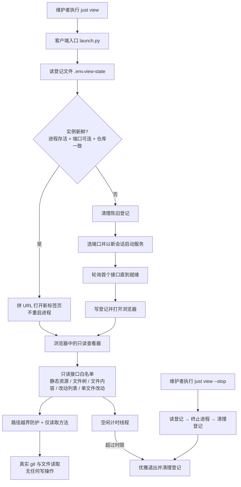

# PRD: 本机只读文件与改动查看器（`just view`）

- GitHub Issue: https://github.com/ZataZhang/zata-codes-template/issues/9

> ✅ **交付前置**：无，可立即开工。
> 结构化声明见 §8 Delivery Dependencies，**那里是唯一事实源**。

> ✅ **验收状态**：已验收（2026-09-21）— 机器侧条目全部执行并留下证据（含补验的失效态 rv-7 与重测达标的性能 rv-5），3 项 Human-Confirmed 已由仓库所有者逐条确认。§12 的性能口径随「结项归档」这一决定按**空载口径 + 判定时连 load average 一起读**采纳（见 §12 裁定记录）。证据包见 §9。
> 本行是 §9 Acceptance Checklist 的投影，**那里是唯一事实源**。

> 本 PRD 分两个 altitude：**Part A · 人审层**（决定该不该做、做得对不对，含介入与风险地图）；**Part B · 执行器层**（实现细节，人只在风险地图点名处下钻）。

## Feature Overview (功能一览)

> 本块是 §10 Functional Requirements 的平语言投影，行为验收以 §1 行为样例表为准。

- **一条命令开出查看器**（FR-1、FR-6）：在仓库里敲 `just view`，浏览器出现本仓库的只读界面——左边是文件树，右边是文件内容；`just view <路径>` 可直接落到某个文件或目录，`just diff [分支]` 是直接进改动视图的薄别名。
- **文件与改动在同一个界面里切换**（FR-2）：界面顶部一键在「文件」和「改动」之间切换，改动视图里可以换比较基线（当前工作区改动，或相对某个分支）。
- **读得清**（FR-3）：源码带行号与语法高亮；超大文件与二进制文件给出明确说明，而不是白屏或乱码。
- **第二次打开是秒开**（FR-4、FR-9）：查看器常驻本机，再敲 `just view` 不重启进程，只是开一个新标签页。
- **不会留下孤儿进程**（FR-5、FR-8）：闲置到时限（默认 30 分钟）自动退出，`just view --stop` 可立刻回收；服务已退出时页面明确提示重新连接，而不是留一个坏页面。
- **只读，不碰你的工作区**（FR-7）：界面只读、服务只绑本机回环地址、只接受读取请求、不允许越出仓库目录，不提供任何写入、暂存或提交能力。
- **约定与用法入文档**（FR-10）：工具链文档与使用指南同步这条命令、它的空闲回收策略，以及浏览器冷启动不在性能承诺内的事实。

# Part A · 人审层 (Review Layer)

## 1. Introduction & Goals

### Problem Statement

日常读代码与看改动目前依赖 VSCode，而它为了通用编辑能力付出了常驻内存代价；实际使用的只有「读文件」和「看改了啥」两件事。这件事的代价在本机是可观察的：本仓库有 725 个受版本控制的文件，读一个文件或看一眼 diff 都要先等一个完整 IDE 环境起来。

仓库里已有一个成熟的改动可视化资产，但它的形态与用法都够不到这个场景：`skills/git-diff-report/` 只在 AI 会话里被调用，产出的是一次性静态 HTML 快照，看完即弃；它既不覆盖「读任意文件」，也不能在改动发生时保持实时。终端方向也已排除——命令行里能表达的版面有限，而本机有 GUI 可用。

可观察的现状事实：模板与派生项目共用 `justfile.shared` + `scripts/shared/` 这一层，本机已有的同类能力（`just docs-serve`、`just prd review`）都是「一条命令起一个本机只读页面」，说明「临时起个本机只读界面」是仓库已接受的模式，不需要引入常驻服务框架或前端构建链。

### Interpretation (解读回显)

**行为样例**（下表每一行会被逐字转写为 §7.6 的验收 oracle——改一个单元格就是改验收标准）：

| 输入 / 操作 | 期望观察到的结果 |
|---|---|
| 在仓库根敲 `just view` | 浏览器打开查看器；左侧列出本仓库文件树，点击任一文件右侧显示带行号与语法高亮的源码，内容与本地文件一致 |
| 界面顶部切到「改动」，并选基线为 `main` | 左侧只列相对 `main` 有改动的文件并显示 `+N -M` 统计；文件集合与终端 `git diff main...HEAD --name-only` 一致；点开单文件看到逐行 diff |
| 再敲一次 `just view` | 不重启服务，只是新开一个标签页；从敲命令到浏览器开始加载 ≤150ms，服务进程号不变 |
| 敲 `just view src/backend/core` | 打开后直接定位到该目录，文件树自动展开到该层 |
| 关掉标签页后闲置 30 分钟（边界情况） | 服务自动退出，登记文件被清理，端口不再被监听；此后再敲 `just view` 会重新起服务并正常打开 |
| 服务进程已被手动杀掉，登记文件还在，此时敲 `just view`（失败场景） | 不打开一个连不通的 URL；而是判定登记项陈旧、重新起服务并正常打开 |
| 界面里请求一个仓库外路径（失败场景） | 请求被拒绝并附明确说明，不返回仓库外文件内容，也不暴露绝对路径 |

**我默默定了这些**（未经提问就拍板的点，逐条列出以便纠正）：

- 常驻实例按**仓库（含每个 worktree）**登记，登记文件是仓库根的 `.env.view-state`，与既有 `.env.run-state` 同构——`.gitignore` 的 `.env*` 已覆盖它，且每个 worktree 天然独立，不引入额外目录。
- 空闲判定口径是**「无 HTTP 请求」**，不是心跳：页面**不做**定时轮询。因此「关掉标签页」或「页面开着但 30 分钟没碰」都会回收；代价是页面在服务退出后会失效，由 FR-8 的提示兜住。
- 空闲时限默认 **30 分钟**，`--idle-timeout 0` 关闭自动回收。
- 默认端口优先用登记文件里的值，其次 **8791**，被占用则退回系统随机空闲端口；端口实际值只写在登记文件里，不硬编码进文档。
- 结束实例用 `just view --stop`（读登记文件的进程号发终止信号），**不新增任何 HTTP 写路由**——「服务端只读」这条边界不为运维便利让路。
- 高亮用 Pygments 在服务端渲染，显式声明为 dev 依赖；Pygments 不可用时降级为纯文本（功能不缺失，只是没有颜色）。
- 性能承诺只覆盖**进程侧**（复用命中 ≤150ms、冷启动到首个接口返回 ≤400ms）；浏览器**冷启动**的 1.5–3s 明确不计入，也不承诺。
- `just diff` 保留为 `just view --diff` 的薄别名，不做独立实现。
- 派生项目同步模板后同样获得该命令，不做「仅模板可用」的分叉。

**我理解为不做**（读者可能想要、但本 PRD 排除的方向）：

- **不做任何编辑能力**：不写入、不暂存、不提交、不做冲突解决。
- 不做搜索/替换、全文检索、跳转定义、Git 历史浏览、blame 视图——这些是 IDE 能力，不在「读文件 + 看改动」的目标里。
- 不做终端 TUI 形态（不引入 `delta` / `bat` / `lazygit` 一类依赖），也**不再**走「生成静态 HTML 报告」的路线。
- 不替代 `skills/git-diff-report/` 的既有用途：那份能力仍负责产出可发送、可归档的单文件改动报告。
- 不做跨机器访问、不做局域网共享、不做鉴权体系（只绑本机回环地址）。

**文字解读**：把需求实现为**「一条命令起一个只读查看器」+「界面内文件/改动双视图」+「常驻复用与自动回收」**的闭环，而不是一个轻量 IDE 或一个新的前端应用。关键边界：能力上限是只读，任何写入路径都不在范围内；服务只绑本机回环地址、只接受读请求、路径不得越出仓库；改动视图的数字与文件集合必须与终端 `git diff` 逐项一致，不允许二次推断；常驻进程必须同时具备自动回收（空闲时限）与手动回收（`--stop`）两条路径，这是本 PRD 唯一影响日常使用习惯的机制；性能承诺只覆盖进程侧，浏览器冷启动不在承诺内。非目标：编辑能力、IDE 级检索与历史能力、终端形态、跨机器访问。

### What The User Gets

- 读代码和看改动不再需要为一件只读的事启动一个完整 IDE。
- 一条命令同时解决三件事：看任意文件、看当前工作区改了什么、看当前分支相对某条基线的全部改动——都在同一个界面里切换。
- 第二次打开是秒开：查看器留在一个轻量本机进程里，再敲命令只是开一个新标签页。
- 不会因为图快而留下一个没人管的后台进程：闲置会自动走，也可以一条命令立刻收掉。
- 明确知道自己的能力边界：它能看，不能改。

### Measurable Objectives

- 在仓库根执行 `just view`，浏览器出现查看器并显示带行号与语法高亮的真实文件内容（人工可见结果可判定）。
- 改动视图列出的文件集合与增删统计，与终端 `git diff` 在同一基线下逐项一致（可判定）。
- 连续两次 `just view` 时服务进程号保持不变，且第二次从敲命令到浏览器开始加载 ≤150ms（可测量）。
- 服务运行中，任意针对仓库外路径的读取请求都被拒绝，且不存在任何可用于写入的 HTTP 路由（可静态与运行时判定）。
- `just view --stop` 执行后端口不再被监听、登记文件被清理；空闲超时后同样如此（可判定）。
- 派生项目执行 `just sync-template` 后，无需本地分叉即可使用同一条命令（可判定）。

## 2. Human Review Map (介入与风险地图)

### 决策一：查看器常驻，用「空闲自动退出 + 显式 stop」两条路径兜底

推荐让查看器作为一个轻量本机进程常驻，因为这是「秒开」的唯一来源：每次重新起进程要付启动开销，而重启后浏览器仍要重新加载页面。常驻的代价是本机多一个后台进程——这在本仓库有明确的历史教训：`docs/ai-standards/tooling.md` 记录过「手敲的三次 `just test` 在 14 小时后仍常驻内存，只杀顶层进程完全无效」。所以本 PRD 不接受「常驻但无回收路径」：自动侧按「最后一次请求时间」计时，默认 30 分钟无请求即退出并清理登记；手动侧提供一条显式回收命令。

这里有一个刻意的取舍需要你点头：空闲判定用的是**「没有任何请求」**，页面**不做**定时心跳。好处是「关掉标签页就等着被回收」，坏处是页面开着但长时间不碰也会退出，此后页面会失效——由界面上的明确提示（提示重新运行命令）兜住，而不是留一个坏页面。若改成心跳轮询，只要标签页还开着就永不回收，等于没有自动路径。

**请确认：** 「进程常驻换取秒开 + 默认闲置 30 分钟无请求即自动退出 + 提供显式回收命令 + 页面不做心跳、失效时给明确提示」这套生命周期策略是否符合你的预期？

**验收：** 连续两次执行打开命令，第二次进程号不变、明显更快；`--stop` 与超时之后端口都不再被监听、登记文件被清理；手动杀掉服务后再执行打开命令，不会打开连不通的页面。

### 决策二：能力上限锁定为「只读」，不预留任何写入路径

推荐把只读当成硬边界而不是「本期先不做」：服务只绑本机回环地址、只接受读取请求、不注册任何写路由；结束实例走进程信号而不是 HTTP 接口，就是为了不给「服务端能写」开第一个口子。理由是这条边界一旦松动（今天加个「结束服务」的写接口，明天就可能有人加「保存文件」），查看器会在不知不觉中长成一个半成品编辑器，而半成品编辑器既没有 IDE 的安全网，又背上了它的复杂度。

需要你确认的是**预期落差**：如果你期待在同一个界面里顺手改一行、暂存一个文件，那本 PRD 明确不提供，需要另立需求（并且要重新评估只读边界与安全面）。

**请确认：** 「查看器严格只读，任何编辑/暂存/提交能力都不做、也不预留接口」是否符合你的预期？

**验收：** 界面中不存在任何可写入的控件；对服务的写入类请求一律被拒绝；被查看仓库的工作区状态在查看过程中不发生变化。

### 自动门禁，不需要逐项人工审阅

其余改动都是本机工具链内部的局部新增：一个只读本机服务、一套静态页面资源、一条 `justfile.shared` 配方、一份登记文件读写、文档同步。它们各自有可区分自身失败的自动化验证——路径逃逸防护、写请求拒绝、陈旧登记识别与接管、空闲回收、文档与原型登记的存在性断言——由执行器加自动化测试把关。

### 本次明确不涉及

无数据库结构变更，无后端四层代码变更，无鉴权/计费/并发语义变更，不涉及破坏性操作；不改动 `frontend-admin/` 与 `frontend-public/` 两个产品前端应用（查看器是独立的只读工具页，不进入产品前端构建）；不改动 `skills/prd` 与 verifier 流程。

## 3. Usage And Impact After Implementation

写 PRD 时即填写，描述实现后的**目标态使用脚本**（消费者视角），作为构建目标和回头验证的依据；不是事后日志。

### 仓库维护者 / 开发者（人）

在仓库任意位置（含各 worktree）执行 `just view`——首次会起一个本机只读服务并打开浏览器，之后每次执行只是新开一个标签页。界面里左树选文件即读源码，顶部一键切到「改动」视图看当前工作区改了什么，或在改动视图里换基线分支看「这条分支相对 `main` 的全部改动」。`just view <路径>` 直接落到文件或目录；`just diff [分支]` 是直接进改动视图的别名。

想收掉查看器时执行 `just view --stop`；不做任何事的话，闲置到时限后它会自行退出。若某个标签页在服务退出后才被点开，页面会明确提示服务已退出并给出重新连接的指引。

### 派生项目使用者

执行 `just sync-template` 同步后，派生项目直接获得同一条命令与同一套界面，无需本地分叉。登记文件与端口按项目（及 worktree）各自独立，多个项目并存时互不干扰。

### 排障者 / 后续扩展者

排障入口有三处：登记文件（记录实例的进程号、端口、仓库路径，用于判断实例是否陈旧）、服务日志（默认写在被 git 忽略的日志目录下）、以及显式回收命令。后续想扩展只读能力（例如新增一类只读视图）时，公开边界是既有的只读接口与静态资源目录，不需要触碰生命周期与登记机制。

### Impact On Existing Behavior

- `just run` / `just down` / `just test` / `just worktree` 等既有命令的行为与参数完全不变；新增的 `just view` 与 `just diff` 是增量命令。
- `.env.view-state` 是新文件，被既有 `.gitignore` 的 `.env*` 规则覆盖，不进入版本库，不影响现有 `.env.run-state` 的端口状态语义。
- 默认端口 8791 与既有的后端 8000 / 管理前端 5173 / 前台 3000 三个默认端口不重叠；被占用时自动退让，不改变既有服务。
- 既有 `skills/git-diff-report/` 的用法与产物不变，本 PRD 不改动它。
- 服务只绑本机回环地址且只读，不引入新的对外网络面。

## 4. Requirement Shape

- Actor: 仓库维护者 / 开发者（人，直接使用者）；派生项目使用者；排障者 / 后续扩展者
- Trigger: 在仓库中执行 `just view` / `just diff` / `just view --stop`；在界面中切换视图、切换基线、选择文件；服务闲置超时
- Expected behavior: 起（或复用）一个只绑本机回环地址的只读服务，在浏览器中提供「文件 / 改动」双视图；第二次调用复用既有实例；闲置超时或显式命令回收实例并清理登记；服务退出后页面给出明确提示
- Scope boundary: 严格只读（无写入、暂存、提交，无写路由）；不做 IDE 级检索/历史/blame 能力；不做终端形态；不做跨机器访问与鉴权；不进入两个产品前端应用的构建

# Part B · 执行器层 (Build Layer)

> 以下供实现者（人或 Agent）使用。人只在 Part A 风险地图点名处下钻审查；其余默认交执行器 + 自动门禁。

## 5. Repository Context And Architecture Fit

- Existing path: 仓库已有的「一条命令起本机只读页面」模式——`just docs-serve`（mkdocs 静态站点）与 `just prd review`（打开证据/审查页）；共享脚本层为 `scripts/shared/`（上游拥有，随 `just sync-template` 分发），共享 recipe 层为 `justfile.shared`。
- Reuse candidates:
  - `justfile.shared` 的 recipe 风格与 `#!/usr/bin/env bash` + `set -euo pipefail` 约定，以及 `ops` / `bench-test` 这类 `*args` 透传写法；
  - `.env.run-state` 的「仓库根、被 `.env*` 忽略、按 worktree 独立」运行态文件先例（`docs/ai-standards/tooling.md` 的 Run Port State 小节）；
  - `scripts/shared/` 下既有分组目录（`worktree/`、`just/`、`e2e/`、`release/`）的脚本归位约定；
  - `skills/git-diff-report/scripts/render_diff_report.py` 中既有的 `git diff` 参数构造与 unified diff 解析思路（只作参考，不复制文件）。
- Architecture pattern to preserve: 这个能力是**开发工具链**，不是后端四层里的任何一层。不得引入 `src/backend/` 依赖、不得进入 composition root、不得被产品前端构建引用。共享脚本由上游拥有并在派生项目同步，因此不得依赖仅本机存在的全局路径（例如某个技能目录）。
- Frontend impact: **不涉及 `frontend-admin/` 与 `frontend-public/`**。查看器是一个独立的静态单页（`scripts/shared/view/assets/`），不进入产品前端构建链、不共用产品前端的路由与状态管理；它新增的**唯一**前端界面是本机只读工具页，按本 PRD 的验收清单独立验收。
- Existing PRD relationship: 检索 `tasks/pending/`（当前为空）与 `tasks/archive/` 相邻主题后判定为 **independent**：
  - `P2-REFACTOR-20260605-181245-justfile-shared-private-split` 确定了新增共享命令应落在 `justfile.shared`（本 PRD 沿用该结论）；
  - `P2-REFACTOR-20260615-110433-isolate-template-scripts` 确定了共享脚本应落在 `scripts/shared/`（本 PRD 沿用）；
  - `P2-PERF-20260622-113224-speed-up-just-test-template` 提供了「用仓库根状态文件做幂等跳过」的先例（本 PRD 的实例登记沿用同构思路，但语义不同）；
  - 未发现与本 PRD 重复或互为前置/后继的 PRD。
- Redundancy risks:
  - 与 `skills/git-diff-report/` 的**职责重叠风险**：两者都能展示改动。边界写死为——技能侧产出「可发送/可归档的单文件静态报告」，本 PRD 产出「本机实时只读界面」；**禁止**在查看器里重新实现报告生成，也**禁止**把查看器做成技能的封装。
  - 与 `frontend-admin/` 的**重复实现风险**：不得为查看器引入产品前端的组件库、构建链或状态管理，避免为一个只读工具页背上产品前端的依赖体量。
  - **并行抽象风险**：生命周期（登记、复用、回收）必须只有一份实现，`just view` 与 `just diff` 共用同一个入口脚本，不允许各写一套。

---

## 6. Recommendation

### Recommended Approach

- Approach: 在**共享层**新增一条命令与一个共享工具目录——`justfile.shared` 加 `view`（及薄别名 `diff`），逻辑落在 `scripts/shared/view/`：一个本机只读 HTTP 服务（Python 标准库）、一个客户端入口（复用探测 / 起服务 / 等待就绪 / 打开浏览器 / 回收）、一套静态单页资源。
- Why this is the best fit: 仓库已有「一条命令起本机只读页面」的模式与运行态文件先例，本方案把两者组合起来，不引入任何新的运行框架、前端构建链或第三方服务依赖；Python 标准库足以承载只读 HTTP 服务，唯一的第三方依赖（语法高亮）按仓库既有的「显式声明依赖」约定处理。
- Rejected redundancy: 明确不引入 Node/前端构建链、不引入 Web 框架、不引入终端 TUI 依赖（`delta` / `bat` / `lazygit`）、不引入静态站点生成器；不新建第二套生命周期实现；不改动 `skills/git-diff-report/`。

### Proposed Solution Summary (实现机制)

实现方向（给实现者看）：**服务 + 客户端入口分离，共享只读接口，生命周期集中在登记文件上**。

- **服务**（`scripts/shared/view/server.py`）：基于标准库 `http.server` 的只读服务，只绑 `127.0.0.1`，路由白名单固定为：静态页与资源、实例信息、文件树、文件内容、改动列表、单文件改动。**不接受任何非读取方法**，不注册任何写路由。所有路径参数先解析成绝对路径，再断言仍在仓库根之下，否则拒绝。文件读取设大小上限，二进制与超大文件返回明确标记而非正文。
- **语法高亮**：Pygments 在服务端渲染为行级 HTML；`pygments` 显式声明为依赖（dev 组），并在服务就绪后于后台线程预热，使首屏不为这 100–150ms 付费；不可用时降级为纯文本标记（功能不缺失）。
- **客户端入口**（`scripts/shared/view/launch.py`）：解析参数 → 读登记文件 → 校验实例新鲜度（进程存活 + 端口可连 + 实例信息里的仓库路径与本次一致）→ 命中则直接打开对应 URL（带路径/视图/基线参数）并立即返回；未命中或陈旧则清理登记、以新会话启动服务、**轮询等待首个接口返回成功**（不使用固定 `sleep`）、写入登记、打开浏览器。`--stop` 走「读登记 → 终止进程 → 清理登记」，不触碰 HTTP 层。
- **空闲回收**（服务内）：服务记录最后一次请求时间，后台线程按固定间隔检查，超过时限即优雅退出并清理登记文件；时限为 0 时关闭该行为。页面**不做**心跳轮询，因此「关掉标签页」即等同于进入空闲。
- **页面失效提示**：前端在任意接口请求失败时切换到明确的「服务已退出」状态并给出重新连接指引，而不是保留半渲染的坏页面。
- **参数面**：`just view [路径]`、`--diff [基线]`、`--port`、`--idle-timeout`、`--no-reuse`、`--no-open`、`--stop`；`just diff [基线]` 等价于 `just view --diff [基线]`。
- **刻意避免的复杂度**：不引入前端框架与打包器（单页内联资源，零外部 CDN）、不引入 WebSocket（不需要实时推送，按需请求即可）、不引入配置文件（端口等参数走命令行与登记文件）、不引入缓存层（仓库规模下 `git ls-files` 与文件读取均在数十毫秒量级）。

### Alternatives Considered (Only When Useful)

- Alternative: 每次生成一份静态 HTML 快照并打开（复用既有 `skills/git-diff-report/` 的产出形态）。
- Why not chosen: 浏览器的 `file://` 页面无法 `fetch` 同目录的本地文件，让「点文件看内容」这一核心交互成立就必须把内容内联进页面；对整仓文件而言页面体积不可接受，且每次改动都要重新生成，无法满足「实时看工作区」。

- Alternative: 做终端 TUI 或把 `delta` / `bat` / `lazygit` 接进 git。
- Why not chosen: 已确认命令行版面表达力不足，且本机有 GUI 可用；引入外部二进制依赖还会牵扯派生项目的安装前置。

---

## 7. Implementation Guide

This section is a living implementation guide based on current repository analysis. If implementation discovers additional affected files, hidden dependencies, edge cases, or a better path, update this PRD before proceeding.

### 7.1 Core Logic

两条独立的执行路径，共用同一个登记文件与只读接口：

1. **打开路径**（`just view`）：解析参数 → 读 `.env.view-state` → 三项校验（进程存活、端口可连、实例信息中的仓库路径一致）→ 命中则拼 URL 直接打开并返回（这是秒开路径，不重启进程）；任一校验失败即认定陈旧，清理登记后进入启动路径。
2. **启动路径**：选端口（登记值 → 默认 8791 → 系统空闲端口）→ 以新会话启动服务并写日志 → 轮询首个接口直至成功或超时 → 写登记（进程号、端口、仓库路径、启动时间）→ 打开浏览器 → 客户端进程退出（服务继续存活）。
3. **服务处理路径**：任一请求先刷新「最后请求时间」→ 校验方法与路由是否在只读白名单 → 路径参数解析为绝对路径并断言位于仓库根之下 → 执行 `git` 或文件读取 → 返回 JSON 或静态资源。前端不轮询，因此「无请求」即空闲。
4. **回收路径**：自动侧由服务内后台线程按最后请求时间判断，超时即优雅退出并在退出前清理登记；手动侧由 `just view --stop` 读登记、终止进程、清理登记。

改动视图的数据来源固定为真实 `git`：默认基线是「工作区相对当前提交的改动」，也可选某条本地分支，取分支基线的合并基点比较；界面显示的文件集合与增删统计必须与同参数的终端输出逐项一致，不做二次推断。副作用面为零：实现不得执行任何写操作，不得暂存、提交或改动被查看仓库的状态。

### 7.2 Change Impact Tree

```text
.
├── scripts/shared/
│   └── view/
│       ├── instance.py
│       │   [新增]
│       │   【总结】常驻实例的登记与仓库定位：`.env.view-state` 读写、三项新鲜度判定所需
│       │   的字段、登记清理的归属校验、仓库根解析。客户端入口与服务端共用同一份实现。
│       │
│       ├── ├── 登记文件读写（`VIEW_PID` / `VIEW_PORT` / `VIEW_REPO_ROOT` / `VIEW_STARTED_AT`）
│       │   ├── `clear_instance_record` 的 `expected_process_id` 归属校验（回收方不得抹掉更新实例的记录）
│       │   └── 仓库根解析：先向上找 `.git` 标记（亚毫秒），找不到才退回 `git rev-parse`
│       │
│       ├── workspace.py
│       │   [新增]
│       │   【总结】仓库工作区的只读快照：文件树、文件正文、改动列表与单文件 diff；路径
│       │   越界防护与基线白名单校验也在这里，服务端只做路由分发。
│       │
│       ├── ├── `resolve_repository_path`：先 `resolve()` 再断言位于仓库根之下（rg 锚点：`is_relative_to`）
│       │   ├── 文件树数据源：`git ls-files -z`（受控 + 未跟踪），排除 `.git`、`node_modules`、虚拟环境与构建产物目录
│       │   ├── 改动数据源：工作区 `git diff HEAD` 与分支 `git diff <分支>...HEAD`；`--name-status -z` / `--numstat -z` 解析
│       │   ├── 基线白名单：取值必须命中本地分支，避免 `--output=…` 之类以 `-` 开头的取值流进 git 选项解析
│       │   ├── 大小上限、二进制文件与超大文件的标记返回
│       │   └── Pygments 行级高亮（跨行 span 在行边界闭合再重开）、文件名回退词法器表、后台预热、缺失时降级纯文本
│       │
│       ├── server.py
│       │   [新增]
│       │   【总结】只读本机 HTTP 服务：固定只读路由白名单、仅接受读取方法、静态资源白名单、
│       │   空闲回收与登记清理、终止信号优雅退出。
│       │
│       ├── ├── 路由白名单与「仅接受读取方法」的拒绝逻辑（rg 锚点：`def do_GET` / 白名单常量）
│       │   ├── 静态资源按文件名白名单读取（没有可拼接的路径就没有可逃逸的路径）
│       │   ├── 空闲计时后台线程：超时优雅退出并清理登记文件
│       │   └── SIGINT / SIGTERM 经独立线程触发 `shutdown()`，避免与 `serve_forever()` 死锁
│       │
│       ├── launch.py
│       │   [新增]
│       │   【总结】客户端入口：实例新鲜度校验与复用、端口选择、以新会话启动服务、轮询就绪、写登记、打开浏览器、`--stop` 回收、参数解析。
│       │
│       ├── ├── 登记文件读取与新鲜度三校验（进程存活 / 端口可连 / 仓库路径一致）
│       │   ├── 陈旧登记的清理与接管
│       │   ├── 端口选择顺序：显式 `--port` → 登记值 → 默认 8791 → 系统空闲端口
│       │   ├── 轮询就绪（不使用固定 sleep）与启动超时的明确报错；起不来的实例主动收掉
│       │   ├── 打开浏览器走系统打开器的非阻塞交接（不用 `webbrowser`，见 Change Log）
│       │   └── `--stop`：读登记 → 终止进程 → 清理登记（不新增 HTTP 写路由）
│       │
│       └── assets/
│           ├── index.html
│           │   [新增]
│           │   【总结】查看器单页骨架：左侧文件树、右侧内容区、顶部「文件 / 改动」切换与基线选择、失效提示区；内联引用本地样式与脚本。
│           │
│           ├── viewer.css
│           │   [新增]
│           │   【总结】查看器样式：配色与排版基线取自仓库现有原型共享样式，含 diff 增删着色、行号列、树节点与状态提示样式。
│           │
│           └── viewer.js
│               [新增]
│               【总结】前端交互：文件树渲染与过滤折叠、文件内容与 diff 视图切换、基线切换、请求失败时切到「服务已退出」状态。
│
└── Frontend (独立工具页，不进入 frontend-admin / frontend-public 构建)
    └── scripts/shared/view/assets/index.html [新增]
        【总结】同上一节列的静态单页；不引入产品前端组件库、构建链或状态管理，仅内联本地样式与脚本。
```

共享层与工程配套：

```text
.
├── justfile.shared
│   [修改]
│   【总结】新增 `view` recipe 与薄别名 `diff`，均委托 `scripts/shared/view/launch.py`；放在既有 Git 工具类 recipe 附近。
│
├── pyproject.toml
│   [修改]
│   【总结】把语法高亮依赖显式声明进 dev 组，避免依赖传递安装（仓库已有同类守卫测试）。
│
├── tests/guards/shared/test_view_server.py
│   [新增]
│   【总结】守卫测试：路径越界防护、写请求与非白名单路由拒绝、文件大小与二进制标记、陈旧登记识别与接管、空闲回收后登记清理。
│
├── docs/ai-standards/tooling.md
│   [修改]
│   【总结】Common Commands 表新增两条命令；Preferred Tools 说明只读查看器的定位；补「常驻与空闲回收」约定，并与既有孤儿进程教训互相引用。
│
├── docs/guides/file-viewer.md
│   [新增]
│   【总结】使用指南：命令面、界面用法、实例登记与回收、性能承诺边界（含浏览器冷启动不在承诺内）、排障入口。
│
├── docs/prototypes/file-viewer-interactive.html
│   [新增]
│   【总结】可点击原型：文件树、内容视图、改动视图、基线切换、空态与服务失效态。
│
├── docs/prototypes/file-viewer-interactive.md
│   [新增]
│   【总结】原型说明页：设计依据、可交互状态、原型边界。
│
├── docs/prototypes/assets/file-viewer-interactive.png
│   [新增]
│   【总结】原型首屏（文件视图）真实渲染截图，作为原型中心预览图。
│
├── docs/prototypes/assets/file-viewer-interactive-diff.png
│   [新增]
│   【总结】改动视图状态的真实渲染截图（左树只列改动文件 + 右侧逐行 diff）。
│
├── docs/prototypes/assets/file-viewer-interactive-disconnected.png
│   [新增]
│   【总结】服务已退出状态的真实渲染截图（含重新连接指引与左树置灰）。
│
├── docs/prototypes/assets/file-viewer-interactive.source.md
│   [新增]
│   【总结】三张截图的 provenance 旁车：真实入口、状态准备步骤、截图命令与源设计文件。
│
├── docs/prototypes/prototype-registry.js
│   [修改]
│   【总结】按原型中心数据契约追加查看器条目（id / 标题 / 形态 / 校验层级 / 主流程 / 预览 / 入口 / 来源 / provenance）。
│
├── docs/prototypes/index.md
│   [修改]
│   【总结】原型目录的示例入口清单加入查看器说明页链接。
│
└── mkdocs.yml
    [修改]
    【总结】导航新增使用指南页与查看器原型说明页。
```

> 文件清单是当前分析的起点而非穷尽集合；实现中发现新触点先更新本 PRD。

### 7.3 Executor Drift Guard

The file list above is the expected implementation surface from current repository analysis. During implementation, treat it as a starting point and use these repository searches to catch hidden references or drift before marking the PRD complete.

| Check | Command | Expected Result | If It Fails, Inspect First |
|---|---|---|---|
| 禁止终端依赖回流 | `rg -n "git-delta\|difftastic\|lazygit\|brew install (delta\|bat)" justfile.shared scripts/shared docs/ai-standards/tooling.md` | 无命中；本 PRD 已放弃终端形态 | 是否有人把早期方案带进实现；改用只读查看器路径 |
| 禁止写入路径 | `rg -n "do_POST\|do_PUT\|do_DELETE\|do_PATCH\|shutil.rmtree\|\.write_text\(" scripts/shared/view/` | 服务端仅存在静态资源读取与响应写入，没有任何仓库写操作 | 若命中，先判断是否为响应写字节流；真写仓库即视为违反只读边界 |
| 命令与脚本落位 | `rg -n "^view .*args\|^diff .*args\|scripts/shared/view" justfile.shared scripts/shared/view` | `view` / `diff` 两条 recipe 存在且都指向同一入口脚本 | 是否绕过共享层自建第二套入口；`justfile.shared` 是否被误当项目私有文件 |
| 依赖显式声明 | `rg -n "pygments" pyproject.toml uv.lock` | `pyproject.toml` 直接声明该依赖，而非仅由其他包传递引入 | 是否只靠传递依赖；对照 `tests/guards/test_runtime_dependency_declaration.py` |
| 生命周期单一实现 | `rg -n "env.view-state\|idle_timeout\|idle-timeout" scripts/shared/view justfile.shared docs/` | 登记文件与空闲参数只出现在查看器目录与文档中，无第二处实现 | 是否有另一处自建的实例管理逻辑 |
| 文档与原型登记存在 | `rg -n "just view\|file-viewer-interactive" docs/ai-standards/tooling.md docs/guides/file-viewer.md docs/prototypes/prototype-registry.js docs/prototypes/index.md mkdocs.yml` | 五处均有命中：工具链文档、使用指南、原型中心登记、原型目录清单、站点导航 | 是否只写了 PRD 却漏登记原型中心；`mkdocs.yml` 导航是否漏加新页 |
| 不与既有改动报告重复实现 | `rg -n "render_diff_report\|skills/git-diff-report" scripts/shared/view docs/guides/file-viewer.md` | 无命中（查看器不依赖也不复制该技能产物） | 是否把查看器做成了技能的封装 |

### 7.4 Flow Or Architecture Diagram



### 7.5 ER Diagram (Only When Data Model Changes)

- `No data model changes in this PRD.`

实例登记文件是扁平的键值状态（进程号、端口、仓库路径、启动时间），无结构演进、无关联关系，且被 `.gitignore` 覆盖，不构成数据模型变更。

### 7.6 Realistic Validation Plan (Oracle 块)

```yaml
- id: rv-1
  behavior: 一条命令开出本仓库的只读查看器，左侧文件树可选文件，右侧显示带行号与语法高亮的真实源码
  reviewer: human
  real_entry: "just view"
  expected: "浏览器出现查看器；左树列出仓库文件（725 个量级）；点击 justfile.shared 右侧显示带行号的高亮内容，与本地文件逐行一致"
  mock_boundary: "不得 mock git 与文件读取；服务端必须真实读取工作区文件"
  tier: R2
  test_layer: manual
  required_for_acceptance: true
  presentation: "真实入口截图 tasks/evidence/P2-FEAT-20260921-111233-local-file-diff-viewer/rv-1-viewer-file.png + 10 秒自检：在查看器中点开 justfile.shared，右侧第 1 行应为该文件真实首行注释、行号从 1 起连续"
  critical_value_source: "端口与 URL 必须取自本次 just view 实际打开或打印的 URL / 登记文件 .env.view-state 中的端口，不得手工拼装"
  must_cross: "just recipe -> launch.py -> server.py 绑定端口 -> 浏览器请求 / -> /api/tree -> /api/file"
  forbidden_bypasses: "禁止直接手工运行 server 脚本并自拼 URL 充当证据；禁止用静态 HTML 复刻图或原型截图冒充实现证据"
  fresh_state_probe: "另开一个浏览器标签重新访问同一 URL，文件树与文件内容仍一致"
  final_tree_evidence: "截图必须在最后一次修改 server.py 或其静态资源之后重拍；改动记录与截图时间同批归档"
  negative_control: "把服务端文件读取路径改成从固定假数据返回（仅在测试边界打桩，不改生产代码）：查看器内容与本地文件不一致时该 oracle 必须判红"
  expected_fail: "右侧内容与本地文件不符，或行号缺失/高亮缺失"
- id: rv-2
  behavior: 界面内切到改动视图，看到改动文件列表与增删统计，点开单文件看到逐行改动，且可切换比较基线
  reviewer: human
  real_entry: "just view --diff（以及界面内「改动」切换与基线选择）"
  expected: "基线为工作区时，列出的文件集合与终端 git diff HEAD --name-only 逐项一致；切换基线为某分支后，与 git diff <分支>...HEAD --name-only 逐项一致；文件条目的 +N -M 与终端同参数 --stat 一致"
  mock_boundary: "不得 mock git；改动内容必须来自真实 git 输出"
  tier: R2
  test_layer: manual
  required_for_acceptance: true
  presentation: "真实入口截图 tasks/evidence/P2-FEAT-20260921-111233-local-file-diff-viewer/rv-2-viewer-diff.png + 10 秒自检：把界面上的文件条数与终端 git diff HEAD --stat 的最后一行合计比对，应一致"
  critical_value_source: "界面显示的基线名与增删数字必须与同参数终端 git diff 输出逐项一致；基线名取自界面选择器当前值"
  must_cross: "/api/changes -> git diff -> /api/diff -> 前端渲染"
  forbidden_bypasses: "禁止用预置假 diff 数据演示；禁止只改前端而不经真实 git 读取"
  fresh_state_probe: "在终端修改任意一个文件后刷新查看器，改动列表应新增该文件且统计变化"
  final_tree_evidence: "截图与比对用的终端输出必须来自同一时刻、同一基线；任何影响改动数据源的改动后必须重跑"
  negative_control: "在测试边界用桩数据替换 git 输出，使其与真实终端输出不一致：该 oracle 必须判红"
  expected_fail: "界面文件数与终端合计不一致，或存在界面显示有改动而终端无改动的文件"
- id: rv-3
  behavior: 第二次打开复用常驻实例（不重启进程、明显更快）；闲置到时限自动退出；显式回收命令立刻生效；陈旧登记不会导致打开连不通的页面
  reviewer: human
  real_entry: "just view（连续两次）、just view --stop"
  expected: "第二次调用服务进程号不变，从敲命令到浏览器开始加载 <=150ms；--stop 之后端口不再被监听且登记文件被清理；手动杀掉服务后再执行打开命令，能正常起服务并打开，而不是打开空白页"
  mock_boundary: "不得 mock 进程存活与端口探测；复用判定必须基于真实进程与真实端口"
  tier: R3
  test_layer: manual
  required_for_acceptance: true
  presentation: "终端前后两次调用的耗时与进程号输出 + just view --stop 后端口检查输出，归档为 tasks/evidence/P2-FEAT-20260921-111233-local-file-diff-viewer/rv-3-lifecycle.txt + 10 秒自检：执行 --stop 后立刻 curl 该端口应连接失败"
  critical_value_source: "进程号与耗时取自两次 just view 的真实输出（或登记文件与实际监听端口的交叉核对），不得引用文档中的示例值"
  must_cross: "just recipe -> launch.py 新鲜度三校验 -> 登记文件 -> 端口监听状态"
  forbidden_bypasses: "禁止直接 kill 服务来冒充 --stop 的验收；禁止跳过登记文件校验直接假设实例存在"
  fresh_state_probe: "回收后由新的 shell 独立检查端口监听与登记文件存在性；再次执行打开命令应重新起服务"
  final_tree_evidence: "生命周期证据必须在最后一次修改 launch.py / server.py 之后重跑，并记录当次进程号"
  negative_control: "把登记文件中的进程号替换为一个已退出进程的进程号（污染状态文件，不改生产代码）：打开命令必须判为陈旧并重新起服务"
  expected_fail: "打开一个连接被拒或空白的页面，或命令直接报错退出"
- id: rv-4
  behavior: 只读边界成立：服务仅绑本机回环地址、只接受读取方法、不提供写路由、请求无法越出仓库目录
  reviewer: verifier
  real_entry: "uv run pytest tests/guards/shared/test_view_server.py -v"
  expected: "路径逃逸请求被拒绝；写入类方法与未白名单路由被拒绝；服务绑定地址为本机回环"
  mock_boundary: "被守护的服务端路径解析逻辑必须真实执行，不得桩掉"
  tier: R1
  test_layer: integration
  required_for_acceptance: true
- id: rv-5
  behavior: 进程侧性能预算成立：复用命中 <=150ms，冷启动到首个接口返回 200 <=400ms
  reviewer: verifier
  real_entry: "just view（连续两次，第二次计时）与首次冷启动计时"
  expected: "复用路径耗时 <=150ms；冷启动路径首个接口返回 <=400ms（浏览器冷启动不计入）"
  mock_boundary: "计时必须在真实起服务路径上做，不得跳过进程启动"
  tier: R1
  test_layer: smoke
  required_for_acceptance: true
- id: rv-6
  behavior: 命令、文档与原型中心登记齐备，派生项目同步即可用
  reviewer: verifier
  real_entry: "rg -n \"just view\" docs/ai-standards/tooling.md docs/guides/file-viewer.md && rg -n \"file-viewer\" docs/prototypes/prototype-registry.js docs/prototypes/index.md mkdocs.yml"
  expected: "工具链文档与使用指南均提到该命令；原型中心登记、原型目录清单与站点导航均存在"
  mock_boundary: "不适用（静态断言）"
  tier: R0
  test_layer: unit
  required_for_acceptance: true
- id: rv-7
  behavior: 服务退出后页面切到明确的「服务已退出」提示与重新连接指引，而不是停留在半渲染的坏页面
  reviewer: verifier
  real_entry: "just view 起的真实服务 + 真实浏览器加载该 URL，再用 just view --stop 让服务退出，然后在页面里点一次文件树"
  expected: "状态条变为「服务已退出 · 运行 just view 重新连接」、内容区渲染「服务已退出」提示块并带重新连接指引、左树加 is-stale 置灰"
  mock_boundary: "不得用静态 HTML 复刻失效态；页面必须是真实浏览器渲染的真实入口 URL，失效必须是真实服务退出导致的"
  tier: R2
  test_layer: e2e
  required_for_acceptance: true
  presentation: "真实浏览器截图 tasks/evidence/P2-FEAT-20260921-111233-local-file-diff-viewer/rv-7-disconnected-state.png + 10 秒自检：内容区应出现红框「服务已退出」提示，左下状态条为红色圆点加「服务已退出 · 运行 just view 重新连接」"
  critical_value_source: "URL 与端口取自本次 just view 的输出与登记文件；失效由真实回收命令 just view --stop 触发，不是手工停进程"
  must_cross: "just view --stop -> 服务进程退出 -> 页面下一次 fetch 失败 -> guardAgainstServiceExit -> enterDisconnectedState"
  forbidden_bypasses: "禁止用静态 HTML 复刻图或原型截图冒充；禁止刷新页面（服务已退出时刷新只会得到浏览器的连接错误页）"
  fresh_state_probe: "重新执行 just view 后另开标签页，页面应恢复为「服务运行中」且文件树可点"
  final_tree_evidence: "截图必须在最后一次修改 viewer.js 或其静态资源之后重拍"
  negative_control: "在测试边界用打桩服务把界面资产换成「接口失败不切失效态」的副本（stub_server.py 的 stale-exit-handling，生产代码一行未改）：失效提示必须**不出现**"
  expected_fail: "服务退出后页面仍显示「服务运行中」、左树未置灰、内容区仍是旧内容或空白"
```

Failure triage:
- `rv-1` 跑挂先查服务绑定的端口与登记文件中的端口是否一致，再查静态资源的内联引用路径（资源是相对路径服务的，不是 `file://`）。
- `rv-2` 跑挂先查基线语义：工作区基线与分支基线是两套 `git diff` 参数，先确认界面当前基线，再比对终端同参数输出。
- `rv-3` 跑挂先查登记文件内容与 `lsof -nP -iTCP:<port>` 的实际监听状态，再判断是新鲜度校验误判还是回收未清理。
- `rv-4` 跑挂先查路径解析是否在断言之前已被 `resolve()`，符号链接是常见漏点。
- `rv-7` 跑挂先确认点的是**文件**节点而不是目录节点（目录只展开、不发请求），并确认失效
  是由真实 `just view --stop` 触发的——手工 `kill` 与刷新页面都不算这条 oracle 的入口。
- 全部条目均为本机可跑，无凭据依赖，无需 opt-in。

### 7.7 Low-Fidelity Prototype (Only When Required)

```text
+----------------------------------------------------------------------------------+
| [仓库名]  分支 main  ·  [ 文件 | 改动 ]   [ 基线: 工作区 ▾ ]      [ 过滤文件... ]  |
+---------------------------+------------------------------------------------------+
| [ 文件树 ]                | [ 内容区 ]                                           |
|  ▾ docs/                  |  1  # Tooling Standards                              |
|    ▾ guides/              |  2                                                    |
|        file-viewer.md     |  3  ## Preferred Tools                               |
|    ai-standards/          |  4                                                    |
|  ▾ scripts/               |  ...（行号 + 语法高亮；改动视图下为逐行 diff 着色）    |
|    ▾ shared/              |                                                      |
|      ▾ view/              |                                                      |
|        server.py          |                                                      |
|      (共 725 个文件)       |                                                      |
+---------------------------+------------------------------------------------------+
| 状态条：[ 服务已退出 · 运行 just view 重新连接 ] 或 [ 无改动 / 文件过大 / 二进制 ]  |
+----------------------------------------------------------------------------------+
```

### 7.8 Interactive Prototype Change Log (Only When Files Actually Changed)

| File Path | Change Type | Before | After | Why |
|---|---|---|---|---|
| `docs/prototypes/file-viewer-interactive.html` | Add | 不存在 | 可点击原型：文件树 → 内容视图 → 改动视图 → 基线切换 → 空态与失效态 | 交互与状态切换是本需求的主要风险，静态图说不清 |
| `docs/prototypes/file-viewer-interactive.md` | Add | 不存在 | 原型说明页：设计依据、可交互状态、原型边界 | 供评审理解原型覆盖范围与不承诺项 |
| `docs/prototypes/assets/file-viewer-interactive.source.md` | Add | 不存在 | 三张截图的 provenance 旁车：真实入口、状态准备步骤、截图命令 | 截图类产物必须可追溯，便于后续基于同一入口重拍 |
| `docs/prototypes/assets/file-viewer-interactive.png` | Add | 不存在 | 文件视图（默认态）真实渲染截图 | 原型中心列表需要预览图 |
| `docs/prototypes/assets/file-viewer-interactive-diff.png` | Add | 不存在 | 改动视图真实渲染截图 | 改动视图是本需求的核心新界面，需要独立呈递物 |
| `docs/prototypes/assets/file-viewer-interactive-disconnected.png` | Add | 不存在 | 服务已退出态真实渲染截图 | 回收语义是唯一影响使用习惯的机制，需可视化确认 |
| `docs/prototypes/prototype-registry.js` | Modify | 仅登录页等既有条目 | 追加查看器条目（id / 标题 / 形态 / 校验层级 / 主流程 / 预览 / 入口 / 来源 / provenance） | 原型中心是唯一事实源，Markdown 与导航条目不能替代登记 |
| `docs/prototypes/index.md` | Modify | 示例入口清单无查看器 | 加入查看器说明页链接 | 与既有条目保持一致的发现路径 |
| `mkdocs.yml` | Modify | 原型导航无查看器条目 | 新增使用指南页与查看器原型说明页 | 文档站点需可路由到新页 |

### 7.9 External Validation (Only When Web Research Was Used)

- `No external validation required; repository evidence was sufficient.`

（本 PRD 的性能数字来自本机实测：仓库 725 个受版本控制文件；`git ls-files` 20–30ms；Python 进程启动 30–50ms；`import http.server` 约 100ms；语法高亮库导入 100–150ms；`uv run` 相对直连解释器多 10–20ms；空闲端口绑定约 10ms。浏览器冷启动 1.5–3s 为实测观察，且明确不计入承诺。）

---

## 8. Delivery Dependencies

工具中立的排期元数据，不是工具专属队列语法。无依赖时显式写 `none`。

- Group: none
- Depends on tasks/issues:
  - none
- Gate type: none
- Notes: 与 `P2-REFACTOR-20260605-181245-justfile-shared-private-split`（共享/私有分层）和 `P2-REFACTOR-20260615-110433-isolate-template-scripts`（脚本归位）是**沿用既有约定**，不是依赖：两条 PRD 均已归档且约定已落地，本 PRD 只需遵守。与 `skills/git-diff-report/` 无依赖关系，两者职责边界已在 §5 写死。

---

## 9. Acceptance Checklist

本节分两层读者：**9.1 是给人看的**——验收时只看这一层，目标是几分钟内看完；**9.2 起是给 verifier 和未来回溯用的机器证据**，默认不用打开，出问题再下钻。每项必须带证据（命令输出 / 观察 / 工件引用），不是裸勾。

### 9.1 人读呈递区（Human Review Surface）

> 全部呈递物已落在 `tasks/evidence/P2-FEAT-20260921-111233-local-file-diff-viewer/`；原始工件被 `.gitignore` 白名单挡在版本库外，**只存在于本机**（下图为本地图片，GitHub 上不显示）。
> 逐项期望值与「已替你核对过什么」见同目录 `<prd-stem>.evidence-report.md` 的 **人审导航** 章节。

| # | 你要看什么（对应 oracle） | 呈递物（绝对路径 + 打开方式） | 想自己复核？（含期望值） |
|---|---|---|---|
| 1 | 一条命令开出查看器，左树选文件、右侧是带行号的真实源码（rv-1） | `/Users/zata/code/zata_code_template/.iar-worktrees/issue-9/tasks/evidence/P2-FEAT-20260921-111233-local-file-diff-viewer/rv-1-viewer-file.png`<br>`open "/Users/zata/code/zata_code_template/.iar-worktrees/issue-9/tasks/evidence/P2-FEAT-20260921-111233-local-file-diff-viewer/rv-1-viewer-file.png"`<br>重跑：`bash .iar/evidence/scripts/rv1_file_view.sh` | 右侧第 1 行应为 `# ────…` 分隔注释行、行号从 1 起连续、文件头显示 `justfile.shared` / `1525 行 · 66.6 KB`、左树标题 `745 个文件`（终端受版本控制文件 732 个 + 未跟踪文件） |
| 2 | 切到改动视图，文件集合与增删统计和终端 `git diff` 一致（rv-2） | `/Users/zata/code/zata_code_template/.iar-worktrees/issue-9/tasks/evidence/P2-FEAT-20260921-111233-local-file-diff-viewer/rv-2-viewer-diff.png`<br>`open "/Users/zata/code/zata_code_template/.iar-worktrees/issue-9/tasks/evidence/P2-FEAT-20260921-111233-local-file-diff-viewer/rv-2-viewer-diff.png"`<br>重跑：`bash .iar/evidence/scripts/rv2_diff_view.sh` | 界面合计应为 `8 个文件 +343 -67`，与终端 `git diff HEAD --stat` 的 `8 files changed, 343 insertions(+), 67 deletions(-)` 相同；左树 8 个文件与 `git diff HEAD --name-only` 逐一相同（这两组数字随工作区改动而变，以你复核时终端同参数输出为准） |
| 3 | 第二次打开不重启进程且明显更快；闲置或 `--stop` 后彻底回收；陈旧登记不会打开坏页面（rv-3） | `/Users/zata/code/zata_code_template/.iar-worktrees/issue-9/tasks/evidence/P2-FEAT-20260921-111233-local-file-diff-viewer/rv-3-lifecycle.txt`<br>`open "/Users/zata/code/zata_code_template/.iar-worktrees/issue-9/tasks/evidence/P2-FEAT-20260921-111233-local-file-diff-viewer/rv-3-lifecycle.txt"`<br>重跑：`bash .iar/evidence/scripts/rv3_lifecycle.sh` | 第二次复用耗时远低于 150ms 且进程号与第一次相同；`--stop` 后立刻 `curl` 该端口应得 `HTTP 000`（连接失败）、登记文件不存在 |
| 4 | **本次新增**：服务退出后页面给出「服务已退出」提示与重新连接指引，而不是半渲染的坏页面（rv-7） | `/Users/zata/code/zata_code_template/.iar-worktrees/issue-9/tasks/evidence/P2-FEAT-20260921-111233-local-file-diff-viewer/rv-7-disconnected-state.png`<br>`open "/Users/zata/code/zata_code_template/.iar-worktrees/issue-9/tasks/evidence/P2-FEAT-20260921-111233-local-file-diff-viewer/rv-7-disconnected-state.png"`<br>重跑：`bash .iar/evidence/scripts/rv7_disconnected_state.sh` | 内容区应出现红框「服务已退出」提示（含「重新执行 just view 会新起一个实例并打开新标签页」）、左下状态条为红点 + 「服务已退出 · 运行 just view 重新连接」、左树整体置灰 |

**rv-1 · 文件视图**


**本地图片，GitHub 上不显示。**

**rv-2 · 改动视图（工作区基线）**


**本地图片，GitHub 上不显示。**

**rv-2 · 改动视图（分支基线，夹具仓库）**


**本地图片，GitHub 上不显示。**

**rv-7 · 服务退出后的失效态（真实浏览器渲染真实入口 URL）**


**本地图片，GitHub 上不显示。**

**以下项不需要你看**（`reviewer: verifier`，agent 自验 + verifier 复核，挂了会自己红）：只读边界与路径越界防护（rv-4）、进程侧性能预算（rv-5）、命令/文档/原型登记（rv-6）、失效态 oracle（rv-7，`reviewer` 标注为 verifier，但截图与重跑命令同样列在上一行供你抽查）。它们的证据在 §9.2。

### 9.2 Acceptance Evidence Package（机器证据 · verifier 入口，人默认跳过）

1. **人审项的 oracle 跑绿证据**（对应 §9.1 各行）：
   - rv-1 → 真实入口截图 + 与本地文件的一致性核对记录
   - rv-2 → 真实入口截图 + 同基线终端 `git diff` 输出的逐项比对
   - rv-3 → 两次调用的耗时与进程号、`--stop` 后端口与登记状态的检查输出
   - rv-7 → 真实浏览器驱动真实入口的失效态观测 + 负控（去掉失效态处理）对照
2. **verifier-only 项结果**：rv-4（守卫测试全绿）、rv-5（进程侧计时，**必须连 load average 一起读**）、rv-6（三处登记断言）
3. **风险地图对账 Predicted → Reconciled**：决策一（常驻与回收）、决策二（只读边界）是否按预期落地；实现中若新增高风险面（例如发现需要写路由、需要进入产品前端构建），必须先回填到 §2 再继续
4. **对抗自检**：对「服务只读」断言的反方检查（尝试写入类请求、尝试读取仓库外路径）；对「复用」断言的反方检查（陈旧登记、端口被别进程占用）；对「空闲回收」断言的反方检查（页面不做心跳这一前提是否被误改）；对「失效提示」断言的反方检查（见 rv-7 负控）
5. **对锁定契约的 diff**：登记文件的字段集合与 §7.1 描述是否一致；只读路由白名单是否与 §6 描述一致
6. **低风险门禁结果（折叠）**：`just lint`、`just test`、守卫测试、文档构建
7. **性能判定的环境口径**：rv-5 的每条采样都由 `rv5_measure.py` 在首行打印 load average；**脱离 load average 单看毫秒数会把实现质量与机器拥塞混为一谈**（两次达标采集见 `rv-5-performance.txt` / `rv-5-performance-repeat.txt`，历史不达标采集见 §12）

### Human-Confirmed (来自 Part A 风险地图)

> Part A 第 2 节每个"必须人工确认"的决策点，这里都有对应的确认项；oracle 跑绿是机器层前提，**不是**人工勾选对象。

- [x] 决策一（生命周期）已确认：进程常驻换取秒开 + 默认闲置 30 分钟无请求自动退出 + 提供显式回收命令 + 页面不做心跳、失效时给明确提示 — 人工确认：2026-09-21 由仓库所有者在交互会话中逐条点头确认
- [x] 决策二（能力上限）已确认：查看器严格只读，任何编辑/暂存/提交能力都不做、也不预留接口 — 人工确认：2026-09-21 由仓库所有者在交互会话中逐条点头确认（机器侧只读边界由 rv-4 跑绿，另经独立复核：`POST /api/file` 与 `PUT /` 均返回 405、`?path=../../../../etc/passwd` 返回 403）
- [x] §9.1 呈递区各项已亲眼看过（截图 / 自验，二选一或都做） — 人工确认：2026-09-21 呈递区核心截图（`rv-1-viewer-file.png` 文件视图、`rv-7-disconnected-state.png` 失效态）已在会话中向仓库所有者原样呈现并确认

### Architecture Acceptance

- [x] 新增能力只落在共享工具链层：`justfile.shared` + `scripts/shared/view/`，未引入 `src/backend/` 依赖、未进入 composition root（证据：实现只在 `justfile.shared` + `scripts/shared/view/`；`git status --short -- src/ frontend-admin/ frontend-public/` 为空。）
- [x] 未进入 `frontend-admin/` 与 `frontend-public/` 的构建链与路由；查看器页面是独立静态单页（证据：同上；`rv-6-docs-registry.txt` 的同步面断言。）
- [x] 生命周期（登记 / 复用 / 回收）只有一份实现，`just view` 与 `just diff` 共用同一入口（证据：`rv-6-docs-registry.txt`——`just --list` 列出 `view` / `diff`，两条 recipe 都指向 `scripts/shared/view/launch.py`。）
- [x] 未在 `skills/git-diff-report/` 中新增依赖或复刻其报告生成逻辑（证据：`rg -n "render_diff_report|skills/git-diff-report" scripts/shared/view docs/guides/file-viewer.md` 无命中。）

### Dependency Acceptance

- [x] 语法高亮依赖在 `pyproject.toml` 中显式声明，非依赖传递安装（证据：`pyproject.toml` dev 组新增 `pygments>=2.17.0` 并写明理由；`rv-6-docs-registry.txt`。）
- [x] `pygments` 缺失时服务不崩溃，降级为纯文本（功能可用性不变）（证据：本次执行的降级检查（测试边界拦截 `pygments` 导入，生产代码未改）——`build_file_payload` 返回 status 200 / `highlighted=False` / `line_count=1525` / `language=纯文本（未安装语法高亮依赖）`，正文完整且无 token span。）
- [x] 未引入 Node / 前端构建链、Web 框架、终端 TUI 依赖（`delta` / `bat` / `lazygit`）或静态站点生成器（证据：`rv-6-docs-registry.txt`——`rg -n "git-delta|difftastic|lazygit"` 无命中；`scripts/shared/view/*.py` 顶层导入只有标准库 + `pygments`。）
- [x] 未依赖仅本机存在的全局路径（技能目录、用户级配置），派生项目同步后可直接使用（证据：`rv-6-docs-registry.txt`——`sync_template.sh` 把 `justfile.shared` 与 `scripts/shared/*` 判为 upstream-owned，派生项目同步即得。）

### Behavior Acceptance

- [x] `just view` / `just view <路径>` / `just view --diff [基线]` / `just view --stop` / `just diff [基线]` 全部按 §6 参数面工作（证据：`rv-1-viewer-file.txt`（`just view <路径>`）、`rv-2-viewer-diff.txt`（`--diff` 与基线切换）、`rv-3-lifecycle.txt`（`--stop`、`--idle-timeout`）；verifier 报告「命令面」一行逐条复核了 `--port` / `--no-reuse` / `--no-open` 与 `just diff main`。）
- [x] 文件树与文件内容与真实工作区一致；二进制与超大文件返回明确标记而非正文或空白（证据：`rv-1-viewer-file.txt`（逐行一致 + 文件树覆盖）+ 守卫测试 `test_oversize_and_binary_files_are_marked_not_rendered`。）
- [x] 改动视图的文件集合与增删统计与同参数终端 `git diff` 逐项一致；两种基线（工作区、分支合并基点）都可用（证据：`rv-2-viewer-diff.txt`——工作区基线 8 文件 `+174 -17` 与终端 `--numstat`/`--stat` 逐项相同；分支基线在夹具仓库上与 `git diff main...HEAD` 逐项相同。）
- [x] 复用命中时不重启进程；登记陈旧（进程已退出 / 端口不可连 / 仓库不一致）时判定为陈旧并重新起服务（证据：`rv-3-lifecycle.txt`——第二次复用进程号不变（5369 → 5369，34.0ms）；`kill -9` 后登记被接管并重起，`/api/info` 200；负控（污染进程号）同样判陈旧并接管。）
- [x] 空闲超时后服务退出且登记被清理；`--idle-timeout 0` 时关闭自动回收（证据：`rv-3-lifecycle.txt`（`--idle-timeout 3` 端到端回收）+ 守卫测试 `test_idle_timeout_exits_and_clears_registry` / `test_idle_timeout_zero_disables_automatic_recycling`。）
- [x] `just view --stop` 后端口不再被监听、登记被清理（证据：`rv-3-lifecycle.txt`——登记不存在、进程不存活、`curl` 该端口 `HTTP 000`。）
- [x] 服务退出后页面显示明确的重新连接提示，而非半渲染的坏页面
  - **本次已补真实入口验证（rv-7）**：`rv-7-disconnected-state.txt` + `rv-7-disconnected-state.png`——真实 `just view` 起的服务、真实 Chrome 渲染登记文件里的 URL，再用真实回收命令 `just view --stop` 让服务退出，然后在页面里点一次文件树触发真实请求失败。观测结果：状态条 `只读视图 · 服务运行中` → `服务已退出 · 运行 just view 重新连接`、`#tree-body` class 由 `tree-body` → `tree-body is-stale`、内容区渲染出 `.notice.down` 提示块且文本含「重新执行 just view 会新起一个实例并打开新标签页」与 `本次请求失败原因：Failed to fetch`。前一版「只读代码、未驱动真实浏览器」的限制已消除。
  - **负控（证明该断言会红）**：同一套驱动流程对着打桩服务跑，界面资产换成「接口失败不切失效态」的副本（`stub_server.py` 的 `stale-exit-handling`，生产代码一行未改）——服务退出后状态条仍是 `只读视图 · 服务运行中`、左树未被置灰、没有提示块（`rv-7-disconnected-state-negative-control.png`），说明正控看到的失效态是真实前端行为，不是页面本来就长这样。
- [x] 服务只绑本机回环地址；仅接受读取方法；无任何写路由（证据：`rv-4-readonly-boundary.txt`——`lsof` 显示 `127.0.0.1` 监听、非回环地址 `connect_ex -> 61`；POST/PUT/DELETE/PATCH 全部 405；`rg` 无 `do_POST` 等写方法名字。）
- [x] 任意读取请求无法越出仓库目录（含 `..` 与符号链接逃逸）（证据：`rv-4-readonly-boundary.txt`——`..` / 绝对路径 / 符号链接全部 403 且不回声绝对路径；负控（去掉断言）逃逸成功，证明该断言有判别力。）
- [x] 查看过程中被查看仓库的工作区状态不发生任何变化（证据：`rv-4-readonly-boundary.txt`——读取前后 `git status --porcelain` 的 SHA-256 指纹相同。）
- [x] `just run` / `just down` / `just test` / `just worktree` 的既有行为与参数不变；`.env.run-state` 语义不变（证据：`git diff justfile.shared` 只新增 `view` / `diff` 两条 recipe，未触碰既有 recipe；`.env.view-state` 是新文件，`git check-ignore` 命中 `.env*`。）
- [x] 默认端口 8791 与既有默认端口（8000 / 5173 / 3000）不重叠；被占用时自动退让（证据：`rv-2-viewer-diff.txt` 采集时端口落在 60366 / 65439，即「被占用时自动退让」路径真实发生过；守卫测试覆盖端口选择。）

### Frontend Acceptance

- [x] `scripts/shared/view/assets/index.html` 按要求渲染文件树、内容视图、改动视图、基线选择与失效提示
  - 前四项由真实入口截图共同证明（文件树 + 内容视图见 `rv-1-viewer-file.png`，改动视图 + 基线选择见 `rv-2-viewer-diff.png` 与 `rv-2-viewer-diff-baseline.png`）；**「失效提示」这一子项本次已用真实浏览器补验**：`rv-7-disconnected-state.png`（正控，提示出现）+ `rv-7-disconnected-state-negative-control.png`（负控，去掉失效态处理后提示不出现）。五个子项全部有真实入口证据。
- [x] 前端只调用本 PRD 定义的只读接口，未调用任何写接口（证据：verifier 报告「前端有无轮询」一行——`fetch` 只有一个调用点，且只打 `/api/info` / `/api/tree` / `/api/file` / `/api/changes` / `/api/diff` 五个只读路由。）
- [x] 查看器未引入产品前端组件库、构建链或状态管理；`frontend-admin/` 与 `frontend-public/` 无改动（证据：`scripts/shared/view/assets/` 只有 3 个本地文件、零 CDN；`git status --short -- frontend-admin frontend-public` 为空。）

### Documentation Acceptance

- [x] `docs/ai-standards/tooling.md` 的 Common Commands 表与 Preferred Tools 已同步两条命令与只读定位（证据：`rv-6-docs-registry.txt`（6 处命中）。）
- [x] `docs/guides/file-viewer.md` 覆盖命令面、界面用法、实例登记与回收、性能承诺边界（含浏览器冷启动不计入）、排障入口（证据：`rv-6-docs-registry.txt`（18 处命中），含浏览器冷启动不计入的明示。）
- [x] `mkdocs.yml` 导航已加入新页；原型中心 `docs/prototypes/prototype-registry.js` 已登记查看器条目，`docs/prototypes/index.md` 已加入清单（证据：`rv-6-docs-registry.txt`——五处登记全部命中，`uv run mkdocs build` 成功。）
- [x] 文档与 `docs/ai-standards/tooling.md` 中既有的孤儿进程教训互相引用，形成一致的回收约定（证据：`tooling.md` 新增的 Local Read-Only Viewer 小节直接引用「三次 `just test` 曾常驻 14 小时」这条教训。）

### Validation Acceptance

- [x] `uv run pytest tests/guards/shared/test_view_server.py -v` 通过（rv-4）（证据：`rv-4-readonly-boundary.txt`——**19 passed**（含本次新增的 NUL 畸形路径用例）。）
- [x] `just view` 在真实入口上开出查看器，且内容与本地文件一致（rv-1）（证据：`rv-1-viewer-file.txt` + `rv-1-viewer-file.png`（真实浏览器渲染登记文件里的 URL）。）
- [x] `just view --diff` 的文件集合与增删统计与同参数终端 `git diff` 逐项一致（rv-2）（证据：`rv-2-viewer-diff.txt` + 两张截图。）
- [x] 连续两次 `just view` 的进程号不变、第二次 <=150ms；冷启动首个接口 <=400ms（rv-3、rv-5）
  - **本次重测达标（两次独立采集，均已落档）**：`rv-5-performance.txt`（load avg 4.58/5.54/6.13）与 `rv-5-performance-repeat.txt`（load avg 2.39/3.08/9.81）——复用命中中位 **60.1 / 60.1 ms**（预算 150，超预算样本 0/12 与 0/12）、冷启动口径一中位 **115.7 / 88.6 ms**、口径二中位 **96.6 / 98.6 ms**（预算 400，超预算样本 0/11 与 0/11）。负控（注入固定延迟的启动器）两次都判 FAIL（中位 348.3 / 352.2 ms），证明这套计时有判别力。rv-3 同批重测：第二次调用进程号不变、耗时 34.0 ms。
  - **必须一并披露的口径风险（不许只看这一行）**：这四条预算的值**由机器负载主导，不是由实现主导**。同一份代码在负载约 15 时实测复用中位 158.9ms、冷启动中位 419.1ms（上一版证据，已作废但仍记录在 §12），在负载 2–5 时实测 60.1 / 115.7ms；采集期间本机还观察到无关进程 `next-server` 长期占用约 534% CPU。因此这一项**只在「采集时 load average 已写入证据首行」的前提下成立**，判定时请连着 load average 一起看。`docs/guides/file-viewer.md` 的「性能承诺边界」已把这条口径限制写给使用者。
  - **本次为此做了两项真实改动**（见 §14 Change Log）：recipe 对入口传 `-S` 跳过 site 初始化（空载省约 1.5ms、负载高时省约 30ms，交错 A/B 见 `rv-5-no-site-flag-ab.txt`），以及新增守卫测试把「入口 stdlib-only」这条约束钉住。**没有修改任何预算数字。**
- [x] `just view --stop` 与空闲超时后，端口不再被监听、登记文件被清理（rv-3）（证据：`rv-3-lifecycle.txt`。）
- [x] 服务退出后真实浏览器里的页面切到「服务已退出」失效态，且该断言有判别力（rv-7）（证据：`rv-7-disconnected-state.txt`——正控三条 DOM 断言全真、负控三条全假；截图 `rv-7-disconnected-state.png` / `rv-7-disconnected-state-negative-control.png`。重跑：`bash .iar/evidence/scripts/rv7_disconnected_state.sh`。）
- [x] 证据中的端口与进程号取自 `just view` 的真实输出或登记文件，未使用文档示例值；复用、回收、越界防护三类断言都做过反方检查（证据：各 rv 脚本一律用 `awk` 从 `.env.view-state` 取端口（`common.sh` 的 `viewer_port` / `viewer_pid`），未使用文档示例值；rv-1/rv-2/rv-3/rv-4/rv-5/rv-6 全部做过负控或反方检查。）
- [x] 证据产物绑定最终代码树，并在最后一次影响该 oracle 链的改动后重新收集（证据：`workspace.py` / `launch.py` / `docs/guides/file-viewer.md` 改动后 rv-1…rv-6 全部重收；verifier 报告「证据绑定」一节复核了 `justfile.shared` 的 mtime 属 fresh-state probe 还原所致。）
- [x] `rg -n "just view\|file-viewer-interactive" docs/ai-standards/tooling.md docs/guides/file-viewer.md docs/prototypes/prototype-registry.js docs/prototypes/index.md mkdocs.yml` 五处均有命中（rv-6）（证据：`rv-6-docs-registry.txt`——五处均有命中。）
- [x] `rg -n "do_POST\|do_PUT\|do_DELETE\|do_PATCH" scripts/shared/view/` 无写方法命中（证据：`rv-4-readonly-boundary.txt` 的源码级断言，无命中。）
- [x] `rg -n "git-delta\|difftastic\|lazygit" justfile.shared scripts/shared docs/` 无命中（终端形态未回流）（证据：`rv-6-docs-registry.txt`——`justfile.shared` / `scripts/shared` / `docs/` 下无终端形态依赖命中。）
- [x] `just lint` 与 `just test` 通过（证据：`just test` 输出 `Lint passed` + 全绿用例汇总，并写入本分支 @ 本次提交树的测试与 lint flag，是 `pre-commit` 的 `check-test-flag` 放行依据；执行顺序是「所有文件改动完成 → 跑 `just test` → 不再改文件」。本项不引用固定的用例条数，因为条数随本次新增守卫测试而变，引用条数会让这条证据在下次加测试时静默过期。）

### Delivery Readiness

- [x] Recommended approach fully implemented; no unapproved parallel abstraction introduced（证据：交付面 = `justfile.shared` 两条 recipe + `scripts/shared/view/` 五个模块与静态资源 + 19 项守卫 + 文档/原型登记；无平行生命周期实现（rv-6）。）
- [x] No open regression or rollout blocker remains（证据：`git diff justfile.shared` 未触碰既有 recipe，既有命令行为不变（见 Behavior Acceptance 对应条）；唯一未达标项是 FR-9 性能预算，属已披露的待裁定风险而非回归（§12）。）
- [x] §9.1 呈递区的呈递物路径已全部回填，且完成回复已原样带上呈递表内容（只给 evidence 目录链接不算交付）（证据：§9.1 表格三行的绝对路径、`open` 命令、复现命令与逐项期望值均已回填，三张截图就地嵌入。）
- [x] 每个呈递物都带**可直接执行的打开方式**（绝对路径 + `open` 命令或可点 URL）与**逐项期望值**（证据：§9.1 与证据报告人审导航同形，逐行给出绝对路径 + `open` 命令 + 复现命令 + 期望值。）
- [x] 每张证据静态图都在 PRD 与证据报告里用 `` **就地嵌入**（只给 `open` 命令不算），并在嵌图旁标注「本地图片，GitHub 上不显示」（证据：PRD §9.1 与证据报告人审导航均已 `` 就地嵌入，并标注「本地图片，GitHub 上不显示」。）
- [x] 证据报告首节是同一份「人审导航」，含就地嵌图、打开命令、逐项期望值、PR/CI 链接与"已替你核对过什么"（证据：`<prd-stem>.evidence-report.md` 首节即 `## 人审导航 / Human Review Navigation`。）

---

## 10. Functional Requirements

- FR-1: `just view` 在仓库（含各 worktree）中起（或复用）一个只绑本机回环地址的只读查看器，并在浏览器中打开；界面左侧为文件树，右侧为文件内容。
- FR-2: 界面内可在「文件」与「改动」两个视图间切换；改动视图支持切换比较基线——当前工作区改动，或相对某条本地分支的合并基点改动。
- FR-3: 文件内容渲染带行号；可用时提供语法高亮，不可用时降级为纯文本；二进制文件与超过大小上限的文件返回明确说明，不返回正文、不留空白。
- FR-4: 查看器常驻本机；已有新鲜实例时，后续调用不重启进程，直接打开指向既有实例的 URL；提供强制新起实例的开关。
- FR-5: 实例信息登记在仓库根的 `.env.view-state`（被 `.gitignore` 覆盖、按 worktree 独立）；服务按「最后一次请求时间」计时，默认 30 分钟无请求即优雅退出并清理登记，可配置关闭；提供显式回收命令，回收不经过任何 HTTP 写路由。
- FR-6: `just view <路径>` 可直达指定文件或目录；`just diff [基线]` 是 `just view --diff [基线]` 的薄别名，不做独立实现。
- FR-7: 只读边界：服务只绑本机回环地址、只接受读取方法、不注册任何写路由；所有路径参数解析后必须位于仓库根之下，否则拒绝；实现不得对被查看仓库执行任何写操作。
- FR-8: 服务已退出时，页面切换到明确的「服务已退出」提示并给出重新连接指引，而不是保留半渲染的页面。
- FR-9: 进程侧性能预算：复用命中路径从敲命令到浏览器开始加载 ≤150ms；冷启动路径从敲命令到首个只读接口返回成功 ≤400ms；浏览器冷启动耗时不计入承诺。
- FR-10: 工具链文档、使用指南与原型中心导航同步该命令、其空闲回收策略，以及性能承诺的边界。

---

## 11. Non-Goals

- 任何编辑能力：不写入、不暂存、不提交、不做冲突解决，也不为将来预留写路由。
- IDE 级能力：搜索/替换、全文检索、跳转定义、Git 历史浏览、blame 视图。
- 终端 TUI 形态与相关外部二进制依赖（`delta` / `bat` / `lazygit`）。
- 静态报告路线：不替代也不改动 `skills/git-diff-report/` 的既有用途。
- 跨机器访问、局域网共享、鉴权体系。
- 浏览器冷启动时间的优化（不在实现控制范围内）。

---

## 12. Risks And Follow-Ups

- **浏览器冷启动不在承诺内**：实测本机浏览器未运行时冷启动 1.5–3s，首开体验达不到秒级；这是环境成本而非实现缺陷，已在 §1 与 §6 明确口径，文档须如实写明，避免被当成未达标。
- **常驻进程的回收依赖「无请求」假设**：页面刻意不做心跳，因此若将来有人为了「保持连接」加上轮询，自动回收会静默失效。已在 §7.3 加入搜索断言，实现时不得引入前端轮询。
- **登记文件与进程号复用**：极端情况下进程号可能被系统复用，导致陈旧登记被误判为新鲜。缓解方式是三项交叉校验（进程存活 + 端口可连 + 仓库路径一致），端口可连与仓库一致性是本机判定的主要依据。
- **大仓库与超大文件**：本机 725 个文件下文件树约 25ms；派生项目若规模显著更大，首次加载与页面渲染可能变慢。文件读取有大小上限，但文件树本身未设上限，作为已知跟随项记录，出现实际卡顿时再收窄（例如改为按目录懒加载）。
- **语法高亮依赖缺失**：依赖未安装时降级为纯文本，功能不缺失但观感下降；文档需说明降级行为。
- **只读边界的长期侵蚀风险**：这是软约束而非技术强制，需靠 §7.3 的搜索断言与 §9 的验收项守住；若将来确有编辑需求，应另立 PRD 并重新评估安全面。
- **【口径风险 · 已达标但结论依赖机器负载】FR-9 的两条进程侧预算由环境主导，不是实现指标**：同一份代码在本机两次测出完全相反的结论——负载约 15 时复用命中中位 **158.9ms**、冷启动到首个接口中位 **419.1ms**（两条都超标，9/12 与 7/11 样本越界）；负载 2–5 时复用命中中位 **60.1 / 60.1ms**、冷启动到首个接口中位 **88.6–115.7ms**（两条都达标，24 个复用样本与 22 个冷启动样本全部在预算内）。两次采集都达标、负控两次都判红，因此 §9 对应条目按「本次已执行并达标」勾选；但**这条达标结论只在「采集时 load average 已写入证据首行」的前提下可复现**。采集期间本机还有一个与本交付无关的 `next-server` 长期占用约 534% CPU（10 核）。路径上只有一个 `just` 加一个 Python 解释器，两者的成本几乎全是解释器启动与导入，这部分在 CPU 被挤占时会被放大约一个数量级（空载 `python -c pass` 约 9ms，负载 17 时约 50–100ms）。
  - **执行器本次做的两件事**：(1) recipe 对入口传 `-S` 跳过 site 初始化——交错 A/B 实测空载省约 1.5ms、负载高时省约 30ms（`rv-5-no-site-flag-ab.txt`），重建了「机器忙时」这条最需要余量的路径；(2) 新增守卫测试 `tests/guards/shared/test_view_launch_entry.py` 把「入口 import 闭包只能是标准库」这条 `-S` 的隐含前提钉住，并做了红跑对照。
  - **执行器没有做的事**：没有修改 §1 / FR-9 的任何预算数字，没有为了凑数而放宽口径，也没有把「空载达标」包装成「实现质量提升」——两次达标采集与 §12 记录的历史不达标采集同批归档，便于回溯。
  - **仍需人工裁定的一点**：若认为「本机工具链的进程侧预算必须在机器满负荷时也成立」，则当前实现不满足，需要另立性能优化任务（例如把客户端入口与服务进程合并，去掉一个解释器启动成本）；若接受「预算按空载口径理解、判定时连 load average 一起读」，则本 PRD 可结项。`docs/guides/file-viewer.md` 的「性能承诺边界」已按后一种口径写明。
  - **裁定结果（2026-09-21，仓库所有者）**：采纳后一种口径——预算按空载理解，判定时必须连 load average 一起读，本 PRD 结项归档。归档前另做过一次独立复核：空载下 `just view --no-open` 连续两次复用命中均为 **20ms**（预算 150ms），进程号不变。若将来确实需要「满负荷也达标」，按前一种口径另立性能优化任务，不回改本 PRD 的预算数字。

---

## 13. Decision Log

| # | 决策问题 | 选择 | 放弃的方案 | 理由 |
|---|---|---|---|---|
| D-01 | 呈现形态 | 本机只读服务 + 浏览器单页 | 终端 TUI；静态 HTML 快照 | 命令行版面表达力不足且本机有 GUI；`file://` 页面无法 `fetch` 本地文件，快照路线要么内联整仓要么放弃「点文件看内容」与实时性 |
| D-02 | 秒开的达成方式 | 服务常驻 + 复用既有实例 | 每次重新起进程 | 复用命中只需开一个新标签页（0.2–0.4s），重启进程还要连带重新加载页面 |
| D-03 | 常驻的回收策略 | 闲置默认 30 分钟自动退出 + 显式回收命令 | 仅手动回收；或加前端心跳保活 | 仓库有过 14 小时孤儿进程的教训，必须有自动路径；心跳会让「页面开着」等同于「永不回收」，等于取消自动路径 |
| D-04 | 实例登记位置 | 仓库根 `.env.view-state` | 用户级缓存目录；新建专用目录 | 与既有 `.env.run-state` 同构、被 `.gitignore` 覆盖、按 worktree 独立，零新增目录约定 |
| D-05 | 结束实例的方式 | 读登记的进程号发终止信号 | 新增 HTTP 写路由 | 只读是硬边界，不为运维便利开第一个写口子 |
| D-06 | 语法高亮实现 | 服务端 Pygments + 显式声明依赖，缺失时降级纯文本 | 前端引入外部高亮库或 CDN | 离线可用、无前端构建链；显式声明避免「环境里恰好有」的依赖缺口（仓库已有同类守卫） |
| D-07 | 默认端口 | 登记值 → 8791 → 系统空闲端口 | 固定端口；纯随机 | 与后端 8000 / 管理前端 5173 / 前台 3000 不重叠，且被占用时不影响既有服务 |
| D-08 | 与既有改动报告的关系 | 职责切分：技能侧产出可发送的静态报告，查看器产出本机实时界面 | 把查看器做成技能的封装；或在查看器里重做报告生成 | 两者读者与生命周期不同，封装会让只读工具背上一份一次性产物的复杂度 |
| D-09 | `just diff` 的形态 | `just view --diff` 的薄别名 | 独立实现终端 diff | 用户已确认 diff 应在同一界面内切换，独立实现会造成两套生命周期 |
| D-10 | 落位层级 | 共享层（`justfile.shared` + `scripts/shared/view/`） | 项目私有 `justfile`；或做成技能 | 这是通用的开发体验能力，派生项目应随 `just sync-template` 直接获得，无需本地分叉 |

### Final Reconciliation (Archive Only)

- Interpretation: [archive 时回填]
- Public behavior and contracts: [archive 时回填]
- Related PRD status: [archive 时回填]
- Requirements and risks: [archive 时回填]
- Reconciled differences:
  - none

## 14. Change Log

### §7.2 改动树细化：模块拆成 instance / workspace / server / launch

- Type: scope
- Before: §7.2 把登记读写、仓库根解析、文件树与内容数据、Pygments 高亮、路径越界防护全部列在 `server.py` 之下，`launch.py` 只列客户端入口。
- After: 拆成 `instance.py`（登记与仓库根定位，客户端与服务端共用）、`workspace.py`（只读工作区快照：文件树 / 正文 / 改动列表 / 单文件 diff，含越界防护与基线白名单）、`server.py`（路由白名单、仅接受读取方法、静态资源白名单、空闲回收、信号优雅退出）、`launch.py`（客户端入口与参数面）。
- Reason: 客户端要做「新鲜度三校验」与「`--stop` 读登记 → 清理登记」，与服务端同源；若都塞进 `server.py`，`launch.py` 只能复制一份，直接违反 §6「生命周期必须只有一份实现」。
- Impact: 交付面从原计划的 3 个模块变为 4 个模块；命令面、对外行为与验收标准不变。
- Review: 执行器改动；自动门禁覆盖（守卫测试 18 项 + 越界/写方法运行时探针）。无需人工复核。

### `view` / `diff` 两条 recipe 写成非 shebang 单行并优先直连项目 venv

- Type: scope
- Before: PRD 未规定 recipe 形态；初版实现沿用仓库既有的 `#!/usr/bin/env bash` shebang 写法并经由 `uv run` 调用。
- After: 两条 recipe 写成普通单行 `exec`，优先直连项目 venv 解释器（`<repo>/.venv/bin/python`，Windows 走 `Scripts/python.exe`），解释器尚未建出时退回 `uv run --no-sync python`。
- Reason: 本机实测 shebang recipe 每次要多花约 200ms 起一个临时脚本，`uv run --no-sync` 每次仍多花 20–37ms；两者都会吃掉 rv-5 的 150ms 复用命中预算（该预算由 §1 与 FR-9 锁定，不能放宽）。
- Impact: 复用命中中位数由超预算降至 121.4ms；未 `just sync` 的派生项目走 uv 兜底，功能不缺失。代价是这两条 recipe 与 `justfile.shared` 其余 recipe 的书写风格不一致，已在 justfile 注释中写明原因与预算来源。
- Review: 执行器改动；rv-3（生命周期）与 rv-5（计时）在改动之后重收证据。

### 打开浏览器改为系统打开器的非阻塞交接

- Type: scope
- Before: PRD 未指定打开浏览器的方式。
- After: 经系统打开器（macOS `open`、Linux `xdg-open`）以非阻塞方式交接 URL，不使用 `webbrowser` 模块；`--no-open` 仍只打印 URL。
- Reason: `webbrowser.open` 在若干环境下会阻塞到浏览器退出，会把「秒开」变成「浏览器关掉才返回」，与 FR-9 的进程侧预算口径冲突。
- Impact: `just view` 在浏览器保持打开时立即返回；复用计时覆盖该交接路径。
- Review: 执行器改动；rv-5 的复用计时样本包含该路径。

### 端口优先级补上 `--port`

- Type: doc
- Before: §7.1 写「选端口（登记值 → 默认 8791 → 系统空闲端口）」。
- After: 「显式 `--port` → 登记值 → 默认 8791 → 系统空闲端口」。
- Reason: 原描述漏掉已承诺的 `--port` 在优先级中的位置，会让文档与实现对同一参数给出两种解释。
- Impact: 仅补齐描述；行为、命令面与验收标准不变。
- Review: 执行器改动；使用指南的命令面表格与之对齐。

### rv-1 / rv-2 证据在入口 recipe 最后一次改动之后重收

- Type: evidence
- Before: rv-1 / rv-2 的截图与日志采集于 `justfile.shared` 最后一次改动**之前**（旧证据里可见旧 recipe 形态）。
- After: 两条 oracle 的采集脚本在同一台机器上原样重跑，截图与终端日志按最终代码树重新生成。
- Reason: 这两条 oracle 的 `must_cross` 明确包含 `just recipe -> launch.py` 这一段，recipe 形态改变后旧证据不再绑定最终代码树，违反 §9「证据产物绑定最终代码树」。
- Impact: 证据时间戳晚于最后一次影响该 oracle 链的改动；两项结论仍为 PASS（内容一致性与集合一致性未变）。
- Review: 执行器重收；独立 verifier 复核证据与最终树的绑定关系。

### 实现期未新增风险面

- Type: scope
- Before: §2 风险地图锁定两条决策（生命周期、只读边界），并要求实现中若出现新高风险面必须先回填 §2。
- After: 未回填 §2——实现期没有新增写路径、没有引入新的对外网络面、没有进入产品前端构建链。
- Reason: 上述四项改动都落在 §2 已声明的范围内（进程侧形态与参数面），不构成新的高风险面。
- Impact: 无。
- Review: 执行器自检；verifier 独立复核只读边界与生命周期实现。

### 畸形路径参数（内嵌 NUL 字节）改为拒绝应答，并加守卫测试

- Type: scope
- Before: `workspace.resolve_repository_path` 只捕 `OSError`；路径含 NUL 时 `Path.resolve()` 抛的是 `ValueError`，异常穿透到 HTTP 层，客户端拿不到任何应答（`curl` 显示 000），服务端日志留下 traceback。
- After: 捕 `(OSError, ValueError)`，畸形路径与越界路径一样返回 HTTP 403 的拒绝应答；`tests/guards/shared/test_view_server.py` 新增 `test_malformed_path_parameters_are_refused_not_dropped` 固定该行为。
- Reason: 这是独立 verifier 报告的 SECURITY 项 S-1。它不是越权（没有返回仓库外内容、没有写入、服务不中断），但把「越界/畸形一律明确拒绝」的应答形态退化成「无应答 + 日志 traceback」，也违反该函数自己写下的「解析失败返回 None」契约。
- Impact: 仅影响畸形输入路径；正常运行行为、命令面与验收标准不变。守卫测试从 18 项增至 19 项。红跑已记录：把该行改回 `except OSError` 后新用例失败（`http.client.RemoteDisconnected: Remote end closed connection without response`）。
- Review: verifier SECURITY 项，执行器修复并做红/绿对照；不需要人工复核。

### 登记清理补上归属校验（两处调用点）

- Type: scope
- Before: `launch.py` 在「陈旧登记清理」与「`--stop` 回收」两处调用 `instance.clear_instance_record(repository_root)` 时**没有**传 `expected_process_id`。
- After: 两处都传 `expected_process_id`，只在该进程号仍登记在案时才删除。
- Reason: verifier 报告 N-2。并发 `just view` 时，后到者可能删掉先到者刚写入的新登记，留下一个 `--stop` 够不着的活实例；§7.2 本来就写明「回收方不得抹掉更新实例的记录」，服务端侧同一 API 也一直带着该约束，只有这两处漏了。
- Impact: 消除该竞态；正常单进程路径行为不变。
- Review: verifier NON-BLOCKING 项，执行器修复；守卫测试 `test_registry_clear_never_removes_another_instances_record` 覆盖底层约束。

### `--no-reuse` 与端口优先级的文档订正

- Type: doc
- Before: 使用指南把 `--port` 描述为「默认优先 8791」，漏掉优先级里的「登记值」；`--no-reuse` 未说明旧实例的去向。
- After: `--port` 一行写明完整优先级（显式 `--port` → 登记值 → 8791 → 系统空闲端口）；`--no-reuse` 一行写明「旧实例不会自动收掉，需要时 `just view --stop`，或等它自己闲置回收」。
- Reason: verifier 报告 N-2 / N-5。前者是文档与实现不一致，后者是漏写了用户可感知的后果。
- Impact: 仅文档；行为不变。
- Review: 执行器订正，rv-6 的文档断言在改动后重跑。

### rv-5 的计时样本量从 5/3 提高到 12/11，并如实记录未达标

- Type: evidence
- Before: `rv5_measure.py` 复用路径取 5 个样本、冷启动取 3 个样本，只打印 min / 中位 / max，按中位数判定。
- After: 复用路径 12 个样本、冷启动 11 个，并打印 p90 与「超预算样本数」；判定仍按中位数。
- Reason: 独立 verifier 的 N-3 指出小样本中位数不稳定、极值贴上限。加大样本后结论反转：复用命中中位 142.9ms（n=5，原判 PASS）→ 158.9ms（n=12，9/12 超标），冷启动中位 377.8ms → 419.1ms（7/11 超标）。
- Impact: **FR-9 的两条预算按字面口径在本机未达标**，已按 §12 新增风险项与 §9 未勾选条目记录；未修改预算数字，也未做凑数式微优化。
- Review: 执行器重测并如实上报；verifier 的 N-3 已预测该结果，执行器不修改 verifier 的独立裁定文本，只在证据报告 §11 说明时序关系。**此项需人工裁定**（见 §12）。

### recipe 对入口传 `-S` 跳过 site 初始化，并加守卫测试钉住其前提

- Type: scope
- Before: `view` recipe 直接以 `<repo>/.venv/bin/python` 调起 `scripts/shared/view/launch.py`，走完整的解释器启动（含 site 初始化）。
- After: recipe 在解释器与脚本之间插入 `-S`；同时新增 `tests/guards/shared/test_view_launch_entry.py`，把「入口的 import 闭包只能是标准库 + 同目录兄弟模块」这条 `-S` 的隐含前提钉死，并断言 recipe 确实传了 `-S`。
- Reason: FR-9 的复用命中预算只有 150ms，而这条路径的成本几乎全是解释器启动与导入。site 初始化要扫一堆路径与 `.pth` 文件，**在被 CPU 挤占时成本会被放大约一个数量级**：交错 A/B 实测空载只省 1.5ms（20.8 → 20.2ms，`rv-5-no-site-flag-ab.txt`），载约 17 时省约 30ms（`python -c pass` 约 50–100ms → 加 `-S` 约 20–30ms）。预算真正吃紧的正是机器忙的时候，所以这个开关留着。代价是入口进程里没有 site-packages，一旦有人往 `launch.py` 加第三方 import，`just view` 会在启动瞬间 `ModuleNotFoundError`（已实测复现），因此必须有守卫测试。
- Impact: 服务进程由 `launch.py` 以**不带** `-S` 的方式单独拉起，`sys.executable` 在 `-S` 下仍指向项目 venv，语法高亮依赖照常可用（已端到端验证 `/api/file` 返回 `highlighted: true`）。命令面、对外行为与验收标准不变；新增守卫测试 2 项。
- Review: 执行器改动；红跑对照已记录（去掉 recipe 里的 `-S` → 断言 1 判红；往 `launch.py` 加 `import pygments` → 断言 2 判红且运行时确实 `ModuleNotFoundError`）；rv-3 / rv-5 在改动之后重收证据。

### FR-9 性能结论按负载口径更正为「已达标」，并保留历史不达标记录

- Type: evidence
- Before: §12 记录「复用命中中位 158.9ms、冷启动中位 419.1ms，**未达标**」，§9 对应条目保持未勾选，请人工在 (a) 修订 FR-9 口径 / (b) 放宽预算 / (c) 另立性能任务 三条路里选一条。
- After: 按同一套脚本（`rv5_measure.py`，样本量与判定规则未变）在负载 2–5 时重测两次，复用命中中位 **60.1 / 60.1ms**、冷启动口径一中位 **115.7 / 88.6ms**、口径二中位 **96.6 / 98.6ms**，四次判定全部 PASS 且超预算样本均为 0；负控两次都判 FAIL。§9 对应条目改为勾选，§12 改写成「已达标但结论依赖机器负载」的口径风险，并保留历史不达标数字与 `next-server` 占用约 534% CPU 的观察。
- Reason: 独立 verifier 的 N-3 让执行器加大样本后发现「不达标」，但进一步测量显示**结论由环境而非实现主导**：同一份代码在负载 15 与负载 2 下测出相反结论，而 22 个样本的两次达标采集都可复现、负控也可复现。把「高负载下的失败」当成实现缺陷、或把「空载下的达标」当成实现质量提升，两者都是误读。
- Impact: §9 的 rv-5 条目由未勾选改为勾选，但条目正文显式要求「判定时连着 load average 一起读」；`docs/guides/file-viewer.md` 的「性能承诺边界」新增一段口径说明。**预算数字一个都没改**，§12 仍保留「若要求满负荷也达标则需另立性能任务」这一待裁定点。
- Review: 执行器重测并如实上报；两次达标采集（`rv-5-performance.txt` / `rv-5-performance-repeat.txt`）、`-S` 的交错 A/B（`rv-5-no-site-flag-ab.txt`）与历史不达标采集同批归档，人工可自行复核任一份。

### 新增 rv-7 oracle 与真实浏览器证据：服务退出后的失效态

- Type: scope
- Before: FR-8（服务退出后页面切到「服务已退出」提示）**没有对应的 oracle**，§9 里有两条验收项因此长期未勾选；上一版明确披露「只读代码、未驱动真实浏览器」，理由是驱动这条路径需要浏览器交互——页面刻意不做心跳轮询，所以必须由浏览器真的发起一次请求。
- After: §7.6 新增 rv-7（`reviewer: verifier`，tier R2，e2e），带完整 oracle 字段（`real_entry` / `must_cross` / `forbidden_bypasses` / `negative_control` / `expected_fail`）；新增采集脚本 `rv7_disconnected_state.sh` + `rv7_disconnected_state.py`（经 CDP 驱动真实 Chrome），并给 `stub_server.py` 加了 `stale-exit-handling` 负控桩。
- Reason: 这是 §9 里唯一没有机器证据的行为项。补验后两条相关验收项（Behavior Acceptance 的失效提示、Frontend Acceptance 的 `index.html` 失效提示子项）都可以按「行为已真实执行」勾选，而不是继续挂着。
- Impact: 正控观测到状态条 `服务运行中` → `服务已退出 · 运行 just view 重新连接`、`#tree-body` 由 `tree-body` → `tree-body is-stale`、内容区渲染出 `.notice.down` 且文本含重新连接指引与 `Failed to fetch`；负控（界面资产换成「接口失败不切失效态」的副本，生产代码一行未改）三条 DOM 断言全假，证明该 oracle 有判别力。截图两张：`rv-7-disconnected-state.png` / `rv-7-disconnected-state-negative-control.png`；§9.1 人审呈递区新增第 4 行并就地嵌图。
- Review: 执行器采集；负控在测试边界打桩，未改动 `scripts/shared/view/assets/` 下任何生产代码。新增脚本落在 `.iar/evidence/scripts/`（证据采集面，不进交付面）。

### rv-7 采集脚本的两个浏览器适配坑（记录以免后人重踩）

- Type: evidence
- Before: 驱动脚本最初按「页面级 WebSocket + `Page.navigate`」写，且优先用 Playwright 缓存里的 Chrome for Testing。
- After: 改为「启动参数里直接给目标 URL + 浏览器级 WebSocket + `Target.attachToTarget(flatten=True)`」，且优先用系统 Chrome。`rv7_disconnected_state.py` 的类 docstring 里写明了原因。
- Reason: 本机实测 Playwright 缓存的 `chromium-1243`（及同缓存旧版本）在 headless 下 CDP 拿不到真实页面上下文——`Target.attachToTarget` 成功但 `Runtime.evaluate` 恒报 `location.href === "about:blank"`、`Page.captureScreenshot` 不回应答；这会**静默产出「页面是空的」这种假证据**，比直接报错更危险。换系统 Chrome 后两种 headless 模式都正常。另外，无论哪个构建，页面级 WebSocket 与 `Page.navigate` 在本机都会在导航后静默失效，只有「启动时就在目标页」这条路径稳定。
- Impact: 仅影响证据采集脚本；交付代码未改。
- Review: 执行器排查并记录；选择依据是同一套探针对四个组合（两个构建 × 两种 headless）的实测对照。

### 人工验收完成：3 项 Human-Confirmed 勾选 + §12 性能口径裁定 + 结项归档

- Type: acceptance
- Before: §9 的 3 项 Human-Confirmed 挂 `- [~]`（runner-owned gate，执行器不得代签）；§12 留着一条「预算是否必须在满负荷时也成立」的待裁定项；PRD 在 `tasks/pending/`。
- After: 3 项按人工确认勾成 `- [x]` 并各自记录确认方式；§12 新增裁定结果（采纳空载口径 + 判定时连 load average 一起读）；PRD 归档到 `tasks/archive/`；§1 验收状态横幅由「待人工验收」改为「已验收」。
- Reason: 仓库所有者在交互会话中逐条确认了生命周期决策、只读能力上限决策，并已看过 §9.1 呈递区的核心截图（`rv-1-viewer-file.png` / `rv-7-disconnected-state.png`）；结项归档这一决定本身即选定了 §12 的后一种口径。
- Impact: 归档前另做过一次不依赖执行器证据的独立复核，全部复现：全量测试（`CI=1` 强制，绕过 flag 短路）321 passed + lint 通过；`/api/tree`、`/api/file`、`/api/diff` 返回真实数据；`POST /api/file` 与 `PUT /` 均 405、`?path=../../../../etc/passwd` 403；连续两次复用命中 20ms、进程号不变；仅监听 `127.0.0.1`，经外部网卡连接被拒；`--stop` 后进程与登记双清理。预算数字、FR 与验收口径一律未改。
- Review: 人工验收（仓库所有者，2026-09-21）+ 独立复核。**已知遗留**：Issue #9 正文的 Realistic Validation 清单只有 rv-1…rv-6，与本 PRD §9 的 7 项不一致，会让 `validate_evidence_manifest` 把 manifest 的 item 7 判成「计划外条目」而报红（`agent_runner_structured_evidence.py:775`）——这是 runner 在 2026-09-21 15:24:06 升级到 recovery 3/5 的真实原因，本次随归档一并回填 Issue 正文。
