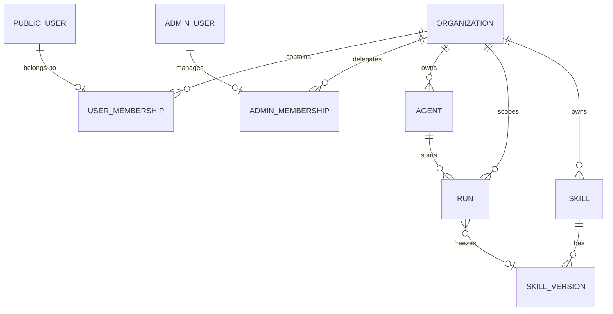
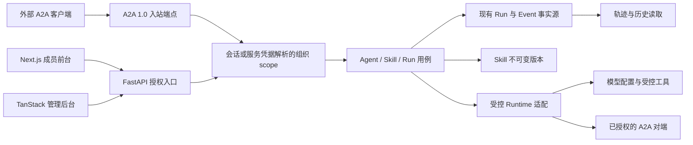

# PRD: 多组织通用在线 Agent 底座

> ✅ **交付前置**：无，可立即开工。
> 结构化声明见 §8 Delivery Dependencies，**那里是唯一事实源**。

> ⬜ **验收状态**：未开工。
> 本行是 §9 Acceptance Checklist 的投影，**那里是唯一事实源**。

> 本 PRD 分为 Part A 人审层和 Part B 执行器层。Part A 用于确认目标行为和关键取舍；Part B 记录实现路径与验证证据。

## Feature Overview (功能一览)

> 本块是 §10 Functional Requirements 的简明投影；行为验收以 §1 行为样例为准。

- **同一部署服务多个组织**（FR-1、FR-2）：组织成员只能看到本组织授权的 Agent、运行、Skill 与资产；平台管理员和组织管理员的权限分开。
- **从创建到运行的在线闭环**（FR-3、FR-4）：管理员发布 Agent，成员从浏览器选择 Agent、发起运行、查看增量结果和历史记录。
- **可追溯的 Skill 变更**（FR-5）：授权人员更新 Skill 时生成不可变新版本，可比较并以新版本恢复旧内容。
- **明确的执行边界**（FR-6）：本地执行只开放模型调用与平台审核的受控工具，Agent 间调用按 FR-11 走 A2A；缺失必需能力时清楚显示不可运行，不执行租户代码、宿主命令或跨组织调用。
- **中性、可分发的仓库**（FR-7、FR-8）：移入能力后保留模板复制与同步流程，发布内容不含来源产品的私有资料、商标素材或不明分发权的构建包。
- **真实入口与证据**（FR-9）：从公开前台、管理后台和 API 走完整链路，并用独立读取证明持久化与隔离。
- **可部署的在线入口**（FR-10）：沿用已有双前端和后端容器部署方式，浏览器经同源代理访问 API，线上密钥留在服务端。
- **Agent 间 A2A 双向互通**（FR-11）：外部获授权的 A2A 客户端可调用本平台发布的 Agent；本平台 Agent 可调用组织已授权的外部 Agent，两种方向都使用同一运行与授权边界。

# Part A · 人审层 (Review Layer)

## 1. Introduction & Goals

### Problem Statement

仓库目前有双域认证、通用 Run 事件和沙箱端口，但用户登录后没有可创建、选择和运行 Agent 的在线闭环。`ai-assistant` 已实现稳定 Agent 身份和运行内核，`freshai` 已实现 Skill 版本管理；两者也各自带有产品业务和不同的前台实现。直接复制两个仓库会把不同的认证、迁移链、前台与品牌资产一起带入，使模板的分发结果无法明确保证通用性与组织隔离。

仓库可观察事实：当前 Run 仅有用户 `owner_id`，应用装配只注册认证、执行轨迹和健康检查入口；现有模板说明也明确写着“模板不内置业务域”。因此目标改变需要正式定义产品边界，不能只靠批量拷贝目录。

### Interpretation (解读回显)

**行为样例**（每一行都成为 §7.6 的验收 oracle；修改表格中的结果就等于修改验收标准）：

| 验证方式 | 输入 / 操作 | 期望观察到的结果 |
|---|---|---|
| 👀 人审 + 自动验证 | 组织管理员创建并发布一个已配置模型的 Agent；本组织成员在前台选择它并提交消息 | 成员看到逐步更新的运行状态、最终回复和可重新打开的历史；管理端能查看同一运行的低敏轨迹 |
| 🤖 自动验证 | 组织 B 的成员或管理员尝试读取组织 A 的 Agent、运行、事件、Skill 或资产 | 所有请求均被拒绝或返回不可见；响应和轨迹不泄露组织 A 的名称、内容、凭据或存在性 |
| 👀 人审 + 自动验证 | 授权人员更新 Skill，比较两个版本，再选择旧版本内容作为新的当前版本 | 版本历史保持线性且旧记录不变；新运行冻结所选版本，旧运行仍指向原版本 |
| 🤖 自动验证 | Agent 缺少可用模型、被禁用，或尝试使用未审核工具/执行命令；成员尝试运行 | 前台显示不可运行原因，API 拒绝创建运行，不产生成功事件，也不执行命令 |
| 🤖 自动验证 | 维护者复制模板创建新项目 | 新项目可启动底座、保留模板同步入口，且不包含来源仓库的品牌包、私有样例和凭据 |
| 🤖 自动验证 | 外部 A2A 客户端调用组织 A 发布的 Agent，并查询、订阅或取消该任务；组织 B 的凭据尝试读取同一任务 | 授权客户端拿到对应 Run 的任务状态与结果，取消和重新查询一致；组织 B 无法获知任务内容或存在性 |
| 🤖 自动验证 | 组织 A 的 Agent 调用已登记且授权的外部 A2A Agent；用户要求改用未登记地址或组织 B 的凭据 | 已授权调用经真实 A2A 客户端边界完成并归入原 Run 的轨迹；未登记目标或跨组织凭据在发起网络请求前被拒绝 |

**我默默定了这些**

- 同一部署支持多个组织；首版一个普通用户只归属一个组织，避免含糊的跨组织会话切换。
- 平台管理员管理组织与授权，组织管理员管理本组织 Agent 和 Skill；普通成员只能使用被授权能力。
- 迁移采用当前模板的目录、认证和 Run 契约作为目标形态；来源仓库是可挑选的实现参考，不整体覆盖目标仓库。
- 现有 Run 和用户数据归入显式的默认组织，迁移不删除历史运行或事件。
- `just copy` 与 `sync-template` 继续是正式能力，派生项目收到可运行的中性底座。
- 默认模型仍由现有三项环境配置提供；不把来源仓库的供应商目录当成平台事实。
- 首版的本地执行只开放模型与平台审核的受控工具，Agent 间调用只走受权 A2A；租户不能上传代码运行或请求执行命令。现有沙箱端口保留为工程能力，但不对在线租户开放。
- 首版支持 A2A 双向互通，使用官方 1.0 的 HTTP+JSON/REST 绑定；每个可对外发布的 Agent 有独立的 Agent Card 与端点，组织授权决定谁能发现和调用。外部 Agent 地址由组织管理员登记并经平台策略批准，不接受运行时任意 URL。
- “在线版”指可经现有生产容器入口部署并使用，本 PRD 的实施不擅自部署到真实公网域名。

**我理解为不做**

- 不复制 Outlook/Office 宿主、货运任务、CargoX 设计包、FreshAI 积分/市场/社交/博客，也不导入两个来源仓库的 Git 历史。
- 不在首版提供任意第三方 Runtime 协议、模型供应商管理后台或跨组织共享市场；Agent 间互通协议明确定位为 A2A。
- 不开放租户代码、Shell/容器命令或用户上传 Skill 包的执行；有强隔离需求时另立 PRD。
- 不把“去商标”理解为仅替换界面文字；发布资产、示例、文档和分发权都必须检查。

本 PRD 把需求读成一个能在线创建、运行、治理并通过 A2A 与独立 Agent 协作的**多组织模板底座**。组织归属必须在登录、查询、运行、A2A、工具和持久化路径一致生效；失败必须显式返回。模板复制和同步能力属于交付的一部分。只有证据证明可独立迁移的通用实现才从两个来源迁入。

### What The User Gets

组织管理员能设置本组织的 Agent 与 Skill、授权 A2A 对端；成员能在浏览器中使用 Agent、回看历史；外部获授权的 Agent 能通过 A2A 调用本平台 Agent，本平台 Agent 也能调用已授权的外部 Agent；平台维护者能用同一部署服务多个互相隔离的组织，并继续从仓库复制出中性的派生项目。

### Measurable Objectives

- 两个组织的真实入口交叉读取和运行请求都不能越权，且失败响应无目标组织内容。
- 一个已配置的 Agent 从发布到运行、重开历史和管理轨迹形成闭环，Run 与事件在新请求中可读。
- Skill 更新、比较、恢复保留完整版本链；运行记录能定位当时使用的版本。
- 缺失模型或执行能力时，启动或操作给出确定的不可用状态，没有宿主机执行回退。
- 复制得到的新项目通过启动检查和中性内容审计；模板同步仍可识别共享文件与项目文件。
- 生产构建和本地容器入口下，两个前端都能经各自 `/api` 代理完成登录与授权请求；模型密钥不出现在浏览器响应或静态包中。
- A2A 入站与出站各有一条真实协议入口证据；任务状态、流、取消、重试与 Run 对应一致，跨组织调用和未经批准的对端均失败闭合。

## 2. Human Review Map (介入与风险地图)

### 决策一：组织与管理员的边界

建议采用一个用户归属一个组织、平台管理员不默认读取组织业务数据的模式。现有双域登录继续存在，组织身份由服务端会话解析，不能由请求方任意指定。存量用户和 Run 归入一个显式默认组织，事件与历史不得丢失。错误的归属会造成跨组织数据暴露，属于本 PRD 最重要的安全决定。

**已确认：** 首版一个普通用户归属一个组织；平台管理员接触组织业务数据必须经显式授权和审计。

**验收：** 用两个真实组织的账号互相读取 Agent、运行、Skill 和资产都失败；迁移后原账号仍能读取自己的历史。



### 决策二：Agent 运行与可用性

建议保留稳定 Agent 身份，运行开始时冻结 Agent、模型和 Skill 的有效版本；状态和增量事件只走一条持久化链。本地执行仅允许模型与平台审核的受控工具，Agent 间委派使用已授权 A2A 对端；租户不能提交可执行代码或命令。模型或必需工具不可用时，Agent 显示不可运行并拒绝启动，不能暗中换另一个执行方式。

**已确认：** 稳定 Agent 身份、单一运行事实源和失败闭合的可用性规则。

**验收：** 用户从前台提交一次运行，能看到同一运行的过程、最终结果与历史；关闭页面后重新进入，状态和内容仍一致；不可用时不会产生伪成功。

### 决策三：Skill 版本与来源取舍

建议把声明式 Skill 的正文与版本治理作为通用能力纳入，但只迁入独立于市场、积分和社交的路径。Skill 可以包含说明与非可执行参考资料，不能包含租户可运行脚本或上传代码包。恢复旧内容应追加一个新版本，不能修改或删除既有历史；运行必须记录实际采用的 Skill 版本。否则源仓库的多条写入入口会形成不同的版本事实。

**已确认：** Skill 保留线性版本历史，恢复旧内容生成新版本；首版不包含 Skill 市场交易。

**验收：** 管理员在浏览器里查看差异并恢复旧内容后，历史顺序和两个已完成运行所引用的版本均可核对。

### 决策四：Agent 间 A2A 互通

首版采用 A2A 双向互通：获授权的外部客户端可发现并调用本组织发布的 Agent；本组织 Agent 可调用已登记、已授权的外部 Agent。独立 Agent 之间使用 A2A；Agent 使用模型与受控工具仍走原有内部接口。外部任务与平台运行记录要能一一追溯，组织边界必须在两个方向成立。管理员能清楚看到对外发布状态和已授权对端，不能由普通消息临时指定未知地址。

**已确认：** 首版交付双向互通；以受控对端目录和组织授权限制流量，不开放任意 URL 调用。

**验收：** 外部客户端可用 A2A 发消息、看状态、订阅结果与取消任务；本平台 Agent 能调用已授权外部 Agent，并将结果和失败归入同一运行历史。其他组织的凭据及未登记对端均不能访问或触发请求。

### 自动门禁，不需要逐项人工审阅

前后端契约、迁移双数据库验证、品牌与敏感内容扫描、模板复制和同步行为，由执行器和独立 verifier 用可复现证据核验。

### 本次明确不涉及

不迁入来源仓库的产品业务或现成二进制设计包；无凭据的外部服务不作为本地测试的假成功。

## 3. Usage And Impact After Implementation

### 组织成员

从公开前台登录、选择本组织可见 Agent、发送消息，看到实时状态和结果；再次打开历史可读到同一次运行的内容。注册和登录入口继续使用既有 public 会话；未加入组织或组织停用时收到明确的不可用提示。

### 组织管理员与平台管理员

组织管理员从管理后台发布 Agent、管理 Skill 版本、管理 A2A 发布与对端授权、查看本组织运行轨迹；平台管理员创建或停用组织并分配组织管理员，不因平台身份自动浏览成员内容。既有 admin 登录域保持独立。A2A 调用方使用专门的组织范围服务凭据，不能复用管理员浏览器 Cookie。

### 部署者与派生项目维护者

部署者填入现有模型三件套和数据库/会话配置后，用既有后端加两个前端的容器配置启动服务；无模型时健康检查仍可工作，但 Agent 标为不可运行。浏览器通过同源 `/api` 代理访问后端，密钥只留服务端。A2A 路由由后端独立暴露并校验服务凭据，出站目标须通过注册目录和平台网络策略；每组织/对端的凭据只在服务端安全存储或按密钥引用获取，不进入 Agent Card、浏览器或日志。受控工具由部署方审核和注册，不接受租户提交可执行代码。维护者复制模板后得到中性配置和可运行入口，并继续使用同步机制接收共享工程更新。

### Impact On Existing Behavior

- 既有 public/admin 登录、健康检查、Run 轨迹查询路径继续工作；新增组织归属后，历史数据通过迁移保持可读。
- 新配置默认不携带真实密钥；缺少模型配置不会让基础应用启动失败，但运行入口明确拒绝。
- 既有模板分发命令保留，项目专属代码仍遵循原有同步排除规则。

## 4. Requirement Shape

| 维度 | 目标 |
|---|---|
| Actor | 组织成员、组织管理员、平台管理员、部署者、派生项目维护者、获授权的 A2A 调用方 |
| Trigger | 登录并管理/使用 Agent、更新 Skill、运行 Agent、通过 A2A 调用或被调用、复制或同步模板 |
| Expected behavior | 同一部署内组织隔离、持久 Run 闭环、A2A 双向互通、可追溯 Skill 版本、双前端可部署和中性可分发项目 |
| Explicit scope boundary | 只迁移通用内核与必要 UI；不引入来源仓库的独立产品业务和商标资产 |

# Part B · 执行器层 (Build Layer)

## 5. Repository Context And Architecture Fit

现有近路：`src/backend/core/shared/models/run.py`、`interfaces/run_repository.py`、`infrastructure/persistence/models/run.py` 已提供 Run/event/trace；`core/auth/`、`composition/auth_wiring.py` 已提供双域登录；`core/shared/interfaces/sandbox_provider.py` 与 `infrastructure/sandbox/` 已提供沙箱端口；`composition/app_factory.py` 是唯一应用装配入口。`frontend-public/` 是 Next.js 公开站点与应用壳，`frontend-admin/` 是 Vite/TanStack 管理后台。

复用来源：`../ai-assistant/src/backend/core/agent/`、`core/organization/`、`core/skill/`、`engines/agent_adapters/` 与相关 API/仓库实现供语义对照；`../freshai/src/backend/core/use_cases/user_skills/version_history.py`、`import_export.py` 与相应持久化路径供 Skill 版本规则对照。迁入前逐项确认依赖闭包、版权/分发权和目标仓库现有实现；不复制两个来源的迁移文件或 package lock。

架构约束：保持 `api → core`，跨层通过 `core/shared/interfaces/`，由 `composition/` 装配；`infrastructure/` 不反向导入 core；已有 Run/event 是唯一事实源。独立 Agent 之间采用 A2A 作为外部互通协议，入站 A2A Task 映射到既有 Run，出站远端 Task ID 关联父 Run，不能另建第二套运行事实源；MCP/受控工具仍是 Agent 使用工具的边界，不替代 A2A。A2A 协议适配放在 API 与 engine/infrastructure 边界，由 core 用例执行授权与运行；只选官方 1.0 HTTP+JSON/REST 绑定，避免同时维护 JSON-RPC/gRPC 适配。新 Alembic 文件只用 `just new-migration <slug>` 生成，验证唯一 head。`just copy` 保留，`sync-template` 默认仍跳过项目特定目录。来源仓库的 `/api/agent-runs` 前缀不能原样搬入：目标前端客户端已有 `/api` baseURL，浏览器请求应为 `/api/agent-runs`，后端实际路由应为 `/agent-runs`，避免 `/api/api/agent-runs`。

前端影响：`frontend-public/app/(app)/` 增加 Agent 目录、会话/运行页面和状态组件，经 `frontend-public/lib/api/` 调用新 API；`frontend-admin/src/routes/_authenticated/`、`features/` 与 `api/` 增加组织、Agent、Skill 管理，复用现有运行轨迹入口。前台使用 `just run frontend-public` / `pnpm build`，后台使用 `just run frontend` / `pnpm build`，真实 UI 使用 `just e2e` 和独立 Playwright 包；先按该包 `README.md` 适配用例。部署沿用 `docker-compose.yml`、`deploy/vps-traefik/docker-compose.yml` 和 `docs/guides/deployment.md` 的三服务形态，检查生产 Next rewrite 与后台 Nginx `/api` 转发。

现有 PRD 关系：`tasks/pending/` 无待执行 PRD，因此没有硬依赖；归档的 `20260518-164340-prd-decouple-template-from-business.md` 曾明确将模板定位为无业务骨架，本 PRD 经用户新目标批准后取代这项**产品定位**，但保留其避免厂商硬编码和分发污染的原则。归档的双域认证 PRD 继续作为认证兼容依据。

主要重复风险：三套 Run/会话状态、两个 Skill 版本写入口、把 Next 前台整体换成 Vite、源仓库迁移链并入模板、复制品牌包。各项均须禁止。

## 6. Recommendation

### Recommended Approach

在现有模板上完成一个可运行的 Agent 闭环及 A2A 双向互通，以 `ai-assistant` 为 Run/Agent/组织规则参考，以 `freshai` 为 Skill 版本语义参考，只移入独立且获得分发确认的代码。两份来源均无可直接迁入的 A2A 实现；按目标仓库四层边界新增薄协议适配，保持当前前端框架和模板分发流程。

### Proposed Solution Summary (实现机制)

组织身份由现有 public/admin 会话经服务端解析；A2A 入站由服务凭据解析组织、调用方及目标 Agent 权限；组织、Agent、Skill 和 Run 仓库查询都接受已解析 scope。Agent 创建时只绑定模型、已批准 A2A 对端和平台审核的工具目录，Run 创建时冻结 Agent 与 Skill 版本快照，事件在既有 Run 事务链追加；浏览器从 canonical Run API 订阅/查询状态。A2A 入站消息经过相同 Run 用例生成任务视图，出站调用经已登记 Agent Card 与受控客户端，将远端任务状态/结果归入父 Run 事件；出站凭据以组织与对端为作用域安全存储、轮换和读取，只向该对端发送，不写入卡片/轨迹。模型客户端作为基础设施适配现有 `load_primary_model_settings()`，缺配置则登记不可运行。在线 API 不暴露沙箱命令或用户代码执行入口。Skill 所有写入统一经过串行版本创建用例；旧版恢复也是一次新写入。前后端分别接到现有 Next/TanStack 应用壳，模板复制只接收审计后的中性资产。

### Alternatives Considered

| 方案 | 结论 |
|---|---|
| 整仓覆盖 `ai-assistant` 与 `freshai` | 拒绝；Run、认证、迁移、前台与产品业务会冲突，且品牌构建包需要单独处置。 |
| 新建微服务/第二套 Run Store | 拒绝；模板已有 Run 事实源和四层装配，平行实现会破坏历史与轨迹一致性。 |
| 仅迁入后端，前台后补 | 拒绝；目标是在线可用底座，缺浏览器入口无法验证实际用户闭环。 |

范围凝聚判断：组织隔离、Agent Run、Skill 版本和 A2A 看似可分别编码，但首版对外承诺的是同一套受组织授权的 Agent/Run；把 A2A 单独后置会交付一个无法满足已确认互通要求的首版，拆开组织/Run 又会产生临时无隔离运行或第二次迁移。因此保留一个目标状态，并以入站/出站协议 oracle 显式核查新增风险。市场、积分、Outlook 集成可独立交付，故明确排除。

## 7. Implementation Guide

本节是基于当前仓库的动态实施指南。若实施时发现额外影响文件、隐藏依赖、边界情况或更好的路径，先更新本 PRD 再继续。

### 7.1 Core Logic

先盘点来源代码许可、资源和目标接口；以现有双域会话建立组织 scope；扩展 Run 的组织与快照契约，复用事件存储及追踪；接入单一模型运行适配、仅由部署方注册的受控工具和 Skill 版本写入；接 A2A 入站/出站适配，最后接前台和管理端。测试数据库迁移必须保留已有 Run/event 的数量、关联和可读性。写操作在事务内锁定归属与版本，读操作按组织和 owner 限定；请求体里的组织 ID 不得覆盖服务端会话结论。A2A 入站按凭据解析组织与目标 Agent，外部 task/context ID 不能直接当作本地授权依据；出站目标只来自已批准的对端目录，解析 Agent Card 后限制 DNS/IP、重定向、内网地址与凭据转发，防止 SSRF 和跨租户泄漏。在线路由不得连接到现有沙箱命令执行端口。

正式路由以当前模板的代理边界为准：后端 `/agents`、`/agent-runs`、`/skills`、`/admin/organizations` 等由前端 `/api` baseURL 暴露为浏览器 `/api/...`；Run 创建、详情、事件和取消分别使用 `POST /agent-runs`、`GET /agent-runs/{run_id}`、`GET /agent-runs/{run_id}/events`、`POST /agent-runs/{run_id}/cancel`。A2A 使用独立后端路径 `/a2a/agents/{agent_id}`（不套浏览器 `/api` 代理），每个 Agent 提供受权的 Agent Card；按 1.0 REST 绑定实现 `POST /message:send`、`POST /message:stream`、`GET /tasks/{id}`、`GET /tasks`、`POST /tasks/{id}:cancel`、`POST /tasks/{id}:subscribe`，声明 `A2A-Version: 1.0`，不宣称未实现的推送通知或其他绑定。流与取消映射现有 Run 的状态/事件；重复消息和重试不可创建不受控的重复 Run。具体 DTO 在实施时以官方版本、归属、快照、失败语义为准定型，不能把来源仓库已含 `/api` 的路由再叠一层代理。Skill 只接受声明式正文/参考文件，上传校验拒绝执行脚本与代码包。

### 7.2 Change Impact Tree

```text
.
├── Database / Migration
│   ├── alembic/versions/                         [新增] 【总结】通过生成器建立组织、Agent、Skill 版本及既有 Run 归属迁移，保留历史事件。
│   └── src/backend/infrastructure/persistence/models/ [修改] 【总结】增加组织、Agent、Skill 关系并扩展现有 Run 归属字段。
├── Domain
│   ├── src/backend/core/auth/                     [修改] 【总结】从服务端会话解析组织身份与管理员权限。
│   ├── src/backend/core/agent/                    [新增] 【总结】管理稳定 Agent 身份、发布与 Run 创建/取消用例。
│   ├── src/backend/core/skill/                    [新增] 【总结】统一 Skill 版本、差异和恢复规则。
│   ├── src/backend/core/a2a/                      [新增] 【总结】定义对端授权、入站调用和出站委派用例，不存第二套 Task 状态。
│   ├── src/backend/core/shared/models/run.py      [修改] 【总结】冻结组织、Agent 和 Skill 来源信息。
│   └── src/backend/core/shared/interfaces/        [修改] 【总结】声明目录、版本与运行适配端口。
├── Engines / Infrastructure
│   ├── src/backend/engines/agent_adapters/         [新增] 【总结】把模型/受控工具输出映射为既有 Run 候选事件。
│   ├── src/backend/engines/a2a/                    [新增] 【总结】隔离官方 A2A 1.0 消息、Task、流与内部 Run 事件的双向转换。
│   ├── src/backend/infrastructure/config/settings.py [修改] 【总结】复用主模型配置并显式表示不可运行状态。
│   ├── src/backend/infrastructure/a2a/             [新增] 【总结】实现受控 HTTP 客户端、Agent Card 获取与目标地址网络限制。
│   └── src/backend/infrastructure/persistence/repos/ [修改] 【总结】按组织过滤并事务化写入运行和版本。
├── API / Composition
│   ├── src/backend/api/                            [新增] 【总结】提供组织、Agent、Skill 和 canonical Run 的受权入口。
│   ├── src/backend/api/a2a/                        [新增] 【总结】提供每 Agent 的 Agent Card、A2A 1.0 REST、流与取消入口。
│   └── src/backend/composition/app_factory.py      [修改] 【总结】装配唯一运行链、路由和依赖。
├── Frontend
│   ├── frontend-public/app/(app)/                  [新增] 【总结】增加 Agent 目录和真实会话页面。
│   ├── frontend-public/lib/api/                    [修改] 【总结】同步 Agent、Run、Skill 类型与调用路径。
│   ├── frontend-admin/src/routes/_authenticated/   [新增] 【总结】增加组织、Agent 与 Skill 治理路由。
│   ├── frontend-admin/src/features/                [新增] 【总结】增加发布、版本差异、A2A 对外状态与对端授权界面。
│   └── frontend-admin/src/api/                     [修改] 【总结】同步管理 API 与类型。
├── Template / Docs / Tests
│   ├── config.toml + .env.example                   [修改] 【总结】只声明中性配置与空密钥示例。
│   ├── docker-compose.yml + deploy/vps-traefik/docker-compose.yml [修改] 【总结】让现有双前端/后端容器入口与新 API 代理保持一致。
│   ├── docs/architecture/system-design.md + mkdocs.yml [修改] 【总结】记录目标契约、租户边界与文档导航。
│   ├── docs/prototypes/                            [新增] 【总结】先产出 Agent/Skill 关键状态的交互目标原型供 PR 对照。
│   ├── tests/backend/ + tests/guards/              [修改] 【总结】覆盖组织越权、A2A 双向协议/授权、版本、迁移与模板分发约定。
│   └── tests/playwright-e2e/tests/                  [新增] 【总结】从真实路由验证管理发布、成员运行及历史。
```

此树列出起点而非穷尽文件；实施时先搜索调用点和生成文件，不按目录批量复制。

### 7.3 Risk Classification Register

| Change point | Tier | 决定性原因 | Intervention | Oracle / gate |
|---|---|---|---|---|
| 组织归属、迁移、管理员权限 | R3 | 跨租户授权与历史数据；安全及数据库固定区 | 人工确认 | rv-1 |
| Agent 创建、幂等、状态及事件 | R3 | 并发执行和持久结果；core 固定区 | 人工确认 | rv-2 |
| Skill 版本、恢复与快照 | R2 | 持久版本与历史语义；core 固定区 | 人工确认 | rv-3 |
| A2A 双向协议、外部身份与对端网络访问 | R3 | 外部信任边界与跨组织数据/凭据风险 | 人工确认 | rv-7（与 rv-1 的组织负控联动） |
| 品牌/私有资产与分发审计 | R1 | 发布前可由静态清单阻断 | 执行器 + 发布清单审计 | rv-4 |
| 模板复制与同步保留 | R1 | 可逆的工程入口 | 执行器 + 干净副本断言 | rv-5 |
| 中性 UI 与 API 客户端 | R1 | 两个界面内的普通展示与调用 | 执行器 + 真实浏览器请求断言 | rv-2、rv-3 |
| 容器部署与同源 API 代理 | R1 | 现有部署适配 | 执行器 + 生产容器入口 smoke | rv-6 |

### 7.4 Executor Drift Guard

先执行 `rg -n 'agent-runs|RunModel|RunEventModel|session_id|admin_session_id|MODEL_BASE_URL|sandbox_agent|project_skip_paths|a2a|AgentCard' src frontend-admin frontend-public config.toml docs` 定位旧入口；分别在两个来源仓库按类名与路由搜索实际依赖闭包，确认尚无可复用 A2A 实现。再用 `rg -n -i 'cargox|freshai|outlook|freight|cost.rate|vendor/' src frontend-admin frontend-public docs config.toml .env.example` 检查待发布面，逐项记录合法引用与必须移除项。不要把 `rg` 零结果当成二进制、图片、历史或依赖包的充分审计。协议实现前核对 A2A 1.0 官方规范与所选 SDK 锁定版本，不凭记忆复制旧版 JSON-RPC 字段。

### 7.5 Flow / Architecture Diagram



ER 目标结构见 §2 决策一。具体新表、索引、外键和存量 Run 回填顺序应在实施前按源模型与当前数据库约束确定，并同步进本 PRD；两种受支持数据库都必须有升级和可支持的降级证据。

### 7.6 Realistic Validation Plan

```yaml
- id: rv-1
  behavior: "组织 B 的成员或管理员尝试读取组织 A 的 Agent、运行、事件、Skill 或资产"
  reviewer: verifier
  real_entry: "just run 后，通过 /api/auth/login、/api/admin/auth/login 取得两个组织的会话并请求正式 /api/* 与 /api/admin/* 入口"
  expected: "所有请求均被拒绝或返回不可见；响应和轨迹不泄露组织 A 的名称、内容、凭据或存在性；迁移后原账号仍能读取自己的历史"
  mock_boundary: "模型响应可替换；认证路由、服务端 scope、数据库事务、Run/Skill/资产仓库与 HTTP 序列化必须真实"
  tier: R3
  test_layer: e2e
  required_for_acceptance: true
  critical_value_source: "由平台管理员创建组织及成员的真实 API 返回 ID，再用各自登录响应的 Cookie；存量 ID 从迁移前数据库读取"
  must_cross: "登录 Cookie → 服务端组织解析 → 正式 API → scope 过滤 → PostgreSQL/MySQL 持久化 → 新请求读取"
  forbidden_bypasses: "手工伪造组织 scope、直接调用用例、预置绕过认证的测试对象、从请求体采信 organization_id"
  fresh_state_probe: "新 HTTP 客户端分别以 A/B Cookie 重读目录、Run、事件、Skill 和资产，并核对存量数据计数"
  final_tree_evidence: "记录最终 Git tree 与数据库迁移版本；相关代码变动后重收 rv-1，分别留 PostgreSQL/MySQL 结果"
  negative_control: "在测试边界故意用 B Cookie 请求已由 A 会话创建的精确资源 ID"
  expected_fail: "若 scope 过滤缺失，负控读到 A 的内容，越权断言变红"
- id: rv-2
  behavior: "组织管理员创建并发布一个已配置模型的 Agent；本组织成员在前台选择它并提交消息"
  reviewer: human
  real_entry: "just e2e tests/workflows/agent-run.auth.spec.ts（从管理页发布，再从真实成员页面运行）"
  expected: "成员看到逐步更新的运行状态、最终回复和可重新打开的历史；管理端能查看同一运行的低敏轨迹；不可用 Agent 被拒绝且无伪成功"
  mock_boundary: "只允许替换付费模型传输；真实页面、代理、登录、API、Run 事务、事件读取与轨迹投影不可替换；模型请求构造须另有契约检查"
  tier: R3
  test_layer: e2e
  required_for_acceptance: true
  presentation: "最终证据目录的 rv-2-agent-run.png 与真实运行录屏；同视口并排对照目标原型，检查运行 ID、状态、结果和历史"
  critical_value_source: "管理页创建 Agent 后显示的 ID 与前台选择项；Run ID 从浏览器实际请求/响应及页面取得，不在测试中重构"
  must_cross: "管理 UI → admin API → Agent commit → 成员 UI → 正式 Run API → event commit → SSE/轮询 → 新页面历史读取 → 管理轨迹"
  forbidden_bypasses: "组件预览、直接调 core、伪造 Run ID、只检查写响应、/api/api/agent-runs 或旧兼容路由、任何租户代码或命令执行回退"
  fresh_state_probe: "新浏览器上下文登录同一成员并重新打开刚才页面展示的 Run ID，核对终态、回复与管理轨迹"
  final_tree_evidence: "截图、录屏、浏览器请求记录与最终 Git tree 一起写入证据报告；入口或契约改动后重收"
  negative_control: "先在未实现的原始模板树运行正式流程，或在测试替身边界返回故意缺失的模型字段"
  expected_fail: "原始模板无 Agent 入口，或响应契约错误导致运行结果断言变红"
- id: rv-3
  behavior: "授权人员更新 Skill，比较两个版本，再选择旧版本内容作为新的当前版本"
  reviewer: human
  real_entry: "just e2e tests/workflows/skill-version.auth.spec.ts（从真实管理页面更新、比较、恢复并重新运行）"
  expected: "版本历史保持线性且旧记录不变；新运行冻结所选版本，旧运行仍指向原版本"
  mock_boundary: "模型传输可替换；版本 API、事务锁、数据库与 Run 快照必须真实"
  tier: R2
  test_layer: e2e
  required_for_acceptance: true
  presentation: "最终证据目录的 rv-3-skill-version.png；与目标原型并排展示版本差异和恢复后的线性历史"
  critical_value_source: "管理界面创建的 Skill 与版本 ID、界面展示的旧版内容；恢复请求直接使用该选择"
  must_cross: "管理 UI → 版本 API → 行锁与 commit → 新请求版本列表 → Run 创建快照 → 历史 Run 读取"
  forbidden_bypasses: "直接改版本表、删除旧版本、前端假造差异、绕过版本写入用例"
  fresh_state_probe: "新的管理会话重读全部版本和两个 Run 快照，核对序号、正文摘要及未修改的旧记录"
  final_tree_evidence: "数据库查询、截图与最终 Git tree 同记证据包；版本或快照路径变更后重收"
  negative_control: "在测试仓库替身中模拟重复版本号或被修改的旧版本"
  expected_fail: "唯一性或旧版不可变断言变红"
- id: rv-4
  behavior: "维护者准备公开分发仓库并审计来源资产"
  reviewer: verifier
  real_entry: "从干净副本运行仓库发布/复制入口，再扫描实际输出目录及 Git 跟踪清单"
  expected: "发布内容不含来源产品品牌包、私有样例、凭据；来源文件的分发权有逐项记录；若公开现有仓库历史，历史也已完成审计或改由干净历史发布"
  mock_boundary: "无；扫描必须针对实际分发输出、二进制/图片元数据和拟公开的 Git 历史"
  tier: R1
  test_layer: smoke
  required_for_acceptance: true
- id: rv-5
  behavior: "维护者复制模板创建新项目"
  reviewer: verifier
  real_entry: "just copy <临时目录名>，然后在新项目运行 just run 与 just sync-template --list"
  expected: "新项目可启动底座、保留模板同步入口，且不包含来源仓库的品牌包、私有样例和凭据"
  mock_boundary: "可使用本地模型替身；模板复制、配置加载、应用装配与同步脚本必须真实"
  tier: R1
  test_layer: smoke
  required_for_acceptance: true
- id: rv-6
  behavior: "部署者从现有双前端和后端容器入口使用在线底座"
  reviewer: verifier
  real_entry: "docker compose -f docker-compose.yml up -d --build，然后通过两个前端容器公开端口访问登录和 /api/agent-runs；完成后 docker compose -f docker-compose.yml down"
  expected: "生产构建启动，两个前端同源 /api 路径只转发一次，登录 Cookie 可用，静态包和浏览器响应中没有模型密钥"
  mock_boundary: "可不配置付费模型；容器、前端生产构建、代理、后端真实路由与会话必须真实"
  tier: R1
  test_layer: smoke
  required_for_acceptance: true
- id: rv-7
  behavior: "外部 A2A 客户端调用组织 A 发布的 Agent；本平台 Agent 调用组织 A 已授权的外部 Agent，组织 B 或未登记对端尝试越权"
  reviewer: verifier
  real_entry: "从真实管理页发布 Agent 并登记/授权对端；通过真实后端 A2A 1.0 REST 入口读取受权 Agent Card、发送消息、订阅/查询/取消 Task；从正式成员 Run API 触发已登记外部 Agent 调用；使用官方 A2A 1.0 兼容客户端/服务端替身走网络协议"
  expected: "入站 Task 与本地 Run 的状态、流、结果、取消及重新读取一致；出站远端 Task 结果与失败归入父 Run；组织 B 对精确 Task ID 不能获知内容或存在性；未登记地址、内网/重定向目标与跨组织凭据在网络调用前拒绝"
  mock_boundary: "远端外部 Agent 可用受规范约束的本地服务端替身；真实 A2A HTTP 序列化/版本协商、后端路由、服务凭据、组织授权、客户端地址策略、Run 事务与事件读取不可替换；替身不得自行发明协议字段"
  tier: R3
  test_layer: e2e
  required_for_acceptance: true
  critical_value_source: "入站 Agent Card URL 从真实管理页和卡片响应取得、任务 ID 从真实协议响应取得；出站对端 URL 从管理员已批准登记记录取得，远端任务 ID 从协议响应取得"
  must_cross: "管理 UI → A2A 发布与对端授权提交 → 外部 A2A 客户端 → Agent Card/1.0 REST → 服务凭据解析 → 组织授权 → Run/event commit → 新客户端 Task 查询/订阅/取消；正式 Run API → 已批准对端目录 → 受控 HTTP 客户端 → 外部 A2A 服务端 → 父 Run 事件读取"
  forbidden_bypasses: "直接调用 core、手工构造 Task/Run 映射、全局公开私有 Agent Card、从 URL/请求体采信组织身份、仅用同一代码库的编解码器互测、运行时任意 URL、跟随内网重定向、将入站凭据转发给外部对端"
  fresh_state_probe: "新客户端使用 A 凭据按响应 Task ID 重查终态与本地 Run/事件，使用 B 凭据查同 ID 得不可见；新会话重读父 Run，核对远端 Task ID、结果与失败轨迹"
  final_tree_evidence: "记录官方兼容客户端/服务端版本、协议请求/响应脱敏摘录、负控网络请求计数、Run/Task 对账及最终 Git tree；协议、权限或 Run 映射变化后重收 rv-7"
  negative_control: "先用 B 凭据访问 A 的精确 Task ID，再将出站目标改为未登记或解析到受限地址"
  expected_fail: "缺少服务端 scope 会暴露 A 的任务；缺少地址/凭据限制会产生本应为零的外呼请求"
```

命令从仓库根目录执行；`<临时目录名>` 由实施者选择并确认不会覆盖现有目录。外部模型和真实外部 Agent 的连接仅在提供凭据后 opt-in；无凭据时 A2A 的本地独立实现互通、真实路由、版本协商、客户端地址策略、模型请求构造和失败闭合仍是必过门禁，但不得称为真实外部服务已验证。租户代码或命令执行不属于本 PRD，不通过临时打开 Docker 沙箱来测试。失败先查 `composition/app_factory.py` 路由装配、前端 `/api` 代理、A2A 独立后端端点和数据库迁移版本，不用直接调用用例代替入口。数据库有关的 rv-1/rv-3/rv-7 分别执行 PostgreSQL 与 MySQL 升级、关键数据核对及可支持的降级。代码改动完成后执行 `just test`，再由独立 verifier 审查证据，最多两轮。

### 7.7 Low-Fidelity Prototype

当前仓库没有 Agent 会话或 Skill 版本的真实目标原型。实施的第一项前端交付是按现有 Next 应用壳与 TanStack 管理壳制作并登记可点击原型（见 `docs/prototypes/` 与 Prototype Hub），覆盖：可用 Agent 目录、不可运行原因、运行中与完成态、重开历史、Skill 差异和恢复确认。原型只表达设计目标，标记 `interactive prototype`；验收必须另拍真实入口截图，使用相同状态、视口、主题和代表数据配对。

### 7.8 External Validation

| Topic | Source | Checked On | Relevant Finding | Impact On Recommendation |
|---|---|---|---|---|
| A2A 协议定位与版本 | [A2A 官方 1.0.0 规范](https://a2a-protocol.org/v1.0.0/specification/) | 2026-09-28 | A2A 规定 Agent Card、消息、Task/状态与多种协议绑定；1.0.0 是查询时的最新发布版。 | 把 A2A 放在独立 Agent 之间的协议边界，实施时固定协商版本，不将其对象直接当作内部 Run 模型。 |
| A2A 与 MCP 的职责 | [A2A 官方规范附录 B](https://a2a-protocol.org/v1.0.0/specification/#appendix-b-relationship-to-mcp-model-context-protocol) | 2026-09-28 | A2A 面向独立 Agent 协作，MCP 面向工具、API 和数据源接入。 | 现有受控工具/MCP 不承担跨 Agent 任务协议职责。 |
| 发现与安全 | [A2A 官方 Agent Discovery 指南](https://a2a-protocol.org/latest/topics/agent-discovery/) | 2026-09-28 | 支持 Agent Card URL 直接配置或目录发现；敏感卡片需鉴权，凭据不应嵌入卡片。 | 多租户 Agent Card 与调用凭据须按组织限制，不能将内部目录公开为全局发现。 |
| 多租户路由 | [A2A 官方 Multi-Tenancy 指南](https://a2a-protocol.org/latest/topics/multi-tenancy/) | 2026-09-28 | 同一主机可通过每个 Agent 的 URL 前缀路由；各 Agent 应各自提供 Agent Card。 | 优先采用每 Agent 独立路径与卡片，组织归属仍由凭据和服务端授权解析，不能相信路径本身。 |

在实际选用第三方沙箱或发布许可结论前，实施者需单独核对届时的官方资料和资产权利记录，不以本 PRD 猜测代替。

## 8. Delivery Dependencies

### Delivery Dependencies

- Group: multi-organization-online-agent-base
- Depends on tasks/issues:
  - none
- Gate type: none
- Notes: 已检查 `tasks/pending/`，无上游待执行 PRD；来源仓库只作只读迁移参考。

## 9. Acceptance Checklist

### 9.1 人读呈递区（Human Review Surface）

| 人要看的结果 | 交付时呈递物 | 约 10 秒自检 |
|---|---|---|
| Agent 从发布到运行和历史闭环 | `tasks/evidence/<本 PRD stem>/rv-2-agent-run.png` 与录屏；交付时填绝对路径、内嵌截图、给出 `open "<绝对路径>"`；PR 中并排呈递原型与真实图 | 查看页面 Run ID、终态与重开历史是否相同 |
| Skill 更新、差异与恢复 | `tasks/evidence/<本 PRD stem>/rv-3-skill-version.png`；交付时填绝对路径、内嵌截图、给出 `open "<绝对路径>"`；PR 中并排呈递原型与真实图 | 查看恢复生成的新版本号，并确认旧版本仍在 |

`rv-1`、`rv-4`、`rv-5`、`rv-6`、`rv-7` 的越权、资产、模板、部署与 A2A 协议门禁由 verifier 审阅，成功日志不占人审页面。上表是未来交付的呈递槽位；PRD 创建时尚无截图，不得把目标原型当成真实验收证据。交付报告必须以相同内容开头，并将静态图片相对路径内嵌、注明本地证据限制与可执行打开命令；最终回复或已授权 PR 的证据评论直接呈递该页面。

### 9.2 Acceptance Evidence Package

#### Human-Confirmed

- [ ] 确认 §2 的组织归属与管理员权限决定；证据为 `rv-1` 两组织负控、迁移前后数据对账和独立 verifier 结论。
- [ ] 确认 §2 的稳定 Agent/单一 Run 事实源与失败闭合决定；证据为 `rv-2` 真实页面、历史和轨迹呈递。
- [ ] 确认 §2 的 Skill 线性版本与恢复决定；证据为 `rv-3` 差异、版本链和两个 Run 快照呈递。
- [ ] 确认 §2 的 A2A 双向互通与受控对端决定；证据为 `rv-7` 双向协议、跨组织和受限地址负控及 Run/Task 对账。
- [ ] 审阅 §9.1 的真实前台与管理后台图、原型对照及披露差异；证据为最终可打开的人审呈递页或 PR 证据评论。

#### Architecture Acceptance

- [ ] 只保留一套 Run/event 存储和 Skill 版本写入口；`rg` 引用清单与架构检查结果入证据包。
- [ ] A2A Task 与现有 Run 的映射、远端 Task 与父 Run 的关联均可追溯；无第二套任务状态存储；Agent Card 仅声明实际实现的 A2A 1.0 REST 能力。
- [ ] `api/core/engines/infrastructure/composition` 依赖符合现有约束；记录 `just lint --reuse` 的架构与重复检测结果。

#### Data And Security Acceptance

- [ ] `rv-1` 从真实会话跨组织负控变红/修复后变绿，PostgreSQL/MySQL 升降级、历史 Run/event 数量和归属对账均留证。
- [ ] 组织停用、无组织、被禁用 Agent、无模型配置及未审核工具均拒绝新的 Run，且不泄露内容、不产生伪成功；在线 API 无租户代码或命令执行路径。证据来自正式 API 与新请求查询。
- [ ] `rv-7` 证明入站凭据与任务读取按组织隔离，出站仅访问已批准对端；DNS/IP、重定向和凭据传播负控没有外呼或泄漏，任务流与取消在新请求中一致。

#### Behavior And Frontend Acceptance

- [ ] `rv-2` 与 `rv-3` 的真实页面流程通过；请求记录证明前端使用正式 API，截图标注 `real user flow`，并与相同状态的目标原型并排呈递。
- [ ] 管理界面能查看 Agent 的 A2A 发布状态、卡片地址和本组织获授权对端；真实管理页面操作与后续 A2A 入站/出站结果一致。
- [ ] 运行状态、事件、Skill 版本和历史在新会话/新请求中仍一致；证据列出关键 ID 来源、事务边界、禁止旁路、独立读取和最终 Git tree。

#### Dependency And Documentation Acceptance

- [ ] `rv-4` 的分发清单覆盖源码、配置、文档、图片/字体、压缩包、二进制元数据及拟公开的 Git 历史；所有来源资产均有保留/替换/排除及权利核对记录，未把私有值写入证据。
- [ ] `rv-5` 的实际 `just copy` 项目能启动并列出同步候选；`README.md`、`docs/architecture/`、`docs/guides/`、`mkdocs.yml` 与实际契约一致。
- [ ] `rv-6` 的三服务生产容器构建与同源 API 代理通过，前台静态包和 HTTP 响应无模型密钥；记录容器入口与环境需求，不要求实际公网部署。

#### Validation Acceptance

- [ ] `just test`、相关前端构建、`just e2e` 真实入口、A2A 独立实现互通和 `uv run mkdocs build --strict` 结果入证据包；真实模型/外部 Agent 连接若无凭据明确标为未验证及阻塞条件。
- [ ] 每项关键证据绑定最终 Git tree；入口、存储、权限或 UI 改动后重收相关 `rv-id`，独立 verifier 给出有效 `PASS`，无未解决 `BLOCKER` 或 `REVIEW_INCIDENT / INCONCLUSIVE`。

#### Delivery Readiness

- [ ] §10 全部要求完成，无未解决发布和隔离阻塞；若有 PR，正文唯一关联本 PRD 并明确“合并即验收”，证据评论呈递 §9.1；合并后核对最终 tree 才能回填与归档。

## 10. Functional Requirements

- **FR-1**：组织归属。平台管理员可建/停用组织并授予组织管理员；一个 public 用户首版最多归属一个组织，会话由服务端解析组织。
- **FR-2**：权限隔离。Agent、Run/event、Skill、资源/产物与管理员诊断按组织和 owner 授权；平台管理员无默认业务数据读取权；越权响应无存在性泄漏。
- **FR-3**：Agent 治理。组织管理员创建、配置、发布和停用稳定 Agent 身份；成员只见授权且可运行的 Agent，不可运行时显示原因。
- **FR-4**：运行闭环。成员从真实前台创建、观察、取消并重开 Run；Agent、模型、Skill 在创建时冻结快照；既有 Run/event 是唯一持久事实源，管理轨迹从其投影。
- **FR-5**：Skill 版本。授权人员更新、比较并以新版本恢复声明式 Skill 正文/非可执行参考资料；旧版本不可变；写入串行且重试幂等；Run 记录使用版本；上传拒绝可执行脚本与代码包。
- **FR-6**：失败闭合。本地执行只允许模型和平台审核的受控工具，Agent 间调用按 FR-11 使用受权 A2A；缺模型、组织停用、Agent 禁用或必需能力不可用时拒绝运行；在线用户不能执行代码/命令，也不能跨组织使用工具/资产。
- **FR-7**：中性分发。迁入代码、资产和拟公开的 Git 历史经来源/权利/敏感内容审计；公开输出无来源产品专属品牌包、私有样例或真实凭据。历史不适合公开时以干净历史发布分发版本。
- **FR-8**：模板能力。`just copy` 和 `sync-template` 按既有规则工作，复制项目含完整中性底座，项目特定文件默认不被同步覆盖。
- **FR-9**：验收证据。双数据库迁移、真实 API 与浏览器入口、跨组织负控、独立读取、原型对照和最终树身份形成可审查证据包。
- **FR-10**：在线部署入口。现有后端、公开前台和管理后台的生产容器形态可用；两个前端通过同源 `/api` 代理访问后端，认证 Cookie 生效，模型密钥只留服务端。
- **FR-11**：A2A 双向互通。首版使用 A2A 1.0 HTTP+JSON/REST：对每个获准对外发布的 Agent 提供独立受权 Agent Card 与消息、Task 查询/列表、流/订阅及取消入口；入站身份和目标按服务凭据授权并映射现有 Run。出站只调用管理员登记且经平台策略批准的外部 Agent，限制目标网络地址和凭据传播，远端 Task 归入父 Run 轨迹。未授权或跨组织请求不泄漏任务存在性；重试、断流、取消与失败状态一致。不声称支持未实现的协议绑定、推送通知或公网目录发现。

## 11. Non-Goals

- 不迁入 Outlook 加载项、货运报价、FreshAI 市场交易/积分/社交/博客、来源仓库的现成迁移链或品牌设计包。
- 首版不支持一个 public 用户同时隶属多个组织，也不提供跨组织共享 Agent/Skill。
- 不把独立模型供应商目录、任意外部 Runtime 协议或在线安装第三方代码作为基础能力；A2A 是独立 Agent 互通的指定协议，不是租户代码执行入口。
- 不向租户开放 Shell、容器、沙箱命令或上传代码执行；现有沙箱端口可以留在模板工程层，但不进入在线 Agent 运行路径。
- 首版不提供 A2A JSON-RPC/gRPC 绑定、push notification、无鉴权公开 Agent 目录或任意 URL 的动态对端注册。

## 12. Risks And Follow-Ups

- 模板原有无组织 Run 需要精确回填；必须先做数量和引用对账，发现无法归属记录时中止迁移而不是删除。
- 来源仓库均有未提交改动；实施时固定只读来源提交号及文件清单，明确是否纳入工作区变更，防止隐式引入半成品。
- 来源 README 未提供清楚的仓库级分发许可，且 `ai-assistant` 前台依赖随仓库保存的品牌设计包；公开发布前需由权利人确认保留文件的分发资格，无法确认的文件替换或排除。
- 当前模板若沿用原 Git 历史公开，删除工作树中的私有文件并不能清除历史版本；发布门禁需选择已审计历史或干净历史分发，不能把改写公共历史当作默认无风险操作。
- 后续如需租户代码执行，应单独立项并验证强隔离环境；现有 Docker 档不能因已经存在就自动对在线租户开放。
- A2A 增加服务到服务的攻击面：私有 Agent Card、Task ID 和远端错误可能泄露组织信息；入站授权与“不可见即不存在”响应、出站 SSRF/重定向/凭据限制及协议版本协商必须进入发布门禁。

## 13. Decision Log

| ID | Decision question | Chosen | Rejected | Rationale |
|---|---|---|---|---|
| D-01 | 在哪里形成底座？ | 当前模板仓库，保留分发能力 | 另建独立产品仓库 | 用户明确选择继续保留 `just copy` 与同步流程。 |
| D-02 | 首版是否多组织？ | 同一部署多组织，一个普通用户一个组织 | 先做单组织版 | 用户已确认多组织隔离；来源仓库已有可参考的组织模型。 |
| D-03 | 如何利用两个来源？ | 逐能力迁入 Run/组织/Skill 规则 | 整仓复制覆盖 | 目标仓库已有认证、Run 和不同前台，整仓覆盖会形成平行契约。 |
| D-04 | Skill 如何恢复旧版？ | 追加一个新版本 | 改写旧记录 | 用户已确认 §2 决策；线性版本可保留审计链与历史 Run 的版本解释。 |
| D-05 | 多租户命令执行范围？ | 本地执行只开放模型与平台审核的受控工具；Agent 间协作用受权 A2A | 租户命令/上传代码执行 | 用户明确选择受控工具；模板文档明确 Docker 不是不可信多租户的最终隔离边界。 |
| D-06 | “在线版”如何交付？ | 沿用现有三服务容器与同源 API 代理，完成可部署验证 | 本 PRD 中直接部署到公网 | 现有仓库已有生产部署配置；实际域名和密钥不属于创建通用底座的必要输入。 |
| D-07 | Agent 间协议与首版交付方向？ | A2A 1.0 REST 双向互通，入站/出站都受组织授权 | 仅架构定位或只做入站；以 MCP 代替 Agent 间协议 | 用户确认全部决策；官方 A2A 定位于独立 Agent 协作，MCP 定位于工具/资源。 |

### Final Reconciliation

- Interpretation: pending — 实施完成后与最终行为核对。
- Public behavior and contracts: pending — 实施完成后与 API/UI 证据核对。
- Related PRD status: pending — 归档前重新检查。
- Requirements and risks: pending — 按最终证据更新。
- Reconciled differences:
  - pending
