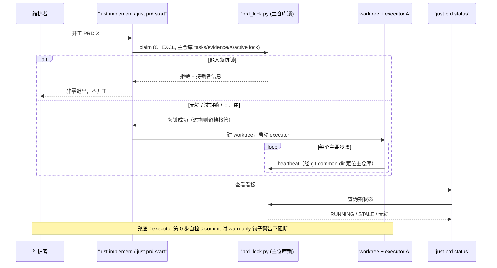

# PRD: PRD 执行锁与看板运行态（防重复开工）

> ✅ **交付前置**：无，可立即开工。
> 结构化声明见 §8 Delivery Dependencies，**那里是唯一事实源**。

> ⬜ **验收状态**：未开工。
> 本行是 §9 Acceptance Checklist 的投影，**那里是唯一事实源**。

> 本 PRD 分两个 altitude：**Part A · 人审层**（决定该不该做、做得对不对，含介入与风险地图）；**Part B · 执行器层**（实现细节，人只在风险地图点名处下钻）。

## Feature Overview (功能一览)

> 本块是 §10 Functional Requirements 的平语言投影，行为验收以 §1 行为样例表为准。

- **开工先领锁**（FR-1、FR-2）：执行任何 PRD 前必须原子领取执行锁；已被领取且对方仍在活跃时直接拒绝，并展示持锁会话、开始时间与最后心跳。
- **锁随执行自动续期、可显式释放**（FR-3）：执行过程中周期性心跳续期；心跳过期或持锁进程已死的锁可被后来者安全接管，旧锁留档。
- **标准开工入口自动领锁**（FR-4）：`just implement` 在创建 worktree 之前自动领锁，领不到就不开工、不建 worktree。
- **看板一眼看清"谁在跑"**（FR-5）：`just prd status` 新增运行态信息——RUNNING（持锁中）、STALE（锁已过期）、以及无锁但近期文件有改动的弱信号。
- **绕过入口也有兜底**（FR-6、FR-7）：executor 提示词把"开工自检"列为第 0 步；git 提交时若检测到别会话持有的新鲜锁，警告但不阻断（宽松版）。
- **约定入文档**（FR-8）：工具链文档与 AGENTS.md 同步"执行 PRD 前必须领锁"的约定。

# Part A · 人审层 (Review Layer)

## 1. Introduction & Goals

### Problem Statement

`just prd status` 看板是纯文件扫描：它汇总验收清单勾选进度与证据包状态，但**无法回答"这条 PRD 此刻是不是正有另一个会话在执行"**——`scripts/shared/just/prd_status.py` 的数据来源只有 PRD 正文和 `tasks/evidence/` 里的 .md 文件，运行态（某个 agent 正在干活）在文件内容里完全不可见。

由此产生两个实际后果：

1. 用户不看板就不知道哪条 PRD 在跑，可能把同一条 PRD 重复递给另一个 agent，两个会话改同一批文件，到提交时才发现互相踩踏。
2. 即使想检查，目前也没有任何机制能检查——没有"执行中"这个概念存在。

可观察的现状事实：`justfile.shared` 的 `implement` recipe 从校验 PRD 到创建 worktree 之间没有任何占用/冲突检查；`tasks/evidence/<prd>/` 下已有的运行态文件先例是 verifier 轮次记录（隐藏文件），说明"证据目录承载 PRD 运行态"是已有模式。

### Interpretation (解读回显)

**行为样例**（下表每一行会被逐字转写为 §7.6 的验收 oracle——改一个单元格就是改验收标准）：

| 输入 / 操作 | 期望观察到的结果 |
|---|---|
| 会话 A 对某条 pending PRD 执行开工命令 | 开工成功；随后看板中该 PRD 显示"执行中"及已运行时长 |
| 会话 B 在 A 活跃期间对同一 PRD 再执行开工命令 | 开工被拒绝，命令输出 A 的持锁信息（开始时间、最后心跳、所在 worktree），退出码非零 |
| 会话 B 对一条"锁还在但 2 小时无心跳且持锁进程已退出"的 PRD 开工 | 自动接管成功，输出提示旧锁已过期并留档，看板转为显示 B 在执行 |
| 同一会话对同一条 PRD 重复执行开工命令（边界情况） | 幂等刷新，不报错、不拒绝 |
| 用户没看看板，直接把同一 PRD 粘贴给另一个 agent 干活（失败/兜底场景） | 该 agent 在开工自检时发现锁冲突，停下并向用户报告持锁者，而不是直接开干 |
| 提交代码时检测到另一会话持有的新鲜执行锁（宽松层） | 提交被允许，但输出一行明确警告 |

**我默默定了这些**（未经提问就拍板的点，逐条列出以便纠正）：

- 锁文件放在该 PRD 的证据目录下（与 verifier 轮次记录同级），**不**新建专门的锁目录——证据目录已被 git 忽略规则覆盖，锁文件天然不进版本库。
- 锁的"归属"按所在 worktree 路径判定，不引入 token / 会话 UUID 机制。
- 心跳过期的判定阈值默认 **30 分钟**；持锁进程（pid）已死时无论心跳多新都视为可接管。
- 接管语义分两档：过期锁**自动接管**（告示即可）；新鲜锁必须**显式释放后重试**，开工命令不提供"强制抢锁"一把梭。
- 锁的释放由人（或归档动作）触发，executor 干活完不自动释放——锁同时也承担"这条已有人认领过"的语义。
- 心跳不靠守护进程，由执行流程在关键步骤显式触发续期。
- 宽松兜底层只做"警告不阻断"，不做任何硬拦截。

**我理解为不做**（读者可能想要、但本 PRD 排除的方向）：

- 不做跨机器 / 多克隆的分布式锁——锁是本机文件，只覆盖本机多个会话 / 多个 worktree 的场景。
- 不在 PRD 正文里加 `status: in-progress` 字段——文件字段无法区分"正在跑"和"跑一半死了"。
- 不做 agent 会话级硬阻断（如在任意 Edit 前拦截）——宽松层只在开工入口与提交检查点警告。

**文字解读**：把"PRD 执行锁"实现为**本机文件锁 + 开工入口强制领锁 + 看板运行态展示 + 宽松兜底警告**的闭环，而不是一个调度和权限系统。关键边界：锁的唯一事实源在**主仓库**（各 worktree 共享可见，而不是各 worktree 各存一份，否则锁形同虚设）；开工入口遇他人新鲜锁必须拒绝而非仅警告；兜底层（executor 自检、提交钩子）只警告不阻断。非目标：分布式锁、PRD 正文状态字段、硬阻断式兜底。

### What The User Gets

- 维护者开工前跑一条命令就能领走一条 PRD 的"执行权"；别人重复开工会被当场拦住并看到是谁在跑。
- 看板上每条 pending PRD 多了一格运行态：没人跑、谁正跑、还是留了一把死锁。
- 即使忘了领锁直接把 PRD 丢给 agent，agent 自己会在动手前发现冲突并停下来报告；提交时还有一道"只警告"的兜底。
- 死掉的会话不会永久卡住 PRD：锁过期后可被安全接管，且有留档可查。

### Measurable Objectives

- 对同一 PRD 并发执行两次开工命令：恰好一次成功、一次被拒绝并输出持锁者信息（命令级可验证）。
- 领锁后运行 `just prd status`，该 PRD 行出现"执行中"标注；将心跳时间改旧后再运行，出现"锁已过期"标注（命令输出可验证）。
- 锁文件不被 git 跟踪：`git check-ignore` 命中（命令可验证）。
- 在另一会话持新鲜锁的情况下提交代码：提交成功且输出警告（钩子行为可验证）。

## 2. Human Review Map (介入与风险地图)

### 决策：新鲜锁一律硬拒绝，接管必须显式

开工入口（`just prd start` 与 `just implement`）遇到**别人持有的新鲜锁**时的行为是本 PRD 唯一真正影响工作流的决策。推荐做法是**直接拒绝开工**并展示持锁者信息；想接管只有两条路——等锁过期（30 分钟无心跳或进程已死）后由开工命令自动接管，或者人确认对方已停后显式运行释放命令再重新开工。开工命令**不**提供 `--force` 之类的就地强抢参数，因为"强抢"一旦顺手，重复开工的防护就形同虚设；而显式释放是一条独立命令，多一步、可留痕。

风险在于误伤：如果阈值太短或心跳机制不可靠，活跃中的会话会被误判为"死锁"而被接管。缓解方式是阈值取 30 分钟（远超 agent 单个步骤的典型耗时）加上"持锁进程已死才立即判死"的双重条件，且自动接管仅限过期锁。

**请确认：** 新鲜锁硬拒绝 + 接管必须显式（自动接管仅限过期锁，阈值 30 分钟），这个策略是否符合你的预期？

**验收：** 会话 B 在 A 活跃时开工被非零退出码拒绝并看到 A 的持锁信息；把 A 的锁心跳改旧后 B 开工自动接管成功并看到旧锁留档提示。

### 自动门禁，不需要逐项人工审阅

其余改动均为工具链内部的局部新增或扩展：锁文件读写脚本、看板新增一列展示、executor 提示词新增第 0 步、warn-only 提交钩子、文档同步。它们各自有可区分自身失败的自动化验证（并发领锁只成功一次、worktree 内领锁落主仓库、看板渲染、钩子告警但放行、文档搜索断言），由执行器加自动化测试把关。

### 本次明确不涉及

无数据库结构变更、无后端四层代码变更、无前端界面变更；不改动 `skills/prd`（PRD 撰写技能）本身；不改变 verifier 流程与证据包结构。

## 3. Usage And Impact After Implementation

**维护者（人）**：开工前可选地跑 `just prd status`，pending 表格中每条 PRD 多出运行态标注——`RUNNING`（谁、跑了多久）、`STALE`（最后活动时间）、或无锁但近期文件有改动的弱信号。想把 PRD 交给 agent 时用 `just implement`（不变），它现在会先领锁再建 worktree；领不到会打印持锁者并非零退出。确认某条锁是死锁后，用 `just prd release <prd-file>` 显式释放。临时接手别人的活时，过期锁会在开工时自动接管并提示旧锁留档。

**Executor AI（经 `just implement` 启动）**：进入 worktree 前锁已由入口领好；提示词第 0 步要求自检领锁状态并在每个主要步骤后心跳续期。行为变化：发现锁被别会话持有时必须停下报告，而不是继续实现。

**Executor AI（ad-hoc，用户直接粘贴 PRD）**：按 AGENTS.md 与提示词约定，动手前先跑 `just prd start <prd-file>`；冲突即停。这是兜底约定，配合提交时的 warn-only 钩子形成双保险。

**向后兼容**：`just prd status [all|pending|archive]` 原有用法与输出列保持不变，只新增运行态信息；`just implement` 参数不变；锁文件不进 git，不影响派生项目同步之外的任何现有流程。

## 4. Requirement Shape

- **actor**：维护者（人）、executor AI（`just implement` 启动或 ad-hoc）
- **trigger**：开工执行某条 pending PRD；查看 PRD 看板；提交代码
- **expected behavior**：开工前原子领锁，他人新鲜锁硬拒绝、过期锁自动接管并留档、同归属重复领锁幂等；执行中心跳续期；看板展示 RUNNING / STALE / 弱信号；executor 自检与提交钩子做宽松兜底（警告不阻断）
- **scope boundary**：仅本机文件锁，不做分布式锁；不改 PRD 正文格式、verifier 流程、`skills/prd`；兜底层不硬阻断

# Part B · 执行器层 (Build Layer)

## 5. Repository Context And Architecture Fit

**现状相关模块**：

- `scripts/shared/just/prd_status.py`——看板脚本，`just prd status` 的实现本体（`justfile.shared` 的 `prd` recipe 调用）。
- `justfile.shared`——`prd subcommand scope=""` recipe（status）与 `implement prd_file ai_tool prompt=""` recipe（创建 worktree 并启动 executor）。
- `scripts/shared/just/executor_prompt.txt`——executor 的强制工作流提示词，支持 `<PRD_DISPLAY>` / `<EVIDENCE_DIR>` / `<PRD_BASENAME>` 占位符（由 `implement` recipe 替换）。
- `scripts/shared/just/worktree_completion.bash` / `worktree_completion.zsh`——为 `just prd status <Tab>` 等补全子命令（见 `docs/getting-started.md`），新增子命令需同步。
- `hooks/shared/` + `.pre-commit-config.yaml`——提交钩子体系；`check_max_file_lines.py --max-lines 1000 --warn-only` 是 warn-only 钩子的现有先例。
- `tests/guards/shared/`——shared 脚本单元测试的既有归位（如 `test_with_timeout.py` 之于 `scripts/shared/just/with_timeout.py`）。
- `.gitignore`：`tasks/evidence/**` 整体忽略，仅放行目录与 `*.md`——证据目录下的锁文件天然不进版本库；证据目录已承载运行态先例（verifier 轮次隐藏文件）。

**架构约束**：`scripts/shared/` 与 `hooks/shared/` 属 upstream-owned（随 sync 分发），守卫测试归位 `tests/guards/shared/`；Python 文本 I/O 必须 `encoding="utf-8"`；命名需有来源/类型/状态语义；公共 API 用中文 Google Style docstring。本任务不触后端四层，无 frontend impact。

**Frontend Impact**：No frontend impact——纯 CLI 工具链改动，不触 `frontend-admin/` 或 `frontend-public/`。

**现有 PRD 关系**：`tasks/pending/P1-FEAT-20260629-152826-ai-self-verify-evidence-package.md` 同样修改 `executor_prompt.txt`（soft 关系：无顺序依赖，但两边落地时需注意提示词上下文漂移，后落地者以前者文本为基线）。其余 pending PRD（frontend-public 平台化、prd-skill 多模式、migration skill、i18n）无重叠。本 PRD 可独立执行。

## 6. Recommendation

**Recommended Approach**：在 `scripts/shared/just/` 新增一个锁脚本（`prd_lock.py`，子命令 `claim` / `heartbeat` / `release`），`justfile.shared` 的 `prd` recipe 扩展 `start` / `heartbeat` / `release` 子命令，`implement` recipe 在创建 worktree 前调用 claim；`prd_status.py` 复用锁脚本的查询逻辑新增运行态列；`executor_prompt.txt` 增加第 0 步自检与心跳约定；`hooks/shared/` 新增 warn-only 提交钩子。

**为什么最贴合现状**：`prd` recipe 已是子命令分发结构，加子命令零新增 recipe；证据目录承载运行态已有先例（verifier 轮次文件），锁放同处可复用现有 gitignore 规则，零配置变更；warn-only 钩子有 `check_max_file_lines.py` 先例；测试归位 `tests/guards/shared/` 有 `test_with_timeout.py` 先例。全部是对既有路径的扩展，无新层、无新依赖（仅标准库）。

**拒绝的冗余抽象**：不新建 `tasks/pending/.locks/` 目录（需改 gitignore 且与证据目录双中心）；不引入锁 token / 会话 UUID（worktree 路径已足够判定归属）；不做守护进程心跳（执行流程显式触发已够，且模板不应引入后台进程）；不把兜底层做硬（用户已明确选择宽松版）。

### Proposed Solution Summary (实现机制)

核心机制是**主仓库证据目录下的本机 JSON 文件锁**（`tasks/evidence/<prd-stem>/active.lock`）。锁内容：`pid`、`hostname`、`worktree`（持锁 worktree 相对路径，主仓库为空）、`started_at`、`heartbeat_at`（ISO 时间）。声明由开工入口显式提供（`just prd start <prd-file>` 或 `just implement` 内部调用），系统不猜测"当前在执行哪条 PRD"。

关键设计：**锁的唯一事实源在主仓库**。锁脚本定位仓库根时，必须用 `git rev-parse --git-common-dir` 反推主仓库根（worktree 内该路径指向主仓库的 `.git`），使各 worktree 共享同一份锁视图；不能用 `--show-toplevel`（worktree 内会返回 worktree 自身路径，锁会被写进 worktree 而互相不可见）。

接入点：现有 `prd` recipe（新子命令）、`implement` recipe（worktree 创建前）、executor 提示词（第 0 步）、pre-commit（warn-only）、`prd_status.py`（运行态列）。系统状态变化：证据目录新增 gitignored 锁文件；用户可见行为变化：看板运行态 + 开工冲突拒绝/接管提示。刻意避免的复杂度：新存储、token 机制、后台进程、状态机变更。

## 7. Implementation Guide

> This section is a living implementation guide based on current repository analysis. If implementation discovers additional affected files, hidden dependencies, edge cases, or a better path, update this PRD before proceeding.

### Core Logic

1. **claim**（`just prd start <prd-file>` → `prd_lock.py claim`）：
   - 由 PRD 文件名解析 stem（复用 `prd_status.py` 的 `PRD_FILENAME_PATTERN` 思路），锁路径 = `<主仓库根>/tasks/evidence/<stem>/active.lock`（`mkdir -p`）。
   - 用 `open(path, "x")`（O_EXCL）原子创建：
     - 创建成功 → 写入锁 JSON，输出持锁确认与该 PRD 当前清单进度（顺带提供开工上下文）。
     - 已存在 → 读锁判定：归属相同（worktree 路径一致）→ 幂等刷新心跳，退出 0；心跳超阈值（默认 30 分钟）或（同 hostname 且 pid 已死，用 `os.kill(pid, 0)` 探测）→ 旧锁改名留档为 `active.lock.<时间戳>.stale`，接管写入新锁并输出告示，退出 0；否则（他人新鲜锁）→ 打印持锁者 `worktree` / `started_at` / `heartbeat_at` 与"显式释放：`just prd release <prd-file>`"提示，退出 1。
2. **heartbeat**：更新自己锁的 `heartbeat_at`；锁不存在或归属不符 → 输出警告并非零退出（让 executor 能发现锁已丢）。
3. **release**：删除锁；归属不符时需 `--force` 并输出告示。
4. **状态查询**（供 `prd_status.py` import）：返回 `none / fresh / stale` 及锁元数据；`prd_status.py` 的 pending 表格新增 `ACTIVITY` 列——fresh → 黄色 `RUNNING <时长>`（附 worktree）；stale → 红色 `STALE <最后心跳时间>`；无锁但 PRD 文件或证据目录 15 分钟内有改动 → 暗色 `⚡ active <n>m ago`；其余 `-`。
5. **`implement` recipe**：在 "Validate PRD file exists" 之后、创建 worktree 之前调用 claim；claim 非零即中止（不建 worktree、不起 executor）。
6. **executor_prompt.txt**：新增第 0 步——"动手前运行 `just prd start <PRD_FILE>`；若报告他人新鲜锁，立即停止并向用户报告持锁者"；并在工作流中要求每个主要步骤完成后运行 `just prd heartbeat <PRD_FILE>`。`implement` recipe 的占位符替换新增 `<PRD_FILE>`（PRD 的仓库相对路径）。
7. **warn-only 提交钩子**（`hooks/shared/check_prd_lock_conflict.py`，注册进 `.pre-commit-config.yaml`，`--warn-only` 语义照 `check_max_file_lines.py` 先例）：staged 变更触及 `tasks/pending/<prd>.md` 或 `tasks/evidence/<prd>/`，且该 PRD 存在**其他 worktree 持有的新鲜锁** → 打印警告，永远退出 0。

### Change Impact Tree

```text
.
├── scripts/shared/just/
│   ├── prd_lock.py
│   │   [新增]
│   │   【总结】PRD 执行锁的 claim/heartbeat/release/查询实现，锁落主仓库证据目录
│   │   ├── git-common-dir 反推主仓库根（worktree 共享锁视图）
│   │   ├── O_EXCL 原子领锁；归属判定（worktree 路径）；stale 判定（30min 心跳 / pid 死亡）
│   │   ├── 接管留档（active.lock.<ts>.stale）与持锁者信息输出
│   │   └── 查询接口供 prd_status.py import
│   ├── prd_status.py
│   │   [修改]
│   │   【总结】pending 表格新增 ACTIVITY 列：RUNNING / STALE / mtime 弱信号
│   │   ├── import prd_lock 查询接口，逐条 pending PRD 取锁状态
│   │   └── 无锁时对 PRD 文件与证据目录做 15 分钟 mtime 弱信号探测
│   └── executor_prompt.txt
│       [修改]
│       【总结】新增第 0 步开工自检（锁冲突即停）与逐步心跳约定
├── justfile.shared
│   [修改]
│   【总结】prd recipe 增加 start/heartbeat/release 子命令；implement recipe 前置 claim
│   ├── prd recipe：新增子命令分发与 usage 文本（锚点：`prd subcommand scope=""`）
│   └── implement recipe：PRD 校验后、worktree 创建前调用 claim，失败即中止；
│       占位符替换新增 <PRD_FILE>（锚点：`<PRD_BASENAME>` 替换行）
├── scripts/shared/just/worktree_completion.bash / worktree_completion.zsh
│   [修改]
│   【总结】为 just prd <Tab> 补全新增 start/heartbeat/release 子命令
├── hooks/shared/check_prd_lock_conflict.py
│   [新增]
│   【总结】warn-only 提交钩子：staged 触及他人新鲜锁 PRD 时警告但放行
├── .pre-commit-config.yaml
│   [修改]
│   【总结】注册 check_prd_lock_conflict（warn-only，照 check_max_file_lines 先例）
├── tests/guards/shared/
│   └── test_prd_lock.py
│       [新增]
│       【总结】锁脚本单元测试：并发唯一成功、stale 接管、worktree 落主仓库、心跳与释放语义
├── docs/ai-standards/tooling.md
│   [修改]
│   【总结】命令表新增 just prd start/heartbeat/release 与锁语义说明
└── AGENTS.md
    [修改]
    【总结】Critical Summary 增加"执行 PRD 前必须 just prd start 领锁"一行
```

以上为起点而非穷尽清单；隐藏引用见 Executor Drift Guard。

### Risk Classification Register

| change point | tier | decisive dimension/override | intervention | oracle/gate |
|---|---|---|---|---|
| claim 原子性与接管语义（并发防护核心） | R2 | 并发正确性（cross-cutting trigger），失败=重复开工防护失效 | 人工确认（策略）+ 强 oracle | rv-2 |
| 锁根目录解析（worktree → 主仓库） | R1 | 单组件内行为，测试可判别 | executor + 测试 | rv-1 |
| `implement` recipe 前置 claim | R1 | 脚本流程变更，可即时回滚 | executor + 测试 | rv-4 |
| `prd_status.py` 运行态列 | R1 | 展示层增强，含 mtime 启发式 | executor + 测试 | rv-3 |
| executor_prompt.txt 第 0 步 + 文档 | R0 | 文本约定，无行为契约 | executor + 搜索断言 | rv-6 |
| warn-only 提交钩子 | R1 | 单钩子，永不阻断（退出恒 0） | executor + 测试 | rv-5 |

### Executor Drift Guard

- `justfile.shared` 会漂移，锚点用 recipe 名与注释：`rg -n "^prd subcommand|^implement prd_file" justfile.shared`。
- evidence 目录命名必须与 `implement` recipe 的推导保持一致：`rg -n "evidence_dir" justfile.shared`。
- shell 补全与文档对 `just prd` 子命令有隐藏引用：`rg -n "just prd" scripts/shared/just/worktree_completion.* docs/getting-started.md docs/ai-standards/tooling.md`。
- gitignore 例外规则若被改动会影响锁文件是否进库：`rg -n "tasks/evidence" .gitignore`。
- 与 `P1-FEAT-20260629-152826-ai-self-verify-evidence-package` 同改 `executor_prompt.txt`，后落地者以其最新文本为基线：`rg -n "workflow is mandatory" scripts/shared/just/executor_prompt.txt`。

### Flow Diagram



### ER Diagram

No data model changes in this PRD.（锁是 gitignored 的本机 JSON 文件，非持久化数据模型。）

### Realistic Validation Plan

```yaml
oracles:
  - id: rv-1
    behavior: 锁脚本的基础语义：领锁、同归属幂等、心跳、释放；且在真实 git worktree 内领锁时锁文件落在主仓库而非 worktree
    real_entry: "uv run pytest tests/guards/shared/test_prd_lock.py -v"
    expected: "全部用例通过；worktree 用例断言锁路径在主仓库 tasks/evidence/<stem>/active.lock"
    mock_boundary: "文件系统用 pytest tmp_path + 真实 git init / git worktree add；不 mock 锁判定逻辑本身"
    tier: R1
    test_layer: unit
    required_for_acceptance: true
  - id: rv-2
    behavior: 对同一 PRD 并发开工：恰好一次成功，另一次被拒绝并输出持锁者信息；过期锁被自动接管且旧锁留档
    real_entry: "just prd start <fixture-prd>（两个进程并发执行，随后对 backdate 心跳的锁再次执行）"
    expected: "并发场景恰一个退出 0；失败者退出 1 且输出含持锁者 worktree 与心跳时间；backdate 后再次执行退出 0 且出现 .stale 留档文件"
    mock_boundary: "真实 just recipe + 真实文件系统；fixture PRD 放临时目录，不污染 tasks/pending"
    tier: R2
    test_layer: integration
    required_for_acceptance: true
    critical_value_source: "prd_lock.py 写出的 active.lock 原始 JSON 与命令 stdout/stderr"
    must_cross: "just recipe -> prd_lock.py -> 主仓库文件系统 -> 二次进程读取同一锁文件"
    forbidden_bypasses: "禁止绕开 just recipe 直接调内部函数充当'开工'；禁止手工预写锁文件后再 claim 冒充并发"
    fresh_state_probe: "每个场景用全新临时仓库目录重新初始化，结束后读锁文件原文验证"
    final_tree_evidence: "rv-2.log 记录命令与输出；实现代码最终变更后重跑"
    negative_control: "实现前运行同命令（prd start 子命令不存在，usage 退出 1）保存红跑日志；测试中再以去掉 O_EXCL 的 tests/ 内测试替身演示并发双成功"
    expected_fail: "红跑：'恰好一次成功'断言失败（usage 退出或替身双成功）"
  - id: rv-3
    behavior: 看板运行态：领锁后显示 RUNNING，心跳 backdate 后显示 STALE，无锁但近期改动显示弱信号
    real_entry: "just prd status pending"
    expected: "三种状态下 ACTIVITY 列分别出现 RUNNING / STALE / ⚡ 标注"
    mock_boundary: "真实看板命令；锁状态通过真实 claim 与文件 mtime 构造，不 mock 渲染"
    tier: R1
    test_layer: smoke
    required_for_acceptance: true
  - id: rv-4
    behavior: just implement 在他人持新鲜锁时中止：不建 worktree、不启动 executor
    real_entry: "just implement <fixture-prd> claude（预置新鲜锁后执行）"
    expected: "退出非零；输出持锁者信息；不生成新 worktree 目录"
    mock_boundary: "真实 just recipe；claim 失败发生在 AI 启动前，无需真实 AI 工具可用"
    tier: R1
    test_layer: integration
    required_for_acceptance: true
  - id: rv-5
    behavior: warn-only 提交钩子：staged 触及他人新鲜锁 PRD 时输出警告但提交放行
    real_entry: "uv run python hooks/shared/check_prd_lock_conflict.py（预置他人新鲜锁与 staged 变更）"
    expected: "stdout 含警告行，进程退出码为 0"
    mock_boundary: "真实钩子脚本；锁与 staged 状态在临时仓库真实构造"
    tier: R1
    test_layer: integration
    required_for_acceptance: true
  - id: rv-6
    behavior: 约定入文档：tooling.md 含新子命令说明，AGENTS.md 含领锁约定，补全脚本含新子命令
    real_entry: "rg -n 'prd (start|heartbeat|release)' docs/ai-standards/tooling.md AGENTS.md scripts/shared/just/worktree_completion.bash scripts/shared/just/worktree_completion.zsh"
    expected: "每处均有命中"
    mock_boundary: "无 mock，纯文本断言"
    tier: R0
    test_layer: smoke
    required_for_acceptance: true
```

失败排查提示：rv-2/rv-4 失败先看 fixture 临时仓库的 `tasks/evidence/<stem>/active.lock` 原文与 `git rev-parse --git-common-dir` 输出；rv-4 注意 just 的工作目录与 `justfile.shared` 是否被 `justfile` import。

### Low-Fidelity Prototype

不需要——纯 CLI 输出变更，无多步交互布局问题。

### Interactive Prototype Change Log

No interactive prototype file changes in this PRD.

### External Validation

No external validation required; repository evidence was sufficient.

## 8. Delivery Dependencies

### Delivery Dependencies

- Group: none
- Depends on tasks/issues:
  - none
- Gate type: none
- Notes: 与 `P1-FEAT-20260629-152826-ai-self-verify-evidence-package` 同改 `executor_prompt.txt`，属 soft 上下文关系（后落地者以先落地者文本为基线），不构成顺序依赖。

## 9. Acceptance Checklist

### Human-Confirmed

- [ ] **新鲜锁策略确认**：实测会话 B 在 A 活跃期间开工被非零退出拒绝并看到 A 的持锁信息；backdate 心跳后 B 开工自动接管成功并看到 `.stale` 留档提示（证据：rv-2.log 两段命令输出原文）。

### R2 证据

- [ ] **并发开工唯一成功**（rv-2）：对同一 fixture PRD 并发执行两次 `just prd start`，证据日志显示恰一次退出 0、一次退出 1 且输出含持锁者 worktree 与心跳时间；含实现前红跑记录与 tests/ 内去 O_EXCL 替身的负控结果。

### R1 / R0 门禁（折叠）

### Architecture Acceptance

- [ ] 锁唯一事实源在主仓库：worktree 内执行领锁后，主仓库 `tasks/evidence/<stem>/active.lock` 存在而 worktree 内同名路径不存在（rv-1 用例断言）。
- [ ] 锁文件不进 git：`git check-ignore tasks/evidence/<stem>/active.lock` 命中；`git status` 不出现锁文件。
- [ ] 未新增任何第三方依赖：`rg -n "import" scripts/shared/just/prd_lock.py` 仅标准库。

### Behavior Acceptance

- [ ] `just prd start / heartbeat / release` 三个子命令可用且 usage 文本更新（rv-2、命令实测）。
- [ ] 看板运行态三种标注（RUNNING / STALE / ⚡）实测各出现一次（rv-3）。
- [ ] `just implement` 在新鲜锁下中止且不建 worktree（rv-4）。
- [ ] 提交钩子警告但退出 0（rv-5）。

### Documentation Acceptance

- [ ] `docs/ai-standards/tooling.md`、`AGENTS.md`、两个 shell 补全脚本的搜索断言全部命中（rv-6）。
- [ ] `executor_prompt.txt` 第 0 步含开工自检与心跳约定，`<PRD_FILE>` 占位符由 `implement` recipe 正确替换。

### Validation Acceptance

- [ ] 真实入口验证：`just prd start`、`just prd status pending`、`just implement`、`hooks/shared/check_prd_lock_conflict.py` 均以真实命令跑通并留证（rv-2 至 rv-5 日志），非仅单元测试。
- [ ] `uv run pytest tests/guards/shared/test_prd_lock.py -v` 全绿（rv-1）。
- [ ] 证据包落 `tasks/evidence/P2-FEAT-20260915-112126-prd-execution-lock/`，按 rv-id 命名。

### Delivery Readiness

- [ ] 推荐方案完整实现，无遗留临时兼容层；`just lint` 与既有测试套件无回归。
- [ ] 与 ai-self-verify PRD 的 `executor_prompt.txt` 基线已对齐（后落地者已合并先落地者文本）。

## 10. Functional Requirements

- **FR-1**：PRD 执行锁以主仓库 `tasks/evidence/<prd-stem>/active.lock` 本机 JSON 文件实现，字段含 pid、hostname、worktree、started_at、heartbeat_at；锁脚本在任何 worktree 内均解析到主仓库根；锁文件被 git 忽略。
- **FR-2**：`just prd start <prd-file>` 原子领锁（O_EXCL）；他人新鲜锁拒绝并输出持锁者信息（退出 1）；过期锁（心跳超 30 分钟或持锁 pid 已死）自动接管并将旧锁留档；同归属重复领锁幂等刷新。
- **FR-3**：`just prd heartbeat <prd-file>` 续期自己的锁（锁丢失时警告并非零退出）；`just prd release <prd-file>` 释放锁（归属不符需显式强制）。
- **FR-4**：`just implement` 在校验 PRD 后、创建 worktree 前自动领锁；领锁失败即中止，不建 worktree、不启动 executor。
- **FR-5**：`just prd status` pending 视图新增运行态列：新鲜锁显示 RUNNING 与时长，过期锁显示 STALE 与最后心跳时间，无锁但 15 分钟内有文件改动显示弱信号；原有列与 scope 用法不变。
- **FR-6**：`executor_prompt.txt` 工作流新增第 0 步：动手前 `just prd start` 自检，发现他人新鲜锁即停并报告；每个主要步骤后心跳续期。
- **FR-7**：新增 warn-only 提交钩子：staged 变更触及他人新鲜锁 PRD 的 `tasks/pending` / `tasks/evidence` 路径时输出警告，永远退出 0。
- **FR-8**：`docs/ai-standards/tooling.md` 与 `AGENTS.md` 同步领锁约定；shell 补全脚本覆盖新子命令。

## 11. Non-Goals

- 跨机器 / 多克隆分布式锁。
- PRD 正文新增状态字段（如 frontmatter `status`）。
- agent 会话级的任意编辑硬拦截（如 PreToolUse deny）。
- 守护进程 / 后台心跳服务；锁 token 或会话 UUID 机制。
- 改动 `skills/prd`、verifier 流程、证据包结构或后端 / 前端代码。
- 锁的自动释放（如 PRD 归档时联动）——本期释放为显式命令，联动留作后续观察项。

## 12. Risks And Follow-Ups

- **心跳依赖 executor 自觉**：若 executor 长时间不触发心跳，活跃会话可能被误判过期而被接管（缓解：30 分钟阈值 + pid 存活双重判定；后续若误判频发，可评估在 `ai_run.sh` 包装层加自动心跳）。
- **归档后死锁残留**：PRD 归档而锁未释放时看板会持续显示 STALE（缓解：STALE 标注本身就是清理信号；可考虑后续在归档流程中联动 `release`）。
- **与 ai-self-verify PRD 的提示词上下文漂移**：同改 `executor_prompt.txt`，后落地者需手工对齐基线。

## 13. Decision Log

| ID | Decision | Chosen | Rejected | Rationale |
|---|---|---|---|---|
| D-01 | 锁存放位置 | 主仓库 `tasks/evidence/<prd-stem>/active.lock` | 新建 `tasks/pending/.locks/` 目录 | 证据目录已有运行态先例（verifier 轮次文件）且 gitignore 规则现成，零配置变更、避免双中心 |
| D-02 | 锁的共享视图 | `git rev-parse --git-common-dir` 反推主仓库根 | `git rev-parse --show-toplevel` | worktree 内后者返回 worktree 自身路径，锁会各存一份而互相不可见，防护失效 |
| D-03 | 新鲜锁冲突处理 | 硬拒绝 + 显式 release 后才可重试，过期锁自动接管 | 开工命令提供 `--force` 就地强抢 | 强抢一旦顺手，重复开工防护形同虚设；显式释放多一步、可留痕 |
| D-04 | 归属判定 | worktree 相对路径（主仓库为空） | 锁 token / 会话 UUID | worktree 路径已覆盖"哪个执行上下文持有"，token 机制增加 env 传递复杂度而无对应收益 |
| D-05 | 心跳方式 | 执行流程在关键步骤显式触发 | 守护进程 / 后台定时器 | 模板不应引入后台进程；executor 工作流本身有明确的步骤边界可挂心跳 |
| D-06 | 兜底层强度 | 宽松版：executor 自检 + warn-only 提交钩子 | 硬阻断（deny 编辑 / 拒绝提交） | 用户明确选择宽松版；误报代价是噪音而非流程卡死 |
