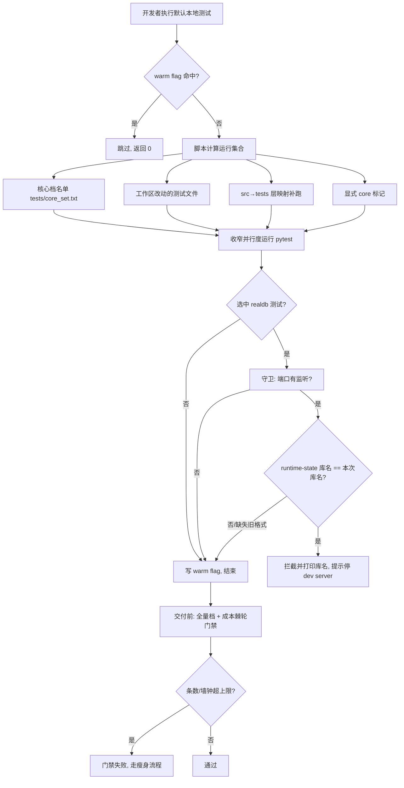

# PRD: 回迁下游已验证的本地测试分层与共享库守卫到模板

> ⛔ **交付前置**：依赖 `ai-assistant-observation-window`（下游 ai-assistant 的 10 天观察窗口，2026-10-04 → 2026-10-14），到期确认有效后再开工。顺序重要：这套机制的价值前提是「下游连续 10 天证明它真的加速且不误伤」，未等观察结果就回迁，等于把尚未证伪的机制固化成全模板基础设施。
> 结构化声明见 §8 Delivery Dependencies，**那里是唯一事实源**。

> ⬜ **验收状态**：未开工。
> 本行是 §9 Acceptance Checklist 的投影，**那里是唯一事实源**。

> 本 PRD 分为 Part A 人审层和 Part B 执行器层。Part A 用于确认目标行为和关键取舍；Part B 记录实现路径与验证证据。

## Feature Overview (功能一览)

> 本块是 §10 Functional Requirements 的简明投影；行为验收以 §1 行为样例为准。

- **本地默认只跑核心档**（FR-1、FR-2）：默认的本地测试不再全量跑，只跑「由实测耗时自动生成的核心子集 ∪ 本次改动/新增的测试 ∪ 改动源码映射到的测试 ∪ 显式 core 标记」，并收窄并行度，使常见改动一轮反馈稳定在几十秒以内。
- **改了什么就补跑什么**（FR-3）：提供一个不受核心档预算限制的定向补跑入口，用于验掉核心档结尾点名、这次没跑的相关文件。
- **名单会自我维护**（FR-4）：核心档名单与耗时基线可按实测重算，避免名单随用例变慢而悄悄腐烂。
- **全量档成本有上限**（FR-5）：全量测试的用例条数在任何环境强制上限、墙钟上限在 CI 强制；超限即红，逼出「瘦身 PR」而不是原地放行。
- **瘦身只出证据、不自动删测**（FR-6）：提供重复/最贵/最慢用例的证据报告，删除或合并必须逐条人审。
- **机制随模板分发给派生项目**（FR-7）：上述能力作为上游共享基础设施下发，派生项目同步即得。
- **共享库守卫按「库身份」判拦截**（FR-8、FR-9）：只有在「有监听进程 + 该进程指向的库与本次测试库相同」时才拦截；库名不同（别处进程恰占同名端口）放行；旧格式状态保持保守拦截。
- **守卫的项目专属部分可配**（FR-10）：守卫中依赖项目业务（判断库内是否有活跃运行）的那一步由项目提供，通用部分只负责端口、库名与状态文件。
- **规则与文档同步更新**（FR-11）：测试分层与守卫的说明随机制一并落地到规范文档。

# Part A · 人审层 (Review Layer)

## 1. Introduction & Goals

### Problem Statement

模板与派生项目共用一套 `justfile.shared` 与 `scripts/shared/*`，但「测试怎么跑才快」这件事，派生项目 `ai-assistant` 已经走得比模板远：它把默认本地测试从「全量」改成「按实测耗时自动生成的核心档子集」，并给全量档加了成本棘轮，还补了一条防止「测试与本地开发服务器共用同一个真实数据库」的外部写者守卫。这些改动目前**只存在于下游项目内**，模板本身和其余派生项目拿不到。

可观察的当前状态事实：

- 模板的 `justfile.shared` 只提供了 `JUST_LOCAL_TEST_FLAGS` 这个**扩展点**（`template/justfile.shared` 与 `ai-assistant/justfile.shared` 在该处内容一致），但模板没有核心档名单、没有预算棘轮脚本、没有定向补跑入口；模板 `tests/` 下不存在 `core_set.txt`、根目录不存在 `test-budget.json`，`scripts/dev/` 下没有 `test_tiers.py` / `check_test_budget.py`。
- `ai-assistant` 已落地这一整套（近期提交 `7772cf6`/`9239c88`/`f914445`/`edd673f`/`fde1d54` 等），并已稳定使用。
- 模板的 `tests/conftest.py` 中**完全没有**共享库外部写者守卫（不存在 `_guard_shared_database_external_writer` / `_dev_server_backend_port` / `ALLOW_SHARED_DATABASE` 等标识）；`ai-assistant` 有，并在 PR #60 中把判据从「端口有监听即拦」收紧为「端口有监听**且** run-state 记录的库名与本次测试库名相同才拦」。

痛点是：**模板是这些能力的最佳归宿，但当前没有任何机制把它们沉淀上去**；每个派生项目要么各自重造，要么永远慢。风险在于——直接照搬下游实现会有两个坑：一是把下游项目专属的业务逻辑（例如全库扫描活跃运行的判定）带进中性模板；二是把尚未被时间证明有效的机制过早固化为全模板默认。

### Interpretation (解读回显)

**行为样例**（每一行都成为 §7.6 的验收 oracle；修改表格中的结果就等于修改验收标准）：

| 验证方式 | 输入 / 操作 | 期望观察到的结果 |
|---|---|---|
| 👀 人审 + 自动验证 | 在模板仓库一个新 worktree 里改一行后端源码，跑一次默认本地 `just test` | 只跑核心档子集（十几秒量级），墙钟不超 30 秒；被改源码映射到的测试一定在本次运行集合里 |
| 🤖 自动验证 | 在干净且已跑过的树上，不再改任何文件，重复跑默认本地 `just test` | 命中 warm flag，直接跳过并返回 0，不重跑 |
| 🤖 自动验证 | 交付前跑全量入口（含 slow） | 全量档用例条数不超过棘轮上限；CI 步骤带墙钟强制，超限即失败并打印超限证据 |
| 🤖 自动验证 | 人为让全量档超出上限（例如新增大量用例） | 棘轮门禁变红，给出条数/墙钟的超限数值；本机只强制条数，墙钟仅报告 |
| 🤖 自动验证 | 下游项目 worktree 中主仓开发服务器正开着，但 worktree 指向的库与主仓不同名 | 共享库守卫**不**拦截，测试正常进行 |
| 🤖 自动验证 | 同上，但 worktree 与开发服务器指向**同一个**库 | 守卫拦截并打印库名，提示停掉开发服务器或显式设置跳过变量 |
| 🤖 自动验证 | 状态文件是缺少库名字段的旧格式，且记录端口上有监听 | 保守拦截（不因缺字段而放松） |

上表的有效行为行即成为验收 oracle；改正其中任一格，就等于改正对应验收标准。

**我默默定了这些**

- 本 PRD 的**目标仓库是模板仓**；`ai-assistant` 是实现参考，按需挑选、不整仓覆盖。
- 只回迁两条能力：**本地测试分层（含成本棘轮）** 与 **共享库守卫**；不含下游项目业务专属逻辑。
- 门禁是一条**时间门禁**：从 2026-10-04 起观察 10 天，2026-10-14 才允许开工。
- 机制以**上游分发面**（随 sync 分发的共享基础设施）形态落地，使派生项目同步即得，而不是只在模板仓内自用。
- 守卫做**通用化拆分**：通用部分处理「端口监听 + 状态文件库名 + 名字比较」，项目专属部分（「库内是否有活跃运行」）由项目声明提供。
- 不引入新的外部依赖；沿用现有 Python + `uv` + `pytest` 及既有 `JUST_LOCAL_TEST_FLAGS` 扩展点。

**我理解为不做**

- 不把下游项目的整个 `tests/`、`docs/` 或业务代码搬进模板。
- 不为提速自动删除或合并测试用例；瘦身只出证据、留人工决策。
- 不引入 `testmon` 等新的测试选择工具作为前置依赖。

本 PRD 把需求读成一个「**把下游已验证、且经时间证明的两项测试基础设施，作为上游共享能力沉淀进模板**」的动作：核心档不是「优化全量」，而是把默认反馈收窄到成本可负担的子集、并要求选中的一定是与本次改动相关的；守卫不是「多一层拦」，而是把误拦（别处进程占了同名端口）与真拦（同一个库被两个写者共用）区分开。两者的共同前提是「先在下游真实使用中跑够时间」，因此开工与否由观察结果决定。

### What The User Gets

模板维护者与所有派生项目的开发者获得一致的测试反馈体验：常见的日常改动跑默认本地测试只需几十秒且一定能覆盖到改动相关的测试；交付前的全量测试有明确的成本上限，超限会被门禁拦下；本地开发服务器与测试共用同一个真实数据库时会被提前拦停，而「仅仅是端口撞车、库不同」不再被误拦。模板维护者还获得一个可复用的上游能力：派生项目同步模板后自动获得上述机制，无需各自重造。

### Measurable Objectives

- 在模板自身测试规模下，一个新 worktree 冷树上默认本地测试墙钟 ≤ 30 秒；改动的测试文件 100% 出现在本次运行集合中。
- 全量档的用例条数超过棘轮上限时门禁必红；CI 步骤在墙钟超限时必红。
- 共享库守卫在「端口有监听 + 状态文件库名 ≠ 本次库名」时**不**拦截；在「同库」或「旧格式无库名」时**拦截**——两条都有可执行 oracle。
- 回迁后的机制存在于随 sync 分发的路径中，派生项目 `just sync-template` 可见（不依赖手工复制）。
- 规范文档中对测试分层与守卫的描述与机制实现一致（无残留的旧描述）。

## 2. Human Review Map (介入与风险地图)

### 决策一：把测试分层机制放进共享分发面，而不只是模板自用

建议把核心档/棘轮这套基础设施放到上游共享层（随模板 sync 下发），模板自身先落地，其余派生项目同步即得。这样做的代价是**共享层的兼容面变大**：一旦有项目反过来改这份脚本，就需要走共享层修复流程（改上游而非本地），否则会被 sync 覆盖。

**请确认：** 是否同意把测试分层机制作为上游共享能力（派生项目默认继承），而不是仅在模板仓内自用？

**验收：** sync 候选清单里能看到该机制文件；一个干净派生项目同步后，默认本地测试即按核心档运行。

### 决策二：守卫做通用化拆分，不把下游业务逻辑带进模板

共享库守卫里，「判断库里是否有活跃运行」需要业务知识（下游用它配合整库扫描的收敛操作），而「端口是否有监听、状态文件记录的库名是什么、两者是否同一个库」是通用逻辑。建议后者进模板，前者由项目以配置/钩子形式提供；没有提供时只启用端口 + 库名这一路判据。

**请确认：** 是否同意以「通用部分 + 项目提供活跃运行探测」的拆分方式回迁守卫，而不是整体照搬下游实现？

**验收：** 在只提供端口与库名的配置下，守卫对「库名不同」放行、对「同库」拦截；项目未提供探测钩子时不会因此崩溃或静默放行。

### 决策三：10 天观察窗口的通过判据

建议到 2026-10-14 时，以下条件同时成立才开工：观察期内下游默认本地测试持续稳定在预算内、成本棘轮没有出现持续误报（把正常改动判红）、共享库守卫没有出现假阳性（正常 worktree 被误拦）或假阴性（共库未拦）。由维护者在到期日核对观察记录后决定是否开工。

**请确认：** 是否同意按上述三条作为 10 天门禁的通过判据，到期由人工拍板？

**验收：** 到期日能给出上述三项各自的一段观察结论及支撑证据；任一项不成立则本 PRD 不开工并记录原因。

**自动门禁，不需要逐项人工审阅**：核心档选择与预算、棘轮门禁、定向补跑、守卫的库名判据等，都由可执行 oracle 与既有提交门禁覆盖，验证结果在 §9 证据包统一呈现，无需逐项人工过目。

**本次明确不涉及**：无数据库结构变更（不新增/修改表、迁移或持久化字段，故本文不附 ER 图）；无前端用户可见变更。

## 3. Usage And Impact After Implementation

本改动改变的是「开发者如何跑测试、以及本地开发服务器与测试共用数据库时会发生什么」，属于开发者工作流与 CI 行为的变化。

- **派生项目开发者**：日常改动的默认本地测试从「全量、分钟级」变为「核心档、几十秒级」，且一定覆盖改动相关的测试；交付前仍可跑全量。入口不变，仍是同一个本地测试命令，语义从「跑全部」改为「跑可负担且相关的子集」。这是**行为变化**，需要在下游文档中讲清「默认≠全量、交付前跑全量」。
- **CI / 流水线维护者**：全量档新增成本上限门禁；本机只强制用例条数，CI 步骤额外强制墙钟。超限会失败，需要按证据走瘦身流程。
- **模板维护者**：获得一份可复用的上游基础设施；后续模板自身的测试规模增长时，只需按实测重算核心档名单。
- **本地开发与测试共用数据库的工作流**：以前只要端口有监听就拦，现在只在「确属同一个库」时拦——正常「主仓开着开发服务器、worktree 跑测试」不再被误拦；真正共库时仍被拦停，避免测试的整库收敛操作踩到正在进行的运行。
- **不变的部分**：测试本身的断言、覆盖率、realdb 语义、warm flag 的跳过条件、以及 CI 全量回归的存在都不变。

## 4. Requirement Shape

- **actor**：模板维护者（落地与维护机制）、派生项目开发者与 CI 维护者（消费机制）。
- **trigger**：开发者执行默认本地测试、定向补跑、名单重算或全量档；CI 在全量档步骤执行成本门禁；测试与本地开发服务器可能共用数据库时触发守卫探测。
- **expected behavior**：默认本地测试只跑「核心档 ∪ 改动相关」并保持在预算内；全量档受成本上限约束；共享库守卫按「库身份」区分误拦与真拦；机制随模板下发给派生项目。
- **explicit scope boundary**：只涉及测试运行与选择的机制、状态文件的字段契约、以及守卫的判断逻辑与文档；不含业务代码、不含数据模型变更、不含前端。

# Part B · 执行器层 (Build Layer)

## 5. Repository Context And Architecture Fit

**来源（实现参考）**：`ai-assistant` 派生项目仓。相关实现分布在项目自有面：

- 项目根 `justfile`：`export JUST_LOCAL_TEST_FLAGS := "--no-header -p no:cacheprovider --core-tier -n4"`；recipe `bench-test` / `test-core-refresh` / `test-changed` / `test-tier-report` / `test-budget` / `test-debt`。
- `scripts/dev/`：`test_tiers.py`（名单刷新/改动选择/报告）、`check_test_budget.py`（棘轮）、`test_debt_report.py`（瘦身证据）、`measure_just_test.py`（端到端计时）。
- 项目根 `test-budget.json`（条数/墙钟上限，棘轮）；`tests/core_set.txt`（实测耗时生成的核心档名单）；`.test_durations.json`（耗时基线）。
- `tests/conftest.py`：`--core-tier` 选项与核心档文件加载；共享库外部写者守卫（含 PR #60 的库名判据，见下）。
- `justfile.shared` 的 `test` recipe：读取 `JUST_LOCAL_TEST_FLAGS`（**该扩展点在模板与下游两侧已一致**）。

**目标（落地仓）**：模板仓 `~/code/zata_code_template`。相关现状：

- `justfile.shared` 的 `test` recipe 已有 warm flag、`with_timeout` 超时兜底、lint fast path，并已支持 `JUST_LOCAL_TEST_FLAGS`。
- `scripts/dev/` 只有 `measure_just_test.py` 与 `sandbox_smoke.py`；根 `justfile` 只有 `bench-test`，无 `test-changed`/`test-core-refresh`/`test-budget`/`test-debt`/`test-tier-report`。
- `tests/conftest.py` 无任何共享库守卫相关标识；无 `tests/core_set.txt`、`test-budget.json`、`.test_durations.json`。
- 所有权边界（权威来自 `scripts/shared/template/sync_template.sh` 的 `_is_upstream_owned`）：`justfile.shared`、`scripts/shared/*`、`scripts/build/*`、`hooks/shared/*`、`tests/guards/shared/*`、`.pre-commit-config.yaml` 等为上游所有；`tests/`、`docs/`、`src/backend/`、`frontend-*` 等为项目自有。当前 `scripts/dev/*` **不在**上游清单内。

**要遵循的既有模式**：

- 共享基础设施放上游清单路径（`scripts/shared/*` 或显式加入 `_is_upstream_owned`），项目专属放项目自有路径。
- 测试入口的差异通过既有 `JUST_LOCAL_TEST_FLAGS` 扩展点注入，不改 `justfile.shared` 的调用约定。
- 守卫的「外部写者」概念沿用下游已验证的判据（端口 + 状态文件库名），并把项目专属的「活跃运行探测」外置。

**前端影响**：`No frontend impact` — 本改动只涉及测试运行与选择机制、状态文件契约与守卫逻辑，不触及任何前端应用的页面、路由或交互。

**约束**：`just test` 必须在提交门禁中被真实执行（`check-test-flag`）；CI 强制全量且禁用 flag 快路径；共享脚本改动会随 sync 分发，需走共享层修复流程；守卫不得为可测性在生产代码中加入故障开关（下游已明确此红线）。

**相关 PRD**：

- `tasks/archive/P2-PERF-20260622-113224-speed-up-just-test-template.md`（模板自身此前的测试提速：slow marker / 并行 / warm flag）。本 PRD 是其**后续**：把「默认跳过慢测试」推进为「默认只跑成本受限的核心档 + 预算棘轮」，并新增守卫；不与之冲突，可独立执行。
- `tasks/archive/P2-FEAT-20260604-191912-remember-run-ports.md`（run-state 记录端口）。本 PRD 的守卫依赖该状态文件，并在其上追加「库名」字段契约。
- `tasks/pending/` 中无重复或依赖本工作的 PRD。

## 6. Recommendation

### Recommended Approach

在模板仓内**新增一套上游共享的测试分层基础设施**，并**把下游的共享库守卫通用化后并入**：

1. 新增共享测试分层脚本（`scripts/shared/` 下的等价路径）与模板根 `justfile` recipe：核心档选择、改动/映射选择、名单重算、报告、全量档成本棘轮、瘦身证据。
2. 在模板仓生成自己的 `tests/core_set.txt`、`test-budget.json`、`.test_durations.json`（按模板自身实测）。
3. 把 `tests/conftest.py` 的 `--core-tier` 支持并入模板 conftest。
4. 把共享库守卫并入模板 conftest，采用「通用部分 + 项目提供活跃运行探测」的拆分；状态文件增加库名字段；旧格式保守拦截。
5. 更新 `docs/ai-standards/testing.md` 的测试分层与守卫章节。

这是最小改动路径：复用模板已存在的 `JUST_LOCAL_TEST_FLAGS` 扩展点与 `justfile.shared` 的 `test` recipe，不新造测试运行入口，也不引入外部依赖。

### Proposed Solution Summary (实现机制)

- **核心机制**：把「本次跑哪些测试」从「全量」改为「由实测耗时自动生成的核心档子集 ∪ 改动相关集合」，并把「全量档成本」变成有上限的门禁。
- **输入来源**：核心档名单与耗时基线由脚本从一次实测全量运行**自动生成**（不手工维护）；预算上限由项目在 `test-budget.json` 显式声明；改动相关集合由脚本从工作区 diff 与 `src→tests` 层映射**推断**。
- **接入点**：默认测试入口仍是既有本地测试命令（`justfile.shared` 的 `test` recipe），通过 `JUST_LOCAL_TEST_FLAGS`（已存在）注入核心档与并行度参数；新增 recipe 挂到模板根 `justfile`。
- **守卫接入点**：模板 `tests/conftest.py` 在收集前探测「外部写者」；判据 = 状态文件记录的端口有监听 **且** 状态文件记录的库名与本次测试库名相同；项目可提供一个「活跃运行探测」钩子（未提供则不启用该路信号）。
- **可见行为变化**：默认本地测试从「全量」变「核心档相关子集」；全量档新增成本上限；共享库守卫区分误拦与真拦。
- **刻意避免的复杂度**：不引入新存储、不新增测试运行入口、不改测试断言与 realdb 语义、不引入 testmon 等外部选择工具；守卫不为可测性在生产代码里加故障开关。

### Alternatives Considered

- **只在模板内自用、不进共享面**：实现更简单，但派生项目拿不到，违背「沉淀为模板能力」的目的，且未来仍需各自重造。收益低于污染共享面的代价，故不选。
- **整体照搬下游守卫实现**：会把下游业务专属的活跃运行判定带进中性模板，违反模板中立性，故不选，改为拆分。
- **保留「端口有监听即拦」的旧守卫**：会把「别处进程占了同名端口」误判为共库，正是下游 PR #60 要修的假阳性，故不选。

## 7. Implementation Guide

> This section is a living implementation guide based on current repository analysis. If implementation discovers additional affected files, hidden dependencies, edge cases, or a better path, update this PRD before proceeding.

### Core Logic

默认本地测试按以下顺序得到运行集合：读取核心档名单（`tests/core_set.txt`）→ 并入工作区改动/新增的测试文件 → 按 `src/backend/<layer>` 到 `tests/<layer>` 的层映射 + 文件名词根补跑映射到的测试（有预算，超出的在结尾点名）→ 并入显式 core 标记 → 以收窄的并行度运行。全量档独立入口，跑完后用 `check_test_budget.py` 对照 `test-budget.json`：条数在任何环境强制，墙钟本机报告、CI 带强制开关。守卫在收集 realdb 测试前探测：若状态文件端口有监听且其记录的库名与本次测试库名相同（或旧格式无库名）则终止会话；「活跃运行」这一路信号由项目钩子提供。

### Change Impact Tree

```
模板仓
├── scripts/shared/ (上游共享)                     # 新增/迁移共享测试分层脚本
│   └── <test-tier scripts>                        #   ← 源自 ai-assistant scripts/dev/test_tiers.py 等
├── justfile (项目根)                              # 新增 recipe：test-changed / test-core-refresh /
│                                                   #   test-budget / test-debt / test-tier-report
│                                                   #   + export JUST_LOCAL_TEST_FLAGS 默认值
├── justfile.shared (上游共享)                      # 复用既有 JUST_LOCAL_TEST_FLAGS 扩展点（预计不改调用约定）
├── tests/conftest.py (项目自有)                    # 新增 --core-tier 支持 + 共享库守卫（通用化拆分）
├── tests/core_set.txt / test-budget.json /         # 按模板自身实测生成的三个数据文件
│   .test_durations.json
├── scripts/dev/measure_just_test.py               # 已存在；联动 bench-test
└── docs/ai-standards/testing.md                   # 更新「测试分层与本地 30 秒预算」「与 dev server 共用数据库」
```

受影响的派生项目：通过 `just sync-template` 获得 `scripts/shared/*` 与 `justfile.shared` 的变更；`tests/conftest.py`、根 `justfile`、数据文件为项目自有，需项目自行合并（模板文档需说明）。

### Risk Classification Register

| 变更点 | 层级/归属 | 风险档 | 决定性维度/覆盖 | 干预 | oracle/门禁 |
|---|---|---|---|---|---|
| 共享测试分层脚本 + recipe（上游面） | 上游共享 | R1 | 单组件、可回滚，无持久状态 | 执行器 + 判别性测试 | rv-2、rv-3 |
| 全量档成本棘轮（CI 行为） | 上游共享 + CI | R2 | 影响交付门禁与多项目，误报会挡住正常合并 | 执行器 + 强 oracle（负控：超限必红） | rv-4 |
| 核心档名单/基线数据文件 | 项目自有 | R1 | 内容随实测漂移，可重算 | 执行器 + 静态断言 | rv-2、rv-4 |
| 守卫库名判据 + run-state 字段契约 | 项目自有（conftest） | R2 | 影响「测试是否被拦」，判断错误会造成误拦或漏拦共库 | 人工确认（决策二）+ 强 oracle（含负控） | rv-5、rv-6 |
| 守卫活跃运行探测外置 | 项目自有 | R1 | 未提供时该路信号关闭，不崩溃 | 执行器 + 判别性测试 | rv-6 |
| 规范文档更新 | 文档 | R0 | 无行为 | 执行器 + 一致性检查 | 静态断言 |

### Executor Drift Guard

- 下游实现会随其自身演进漂移：执行前先在下游仓 `git log --oneline -- scripts/dev/test_tiers.py scripts/dev/check_test_budget.py tests/conftest.py` 确认最新形态，再对照本 PRD；若下游已改判据，以**本 PRD 的验收 oracle** 为准（本文的 oracle 是本 PRD 的事实源）。
- `_is_upstream_owned` 判定与 `project_skip_paths` 是同步面的事实源，实施前用 `rg -n "_is_upstream_owned|project_skip_paths" scripts/shared/template/sync_template.sh config.toml` 复核，确认新脚本落在分发面。
- 若下游的 `justfile.shared` 与模板在该处已一致（本 PRD 写作时一致），不要为落地本机制去改动共享 `test` recipe 的调用约定；优先只经 `JUST_LOCAL_TEST_FLAGS` 扩展点接入。
- 守卫相关：不要把下游的整库收敛/业务判定带进来；实施前用 `rg -n "_guard_shared_database_external_writer|DATABASE_NAME|ALLOW_SHARED_DATABASE" tests/` 确认模板侧当前无残留。

### Flow or Architecture Diagram



### Realistic Validation Plan

```yaml
- id: rv-1
  behavior: "10 天观察窗口到期后，人工核对下游本地测试耗时、棘轮误报、守卫假阳性/假阴性，决定是否开工"
  reviewer: human
  real_entry: "ai-assistant 仓库的观察期记录（本地测试墙钟、CI 棘轮结果、worktree 守卫行为）"
  expected: "三项判据各自给出结论；任一项不成立则本 PRD 不开工并记录原因"
  mock_boundary: "不适用（人工核对既有运行记录）"
  tier: R2
  test_layer: manual_review
  required_for_acceptance: true
  presentation: "tasks/evidence/<prd-stem>/rv-1-observation.md（观察结论 + 证据链接），并抄送到 §9.1"
  critical_value_source: "下游仓观察期内的本地测试墙钟记录、CI 成本棘轮结果、worktree 守卫拦截记录"
  must_cross: "采集观察期原始记录 -> 对照 §2 决策三 三项判据 -> 得出是否开工的结论"
  forbidden_bypasses: "不得以「单次偶然通过」或跳过任一判据来得出开工结论"
  fresh_state_probe: "在到期日重新核对未修改的原始记录，结论一致"
  final_tree_evidence: "观察结论引用的下游提交/PR 标识在到期日仍可解析（git/PR 可查）"
  negative_control: "若观察期内出现持续误报/假阳性，结论应为'不开工'；这条'不开工'本身即为负控预期"
  expected_fail: "把误报/假阳性忽略并得出'开工'结论，即判该 oracle 失败"
- id: rv-2
  behavior: "模板新 worktree 冷树上默认本地测试只跑核心档相关子集且墙钟在预算内，且改动的测试被包含"
  reviewer: verifier
  real_entry: "在模板仓 worktree 内 `just worktree <branch> enter_shell=false` 后执行默认本地测试命令，并注入一条已知改动"
  expected: "墙钟 <= 30s；输出的已选集包含被改动源码映射到的测试文件；退出码 0"
  mock_boundary: "真实 pytest 运行，不 mock"
  tier: R1
  test_layer: e2e_cli
  required_for_acceptance: true
- id: rv-3
  behavior: "定向补跑入口在存在改动时选中相关测试、且不受核心档预算限制"
  reviewer: verifier
  real_entry: "在模板仓 worktree 内改动一个后端文件后执行定向补跑 recipe"
  expected: "选中的路径集合非空且包含该文件映射到的测试；退出码 0；与核心档名单解耦（不受预算裁减）"
  mock_boundary: "真实 pytest 运行，不 mock"
  tier: R1
  test_layer: e2e_cli
  required_for_acceptance: true
- id: rv-4
  behavior: "全量档成本棘轮在超上限时变红，在正常时通过"
  reviewer: verifier
  real_entry: "对既有 junit 产物执行棘轮检查脚本；另构造一个条数超上限的 junit 样本执行同命令"
  expected: "正常样本通过；超限样本失败并打印条数/墙钟超限数值；本机不带强制开关时墙钟仅报告"
  mock_boundary: "使用真实脚本 + 构造的 junit 样本（负控），不改生产代码"
  tier: R2
  test_layer: cli_static
  required_for_acceptance: true
  critical_value_source: "test-budget.json 的条数/墙钟上限字段"
  must_cross: "check_test_budget.py 读取 junit -> 对照上限 -> 退出码"
  forbidden_bypasses: "不得通过跳过该步骤或注释掉 CI 调用让门禁变绿"
  fresh_state_probe: "在干净工作树重复执行，结论一致"
  final_tree_evidence: "脚本文件与 CI 步骤在最终提交树中存在且被调用（rg 断言）"
- id: rv-5
  behavior: "共享库守卫在端口有监听但 run-state 记录的库名与本次测试库名不同时放行"
  reviewer: verifier
  real_entry: "在 conftest 级测试中构造 run-state（含 DATABASE_NAME=A 且端口有真实监听），本次测试库名设为 B，触达守卫"
  expected: "守卫不触发拦截；测试继续执行"
  mock_boundary: "监听端口为真实本地监听；库名比较为真实代码路径"
  tier: R2
  test_layer: integration
  required_for_acceptance: true
  critical_value_source: "run-state 的 DATABASE_NAME 与本次测试解析出的库名"
  must_cross: "读取 run-state -> 端口探测 -> 库名比较 -> 是否追加拦截原因"
  forbidden_bypasses: "不得通过设置跳过变量或删除 run-state 制造通过"
  fresh_state_probe: "清理临时监听与 run-state 后重复，结论一致"
  final_tree_evidence: "守卫代码与新增字段契约在最终树中存在（rg 断言 DATABASE_NAME 与库名比较）"
- id: rv-6
  behavior: "守卫在库名相同或旧格式无库名且端口有监听时拦截；项目未提供活跃运行探测时不崩溃"
  reviewer: verifier
  real_entry: "同 rv-5 的构造，分别令 run-state 库名等于本次库名、以及缺 DATABASE_NAME 字段"
  expected: "两种情况均拦截并打印含库名的提示；未提供探测钩子时守卫正常完成、不抛异常"
  mock_boundary: "监听端口为真实本地监听"
  tier: R2
  test_layer: integration
  required_for_acceptance: true
  critical_value_source: "run-state 的 DATABASE_NAME 与本次测试库名、以及探测钩子是否配置"
  must_cross: "读取 run-state -> 库名比较 -> 拦截分支 / 探测钩子缺省分支"
  forbidden_bypasses: "不得通过放宽为'只看端口'或删除旧格式分支制造通过"
  fresh_state_probe: "清理后重复，结论一致"
  final_tree_evidence: "守卫代码在最终树中存在且含保守回退分支（rg 断言）"
  negative_control: "删除库名字段的比较逻辑后，rv-5 应失败（放行用例被拦）；恢复后通过"
  expected_fail: "库名不同仍被拦截，或旧格式无库名被放行"
```

> `negative_control` 一律通过构造 run-state/junit 样本与真实本地监听实现，**不得**为可测性在生产代码中加入故障开关、失败模式或 test-only 配置。

### Low-Fidelity Prototype

不适用：本改动无前端用户可见变更（见 §5 `No frontend impact`），无需原型图。此处记录为「无视觉/交互变化，豁免原型」。

### External Validation

未使用网络研究：所有结论基于模板与下游两个仓库的本地事实。

## 8. Delivery Dependencies

### Delivery Dependencies

- Group: template-test-infra
- Depends on tasks/issues:
  - ai-assistant-observation-window
- Gate type: hard
- Notes: 时间门禁。`ai-assistant-observation-window` 定义：从 2026-10-04 起观察下游 `ai-assistant` 的「本地核心档 + 成本棘轮 + 共享库守卫」连续 10 天（至 2026-10-14），到期由人工核对 §2 决策三 的三项判据后决定是否开工；未到期或判据不成立则本 PRD 保持 `⬜ 未开工`。参考实现位于下游仓（提交 `7772cf6`/`9239c88`/`f914445`/`edd673f`/`fde1d54` 及 PR #60）。不涉及工具专属标记。

## 9. Acceptance Checklist

### 9.1 人读呈递区（Human Review Surface）

| 观察对象 | 呈递物 | 10 秒自检 |
|---|---|---|
| 10 天观察结论（是否开工） | `tasks/evidence/<prd-stem>/rv-1-observation.md`（结论 + 三项判据 + 证据链接），由完成消息原样抄送 | 打开该文件，确认三项判据各有一条结论，且总判定与 §2 决策三一致 |

> `reviewer: verifier` 的 oracle 组（rv-2 到 rv-6：核心档运行与选择、成本棘轮、守卫库名判据）不出现在本表——它们由执行器自测与独立 verifier 复核，仅在失败时才需要人介入。

### 9.2 Acceptance Evidence Package

按 §7 风险登记排序：先人工确认与 R2，再 R1/R0。

- [ ] rv-1（人工/R2）观察结论已记录，且与本 PRD 是否开工的判定一致 — 证据：`rv-1-observation.md`
- [ ] rv-4（R2）成本棘轮在正常样本通过、超限样本失败 — 证据：`rv-4-*.txt`
- [ ] rv-5（R2）库名不同放行 — 证据：`rv-5-*.txt`
- [ ] rv-6（R2）同库/旧格式拦截且负控成立 — 证据：`rv-6-*.txt`
- [ ] rv-2（R1）冷树默认本地测试 ≤ 预算且含改动相关测试 — 证据：`rv-2-*.txt`
- [ ] rv-3（R1）定向补跑选中相关测试 — 证据：`rv-3-*.txt`

#### Architecture Acceptance

- [ ] 共享测试分层脚本落在随 sync 分发的上游路径（`rg -n "_is_upstream_owned" scripts/shared/template/sync_template.sh` 复核清单包含该路径）— 证据：静态断言输出
- [ ] 守卫采用「通用部分 + 项目提供活跃运行探测」拆分，模板内不含下游业务专属判定（`rg -n "_guard_shared_database_external_writer" tests/` 检查无业务耦合）— 证据：代码审阅记录

#### Dependency Acceptance

- [ ] §8 的时间门禁在开工前已到期（`date +%Y-%m-%d` >= 2026-10-14），且 §2 决策三三项判据成立 — 证据：`rv-1-observation.md`

#### Behavior Acceptance

- [ ] 默认本地测试只跑核心档相关子集，墙钟在预算内（rv-2）
- [ ] 定向补跑不受核心档预算限制（rv-3）
- [ ] 成本棘轮条数任何环境强制、墙钟 CI 强制（rv-4）
- [ ] 守卫按库名区分放行/拦截，旧格式保守（rv-5、rv-6）

#### Documentation Acceptance

- [ ] `docs/ai-standards/testing.md` 的「测试分层与本地 30 秒预算」「与 dev server 共用数据库」章节与实现一致 — 证据：`rg` 断言 + 审阅

#### Validation Acceptance

- [ ] 至少一条最高保真入口验证：在模板仓真实 worktree 中执行默认本地测试并断言墙钟与选中集合（rv-2，真实 CLI 入口）
- [ ] 至少一条守卫的真实入口验证：构造真实本地监听 + run-state 后触达守卫（rv-5/rv-6）

#### Delivery Readiness

- [ ] 独立 verifier 给出 `PASS` — runner-owned gate: independent verifier
- [ ] 交付时（若走 PR）PR 证据评论携带 §9.1 呈递物；否则完成消息原样携带 §9.1 内容 — 证据：PR 链接或完成消息摘录
- [ ] 交付记录路径（PRD 文件与证据目录）不计入代码 diff；RV 脚本一律在证据目录 `scripts/` 下，未进入代码改动 — 证据：`git diff --name-only` 审阅

### Human-Confirmed (来自 Part A 风险地图)

- [ ] 决策一：同意把测试分层机制作为上游共享能力（派生项目默认继承）— 对应 §2 决策一
- [ ] 决策二：同意守卫「通用部分 + 项目提供活跃运行探测」的拆分方式 — 对应 §2 决策二
- [ ] 决策三：确认 10 天观察结论，判定是否开工 — 对应 §2 决策三
- [ ] 已审阅 §9.1 人读呈递区内容并认可呈递方式 — 对应 §9.1

## 10. Functional Requirements

- **FR-1**：默认本地测试只运行「核心档子集 ∪ 改动相关集合」，并保持在本地预算（默认 30s）内。
- **FR-2**：本次运行集合 = 核心档名单 ∪ 工作区改动/新增的测试 ∪ 改动源码按层映射到的测试（有补跑预算，超出部分在结尾点名）∪ 显式 core 标记。
- **FR-3**：提供不受核心档预算限制的定向补跑入口，用于验掉点名未跑的相关文件。
- **FR-4**：提供从一次实测全量运行重算核心档名单与耗时基线的入口，生成物可提交。
- **FR-5**：全量档成本棘轮——用例条数在任何环境强制上限；墙钟上限按 CI 口径校准，本机仅报告、CI 步骤强制。
- **FR-6**：提供测试瘦身证据报告（重复用例块 / 最贵重复文件 / 最慢文件），只出证据、不自动删改。
- **FR-7**：上述机制以随 sync 分发的上游形态落地，派生项目同步即得。
- **FR-8**：共享库守卫的判据为「状态文件记录的端口有监听 **且** 状态文件记录的库名与本次测试库名相同」；库名不同放行。
- **FR-9**：状态文件记录库名字段；旧格式（无库名）保持保守拦截，不放松。
- **FR-10**：守卫中「库内是否存在活跃运行」的探测由项目以配置/钩子提供；未提供时仅启用端口 + 库名判据，不得崩溃或静默放行。
- **FR-11**：规范文档中测试分层与守卫的说明随机制同步更新。

## 11. Non-Goals

- 不把下游项目的业务逻辑、数据模型、前端或整个测试目录搬入模板。
- 不为提速自动删除/合并测试用例（瘦身仅出证据，删除/合并需人工逐条审阅后另做）。
- 不引入 `testmon` 等外部测试选择工具作为前置。
- 不改变测试断言、realdb 语义、warm flag 跳过条件与 CI 全量回归的存在。
- 不为可测性在生产代码中加入故障开关、失败模式或 test-only 配置。

## 12. Risks And Follow-Ups

- **共享面污染风险**：测试分层脚本进入 `scripts/shared/*` 后，派生项目若本地改写会被 sync 覆盖。缓解：共享层修复流程 + 文档说明；模板文档需写明项目侧只应通过 `JUST_LOCAL_TEST_FLAGS` 与数据文件定制。
- **棘轮误报风险**：墙钟上限按 CI 口径校准，本机与 CI 不可互比；若把本机墙钟当强制会误报。缓解：本机仅报告、CI 才强制，与下游已定口径一致。
- **核心档腐烂风险**：名单可能随用例变慢悄悄漂过预算而无自动告警。缓解：`bench-test` 手动量 + `test-core-refresh` 重算；在文档中明确触发条件。
- **守卫拆分边界风险**：项目未提供活跃运行探测时，守卫覆盖面变窄。缓解：在文档与守卫提示中说明该信号为可选增强，并把「未提供不影响端口判据」写入验收。

## 13. Decision Log

| ID | 决策问题 | 选择 | 被拒替代方案 | 理由 |
|---|---|---|---|---|
| D-01 | 测试分层机制放共享面还是模板自用 | 放上游共享面，派生项目同步即得 | 仅模板自用 | 目标就是沉淀为模板能力；共享面代价可用共享层修复流程控制 |
| D-02 | 守卫如何回迁 | 通用部分进模板 + 项目提供活跃运行探测 | 整体照搬下游实现 | 保持模板中立，避免把下游业务判定带入中性层 |
| D-03 | 默认本地测试语义 | 「核心档 ∪ 改动相关」子集 | 继续全量 / 仅按 slow 标记跳过 | 全量在规模增长后不可负担；仅跳 slow 无法覆盖「改动相关性」 |
| D-04 | 开工门禁 | 10 天时间门禁（到 2026-10-14 人工判定） | 立即可开工 / 永久搁置 | 机制价值依赖真实使用时间的证明；过早固化风险高 |

### Final Reconciliation

待交付前填写：实现完成后对照最终实现与证据，修正 §1 解读、§5 现状、FR、Risks、Decision Log 与 `Feature Overview` 的投影一致性，并校准验收状态横幅。

## Change Log

### 创建 PRD（10 天观察门禁）
- Type: scope
- Before: 模板没有承接下游已落地的本地测试分层与共享库守卫的计划文档
- After: 新增本 PRD，规划在 10 天观察窗口（2026-10-04 → 2026-10-14）到期后，把两项能力回迁模板
- Reason: 需要一份带时间门禁的规划，避免把尚未经时间证明的机制过早固化为模板基础设施
- Impact: 新增 pending PRD；不改变现有交付物与需求
- Review: 待人工审阅（§2 决策一/二/三）
